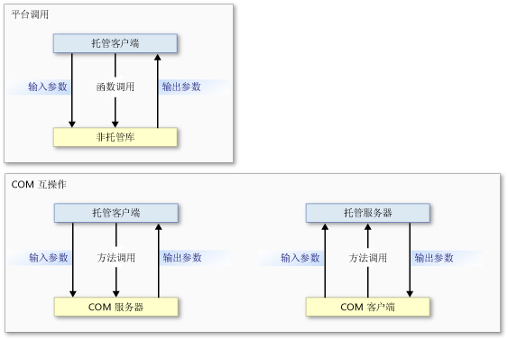

# 互操作封送处理
 互操作封送处理控制调用期间，通过方法自变量和返回值在托管内存和非托管内存之间传递数据的方式。 互操作封送处理是由公共语言运行时的封送处理服务执行的运行时活动。  
  
 大多数数据类型在托管和非托管内存中都具有公共的表示形式。 互操作封送拆收器为你处理这些类型。 其他类型可能是不明确的，或根本不在托管内存中表示。  
  
 不明确的类型可能具有多种映射到单个托管类型的非托管表示形式，或者可能缺少类型信息（如数组的大小）。 对于不明确的类型，封送拆收器提供默认表示形式和替换表示形式（如果存在多种表示形式）。 可以向封送拆收器提供有关它如何封送不明确类型的显式指令。  
  
 本概述包含以下几节：  
  
-   [平台调用和 COM 互操作模型](#platform_invoke_and_com_interop_models)  
  
-   [封送和 COM 单元](#marshaling_and_com_apartments)  
  
-   [封送远程调用](#marshaling_remote_calls)  
  
-   [相关主题](#related_topics)  
  
-   [参考](#reference)  
  
   
## 平台调用和 COM 互操作模型  
 公共语言运行时提供两种用于与非托管代码进行交互的机制：  
  
-   平台调用，它使托管代码能够调用从非托管库中导出的函数。  
  
-   COM 互操作，它使托管代码能够通过接口与组件对象模型 (COM) 对象交互。  
  
 平台调用和 COM 互操作都使用互操作封送处理在调用方和被调用方之间准确地移动方法自变量，并且如果需要，也可以将数据从被调用方移回调用方。 正如下图所示，除涉及 [回调函数](../../../docs/framework/interop/callback-functions.md) 以外，平台调用方法调用从托管代码流向非托管代码，而绝不会以相反方向流动。 虽然平台调用的调用只能从托管代码流向非托管代码，但是数据仍然可以作为输入参数或输出参数在两个方向流动。 COM 互操作方法调用可以在任一方向流动。  
  
   
平台调用和 COM 互操作调用流  
  
 在最低级别，这两种机制都使用同一种互操作封送处理服务；不过，某些数据类型则仅受 COM 互操作或平台调用支持。 有关详细信息，请参阅 [默认封送行为](../../../docs/framework/interop/default-marshaling-behavior.md)。  
  
 [返回页首](#top)  
  
   
## 封送和 COM 单元  
 互操作封送拆收器在公共语言运行时堆和非托管堆之间封送数据。 每当调用方和被调用方无法操作数据的同一个实例时就发生封送。 互操作封送拆收器使调用方和被调用方都能够看上去像是在操作同一数据，即使它们都有自己的数据副本。  
  
 COM 也有一个在 COM 单元或不同的 COM 进程之间封送数据的封送拆收器。 当在同一个 COM 单元内的托管和非托管代码之间进行调用时，互操作封送拆收器是涉及到的唯一一个封送拆收器。 当在另一个 COM 单元或另一个进程中的托管代码和非托管代码之间进行调用时，则同时涉及互操作封送拆收器和 COM 封送拆收器。  
  
### COM 客户端和托管服务器  
 具有由 [Regasm.exe（程序集注册工具）](../../../docs/framework/tools/regasm-exe-assembly-registration-tool.md) 注册的类型库的导出的托管服务器有一个设置为 `Both` 的 `ThreadingModel` 注册表项。 此值指示服务器可以在单线程单元 (STA) 或多线程单元 (MTA) 中激活。 服务器对象在与其调用方相同的单元中创建，如下表所示。  
  
|COM 客户端|.NET 服务器|封送要求|  
|----------------|-----------------|-----------------------------|  
|STA|`Both` 将变成 STA。|相同单元封送。|  
|MTA|`Both` 将变成 MTA。|相同单元封送。|  
  
 由于客户端和服务器位于同一单元中，因此互操作封送处理服务将自动处理所有数据封送。 下图显示了在同一个 COM 样式的单元内的托管和非托管堆之间进行的互操作封送处理服务。  
  
   
相同单元封送进程  
  
 如果计划导出托管服务器，请注意，COM 客户端确定服务器的单元。 在 MTA 中初始化的 COM 客户端所调用的托管服务器必须确保线程安全。  
  
### 托管客户端和 COM 服务器  
 托管客户端单元的默认设置为 MTA；但是，.NET 客户端的应用程序类型可以更改默认设置。 例如，[!INCLUDE[vbprvblong](../../../includes/vbprvblong-md.md)] 客户端单元设置为 STA。 可以使用 <xref:System.STAThreadAttribute?displayProperty=fullName>、<xref:System.MTAThreadAttribute?displayProperty=fullName>、<xref:System.Threading.Thread.ApartmentState%2A?displayProperty=fullName> 属性或 <xref:System.Web.UI.Page.AspCompatMode%2A?displayProperty=fullName> 属性检查并更改托管客户端的单元设置。  
  
 组件的作者设置 COM 服务器的线程关联。 下表显示 .NET 客户端和 COM 服务器的单元设置的组合。 同时还显示得到的针对这些组合的封送要求。  
  
|.NET 客户端|COM 服务器|封送要求|  
|-----------------|----------------|-----------------------------|  
|MTA（默认值）|MTA   STA|互操作封送处理。   互操作封送处理和 COM 封送处理。|  
|STA|MTA   STA|互操作封送处理和 COM 封送处理。   互操作封送处理。|  
  
 当托管客户端和非托管服务器位于同一单元中时，互操作封送处理服务处理所有数据封送。 但是，当客户端和服务器在不同的单元中初始化时，还需要 COM 封送处理。 下图显示跨单元调用的元素。  
  
   
.NET 客户端和 COM 对象之间的跨单元调用  
  
 对于跨单元封送，可以执行下列操作：  
  
-   接受跨单元封送的系统开销，它只在存在许多跨边界调用时才值得注意。 若要使调用能够成功跨过单元边界，必须注册 COM 组件的类型库。  
  
-   通过将客户端线程设置为 STA 或 MTA 改变主线程。 如，如果 C# 客户端调用许多 STA COM 组件，则可以通过将主线程设置为 STA 来避免跨单元封送。  
  
    > [!NOTE]
    >  将 C# 客户端的线程设置为 STA 后，对 MTA COM 组件的调用将需要跨单元封送。  
  
 有关显式选择单元模型的说明， 请参阅 [托管和非托管线程处理](http://msdn.microsoft.com/en-us/db425c20-4b2f-4433-bf96-76071c7881e5)。  
  
 [返回页首](#top)  
  
   
## 封送远程调用  
 与跨单元封送一样，只要对象驻留在不同的进程中，托管代码和非托管代码之间的每个调用就都涉及 COM 封送处理。 例如：  
  
-   调用远程主机上的托管服务器的 COM 客户端使用分布式 COM (DCOM)。  
  
-   调用远程主机上的 COM 服务器的托管客户端使用 DCOM。  
  
 下图显示互操作封送处理和 COM 封送处理如何跨进程和主机边界提供通信信道。  
  
   
跨进程封送  
  
### 保留标识  
 公共语言运行时保留托管引用和非托管引用的标识。 下图显示跨进程和主机边界的直接非托管引用（顶部行）和直接托管引用（底部行）的流。  
  
   
跨进程和主机边界传递引用  
  
 在此图中：  
  
-   非托管客户端从一个托管对象获取一个对 COM 对象的引用，而该托管对象是从一台远程主机获取该引用的。 远程处理机制为 DCOM。  
  
-   托管客户端从一个 COM 对象获取一个对托管对象的引用，而该 COM 对象是从一台远程主机获取该引用的。 远程处理机制为 DCOM。  
  
    > [!NOTE]
    >  必须注册该托管服务器的导出类型库。  
  
 调用方和被调用方之间的进程边界的数目并不相干；对于进程内和进程外调用都会发生相同的直接引用处理。  
  
### 托管远程处理  
 运行时还提供了托管远程处理，可用于跨进程和主机边界建立托管对象之间的通信信道。 托管远程处理可以适应通信组件之间的防火墙，如下图所示。  
  
   
跨使用 SOAP 或 TcpChannel 类的防火墙的远程调用  
  
 某些非托管调用可以通过 SOAP 传递， 如 [服务组件](http://msdn.microsoft.com/en-us/f109ee24-81ad-4d99-9892-51ac6f34978c) 和 COM 之间的调用。  
  
 [返回页首](#top)  
  
   
## 相关主题  
  
|标题|描述|  
|-----------|-----------------|  
|[默认封送处理行为](../../../docs/framework/interop/default-marshaling-behavior.md)|描述互操作封送处理服务用于封送数据的规则。|  
|[用平台调用封送数据](../../../docs/framework/interop/marshaling-data-with-platform-invoke.md)|描述如何声明方法参数以及如何将自变量传递给由非托管库导出的函数。|  
|[用 COM 互操作对数据进行封送处理](../../../docs/framework/interop/marshaling-data-with-com-interop.md)|描述如何自定义 COM 包装器以更改封送行为。|  
|[如何：将托管代码 DCOM 迁移到 WCF](../../../docs/framework/interop/how-to-migrate-managed-code-dcom-to-wcf.md)|描述如何从 DCOM 迁移到 WCF。|  
|[如何：映射 HRESULT 和异常](../../../docs/framework/interop/how-to-map-hresults-and-exceptions.md)|描述如何将自定义异常映射到 HRESULT，并提供从每个 HRESULT 到其在 .NET Framework 中的相似异常类的完整映射。|  
|[使用泛型类型进行交互操作](http://msdn.microsoft.com/en-us/26b88e03-085b-4b53-94ba-a5a9c709ce58)|描述在使用用于 COM 互操作性的泛型类型时，哪些操作受支持。|  
|[与非托管代码交互操作](../../../docs/framework/interop/index.md)|描述由公共语言运行时提供的互操作性服务。|  
|[高级 COM 互操作性](http://msdn.microsoft.com/en-us/3ada36e5-2390-4d70-b490-6ad8de92f2fb)|提供一些链接，指向关于将 COM 组件并入 .NET Framework 应用程序中的详细信息。|  
|[互操作的设计注意事项](http://msdn.microsoft.com/en-us/b59637f6-fe35-40d6-ae72-901e7a707689)|提供有关编写集成 COM 组件的提示。|  
  
 [返回页首](#top)  
  
   
## 引用  
 <xref:System.Runtime.InteropServices?displayProperty=fullName>  
  
 [返回页首](#top)

