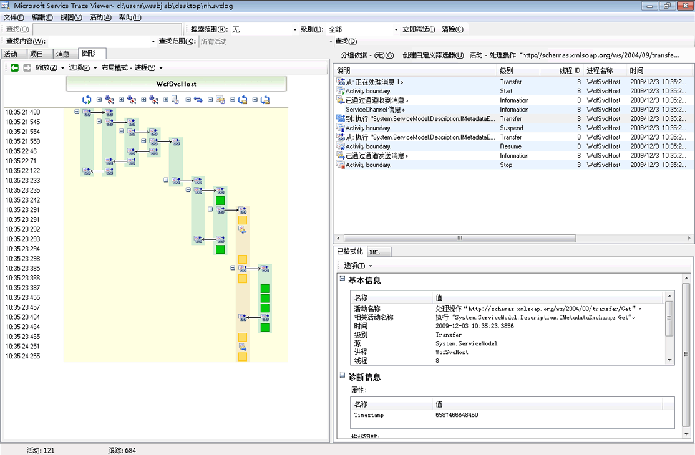
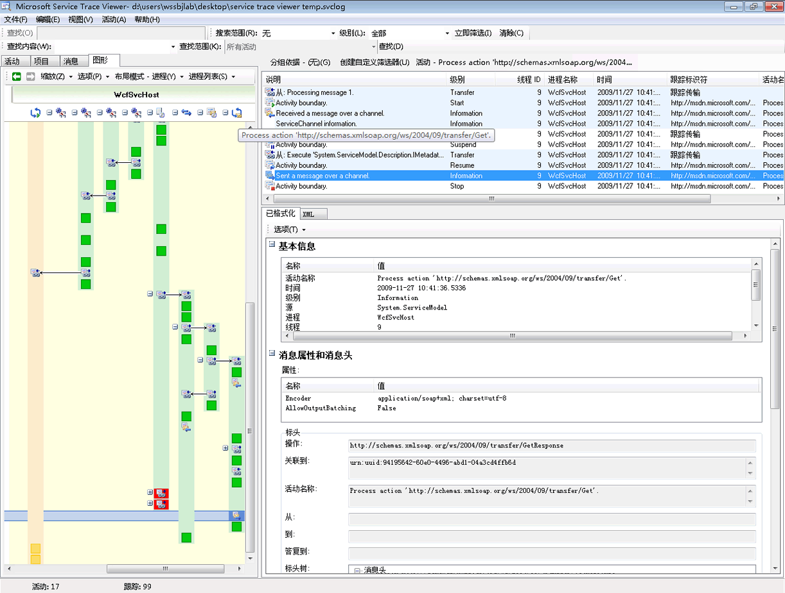
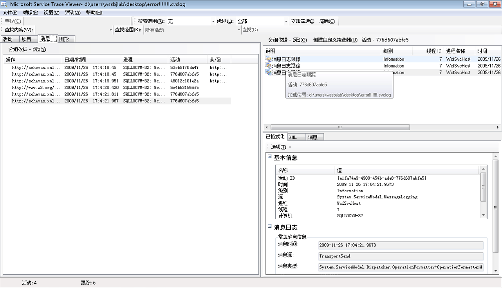

# 使用服务跟踪查看器查看相关跟踪和进行故障诊断
本主题介绍跟踪数据的格式，如何查看它，以及使用服务跟踪查看器对应用程序进行故障诊断的方法。  
  
## 使用服务跟踪查看器工具  
 [!INCLUDE[indigo1](../../../../../includes/indigo1-md.md)] 服务跟踪查看器工具可帮助您详细了解 [!INCLUDE[indigo2](../../../../../includes/indigo2-md.md)] 侦听器生成的诊断跟踪信息，从而找到错误的根本原因。  该工具提供了一种轻松查看、分组和筛选跟踪的方法，以便可以诊断、修复和验证 [!INCLUDE[indigo2](../../../../../includes/indigo2-md.md)] 服务的问题。  有关使用此工具的详细信息，请参阅[服务跟踪查看器工具 \(SvcTraceViewer.exe\)](../../../../../docs/framework/wcf/service-trace-viewer-tool-svctraceviewer-exe.md)。  
  
 本主题包含使用[服务跟踪查看器工具 \(SvcTraceViewer.exe\)](../../../../../docs/framework/wcf/service-trace-viewer-tool-svctraceviewer-exe.md)进行查看时通过运行[跟踪和消息日志记录](../../../../../docs/framework/wcf/samples/tracing-and-message-logging.md)示例生成的跟踪快照。  本主题演示如何了解跟踪内容、活动及其关联，以及进行故障诊断时如何分析大量跟踪。  
  
## 查看跟踪内容  
 跟踪事件包含以下最重要的信息：  
  
-   设置时的活动名称。  
  
-   发出时间。  
  
-   跟踪级别。  
  
-   跟踪源名称。  
  
-   进程名称。  
  
-   线程 ID。  
  
-   一个唯一跟踪标识符，它是指向联机 MSDN 库中目标的 URL，通过它可以获取与跟踪相关的更多信息。  
  
 在服务跟踪查看器的右上面板中可以看到所有这些内容，选择跟踪时在右下面板的格式化视图中的**“基本信息”**部分也可以看到它们。  
  
> [!NOTE]
>  如果客户端和服务位于同一计算机上，则将显示针对这两个应用程序的跟踪。  可使用**“进程名”**列对其进行筛选。  
  
 此外，格式化视图还提供了跟踪说明和其他可用的详细信息。  后者可以包括异常类型和消息、调用堆栈、消息操作、从\/到字段以及其他异常信息。  
  
 在 XML 视图中，有用的 xml 标记包括：  
  
-   \<SubType\>（跟踪级别）。  
  
-   \<TimeCreated\>。  
  
-   \<Source\>（跟踪源名称）。  
  
-   \<Correlation\>（发出跟踪时设置的活动 ID）。  
  
-   \<Execution\>（进程和线程 ID）。  
  
-   \<Computer\>。  
  
-   \<ExtendedData\>，包括发送消息时在消息头中设置的 \<Action\>、\<MessageID\> 和 \<ActivityId\>。  
  
 如果检查“通过通道发送消息”跟踪，则可能会看到以下内容。  
  
```  
<E2ETraceEvent xmlns="http://schemas.microsoft.com/2004/06/E2ETraceEvent">  
   <System xmlns="http://schemas.microsoft.com/2004/06/windows/eventlog/system">  
      <EventID>262163</EventID>  
      <Type>3</Type>  
      <SubType Name="Information">0</SubType>  
      <Level>8</Level>  
      <TimeCreated SystemTime="2006-08-04T18:45:30.8491051Z" />  
      <Source Name="System.ServiceModel" />  
       <Correlation ActivityID="{27c6331d-8998-43aa-a382-03239013a6bd}"/>  
       <Execution ProcessName="client" ProcessID="1808" ThreadID="1" />  
       <Channel />  
       <Computer>TEST1</Computer>  
   </System>  
   <ApplicationData>  
       <TraceData>  
          <DataItem>  
             <TraceRecord xmlns="http://schemas.microsoft.com/2004/10/E2ETraceEvent/TraceRecord" Severity="Information">  
                 <TraceIdentifier>http://msdn.microsoft.com/library/System.ServiceModel.Channels.MessageSent.aspx</TraceIdentifier>  
                 <Description>Sent a message over a channel.</Description>  
                 <AppDomain>client.exe</AppDomain>  
                 <Source>System.ServiceModel.Channels.ClientFramingDuplexSessionChannel/35191196</Source>  
                <ExtendedData xmlns="http://schemas.microsoft.com/2006/08/ServiceModel/MessageTransmitTraceRecord">  
  
                  <MessageProperties>  
                     <AllowOutputBatching>False</AllowOutputBatching>  
                  </MessageProperties>  
                  <MessageHeaders>  
                     <Action d4p1:mustUnderstand="1" xmlns:d4p1="http://www.w3.org/2003/05/soap-envelope" xmlns="http://www.w3.org/2005/08/addressing">http://Microsoft.ServiceModel.Samples/ICalculator/Multiply</Action>  
                     <MessageID xmlns="http://www.w3.org/2005/08/addressing">urn:uuid:7c6670d8-4c9c-496e-b6a0-2ceb6db35338</MessageID>  
                     <ActivityId CorrelationId="b02e2189-0816-4387-980c-dd8e306440f5" xmlns="http://schemas.microsoft.com/2004/09/ServiceModel/Diagnostics">27c6331d-8998-43aa-a382-03239013a6bd</ActivityId>  
                     <ReplyTo xmlns="http://www.w3.org/2005/08/addressing">  
                        <Address>http://www.w3.org/2005/08/addressing/anonymous</Address>  
                    </ReplyTo>  
                    <To d4p1:mustUnderstand="1" xmlns:d4p1="http://www.w3.org/2003/05/soap-envelope" xmlns="http://www.w3.org/2005/08/addressing">net.tcp://localhost/servicemodelsamples/service</To>  
                  </MessageHeaders>  
                  <RemoteAddress>net.tcp://localhost/servicemodelsamples/service</RemoteAddress>  
                </ExtendedData>  
            </TraceRecord>  
          </DataItem>  
       </TraceData>  
   </ApplicationData>  
</E2ETraceEvent>  
```  
  
## ServiceModel E2E 跟踪  
 使用除 Off 之外的 `System.ServiceModel` 以及 `switchValue` 设置 `ActivityTracing` 跟踪源时，[!INCLUDE[indigo2](../../../../../includes/indigo2-md.md)] 创建活动和传输以供 [!INCLUDE[indigo2](../../../../../includes/indigo2-md.md)] 处理。  
  
 活动是一个逻辑处理单元，将与该处理单元相关的所有跟踪组合在一起。  例如，可以为每个请求定义一个活动。  传输在终结点内的活动之间创建因果关系。  通过传播活动 ID，可以跨终结点使活动相关。  通过在每个终结点上的配置中设置 `propagateActivity`\=`true`，可以做到这一点。  活动、传输和传播允许您执行错误关联。  这样，可以更快地找到错误的根本原因。  
  
 在客户端上，为每个对象模型调用创建一个 [!INCLUDE[indigo2](../../../../../includes/indigo2-md.md)] 活动（例如，打开 ChannelFactory、加、除等）。 在“进程操作”活动中处理每个操作调用。  
  
 在下面的屏幕快照（从[跟踪和消息日志记录](../../../../../docs/framework/wcf/samples/tracing-and-message-logging.md)示例中提取）中，左面板显示在客户端进程中创建的活动的列表（按创建时间排序）。  以下是活动的时间顺序列表：  
  
-   构造了通道工厂 \(ClientBase\)。  
  
-   打开了通道工厂。  
  
-   处理了加操作。  
  
-   设置了安全会话（这发生在第一个请求上）并处理三个安全基础结构响应消息：RST、RSTR、SCT（处理消息 1、2、3）。  
  
-   处理了减、乘和除请求。  
  
-   关闭了通道工厂，这样做还关闭了安全会话并处理安全消息响应 Cancel。  
  
 我们看到由于 wsHttpBinding 所致的安全基础结构消息。  
  
> [!NOTE]
>  在 [!INCLUDE[indigo2](../../../../../includes/indigo2-md.md)] 中，显示最初在单独的活动中处理的响应消息（处理消息），之后通过传输将它们与包括请求消息的对应“处理操作”活动关联。  这发生在基础结构消息和异步请求中，并且归因于以下事实：必须检查消息、读取 activityId 标头以及识别具有该 ID 的现有“处理操作”活动以便与它相关。  对于同步请求，我们将为响应截留这些信息，因此可以知道响应与哪个处理操作相关。  
  
   
按创建时间列出的 WCF 客户端活动（左面板）及其嵌套活动和跟踪（右上面板）  
  
 在左面板中选择一个活动时，可以在右上面板上看到其嵌套活动和跟踪。  因此，这是左侧活动列表的简化分层视图（基于所选的父活动）。  因为所选处理操作“加”是发出的第一个请求，所以此活动包含“设置安全会话”活动（传输到，再传输回）和对“加”操作实际处理的跟踪。  
  
 如果双击左面板中的处理操作“加”活动，则可以看到与“加”相关的客户端 [!INCLUDE[indigo2](../../../../../includes/indigo2-md.md)] 活动的图形表示。  左侧的第一个活动是根活动 \(0000\)，它是默认活动。  [!INCLUDE[indigo2](../../../../../includes/indigo2-md.md)] 在环境活动之外传输。  如果未定义此活动，则 [!INCLUDE[indigo2](../../../../../includes/indigo2-md.md)] 在 0000 之外传输。  在这里，第二个活动“处理操作添加”在 0 之外传输。  然后可看到“设置安全会话”。  
  
   
WCF 客户端活动的图形视图：“环境活动”（此处为 0）、“处理操作”和“设置安全会话”  
  
 在右上面板中，可以看到与“处理操作添加”活动相关的所有跟踪。  具体说来，已发送请求消息（“通过通道发送消息”）并在同一活动中收到了响应（“通过通道收到消息”）。  如下图所示。  为清楚起见，在图形中折叠了“设置安全会话”活动。  
  
   
处理操作活动的跟踪列表：已发送请求并在同一活动中收到响应。  
  
 在这里，加载客户端跟踪仅仅是为了清楚起见，但是，如果在工具中也加载了它们而且 `propagateActivity` 设置为 `true.` ，则服务跟踪（收到的请求消息和发送的响应消息）出现在同一活动中。如稍后的图所示。  
  
 在服务上，活动模型映射到 [!INCLUDE[indigo2](../../../../../includes/indigo2-md.md)] 概念，如下所示：  
  
1.  构造并打开 ServiceHost（这可能创建几个与主机相关的活动，例如在出于安全性的情况下）。  
  
2.  在 ServiceHost 中为每个侦听器创建“侦听”活动（包括传入和传出“打开 ServiceHost”）。  
  
3.  侦听器检测到由客户端发起的通信请求时，它将其传输到“接收字节”活动，在其中处理从客户端发送的所有字节。  在此活动中，可以看到在客户端\-服务交互期间发生的任何连接错误。  
  
4.  收到的对应于消息的每组字节都会在“处理消息”活动（在其中创建 [!INCLUDE[indigo2](../../../../../includes/indigo2-md.md)] 消息对象）中处理。  在此活动中，可看到与错误信封或格式不正确的消息相关的错误。  
  
5.  形成消息后，传输到“处理操作”活动。  如果在客户端和服务上 `propagateActivity` 都设置为 `true`，则此活动具有与客户端中定义的活动相同的 ID，如前所述。  从此阶段开始，我们将受益于跨终结点的直接关联，因为在 [!INCLUDE[indigo2](../../../../../includes/indigo2-md.md)] 中发出的与请求相关的所有跟踪都位于该同一活动中，包括响应消息的处理。  
  
6.  对于进程外操作，创建“执行用户代码”活动使在用户代码中发出的跟踪与在 [!INCLUDE[indigo2](../../../../../includes/indigo2-md.md)] 中发出的跟踪隔离。  在前面的示例中，“服务发送添加响应”跟踪是在“执行用户代码”活动中而不是在客户端传播的活动中发出的（如果适用）。  
  
 在下图中，左侧的第一个活动是根活动 \(0000\)，它是默认活动。  接下来的三个活动用于打开 ServiceHost。  第 5 列中的活动是侦听器，剩余的活动（6 到 8）说明消息的 WCF 处理，从字节处理到用户代码激活。  
  
   
WCF 服务活动的列表  
  
 下面的屏幕快照显示客户端和服务的活动，并突出显示跨进程的“处理操作添加”活动（橙色）。  箭头使客户端和服务发送和接收的请求和响应消息相关。  跨进程处理操作的跟踪在图形中单独显示，但在右上面板中作为同一活动的一部分显示。  在此面板中，可以看到已发送消息的客户端跟踪，后跟已接收和已处理消息的服务跟踪。  
  
   
WCF 客户端和服务活动的图形视图  
  
 在下面的错误情形中，服务和客户端上的错误和警告跟踪是相关的。  在服务上的用户代码中首先引发异常（最右侧的绿色活动，包括异常“服务无法处理用户代码中的此请求。”的警告跟踪）。  将响应发送到客户端时，会再次发出警告跟踪以指示错误消息（左侧的粉红色活动）。  然后客户端关闭其 WCF 客户端（左下侧的黄色活动），这将中止与服务的连接。  服务引发一个错误（右侧最长的粉红色活动）。  
  
   
跨服务和客户端的错误关联  
  
 用于生成这些跟踪的示例是使用 wsHttpBinding 的一系列同步请求。  对于没有安全性或具有异步请求的情形，与此图形存在偏差，其中处理操作活动包括造成异步调用的开始操作和结束操作，并显示到回调活动的传输。  有关其他方案的详细信息，请参阅[端到端跟踪方案](../../../../../docs/framework/wcf/diagnostics/tracing/end-to-end-tracing-scenarios.md)。  
  
## 使用服务跟踪查看器进行故障诊断  
 在服务跟踪查看器工具中加载跟踪文件时，可以在左面板上选择任何红色或黄色的活动，以追踪应用程序中问题的原因。  000 活动通常具有最终归因于用户的未经处理的异常。  
  
   
选择红色或黄色活动以找到问题的根本原因  
  
 在右上面板上，可以检查在左侧选择的活动的跟踪。  然后，可以检查该面板中的红色或黄色跟踪以及查看它们是如何相关的。  在前面的图形中，我们看到客户端和服务的警告跟踪都在同一处理操作活动中。  
  
 如果这些跟踪未提供错误的根本原因，则可以通过双击左面板上的所选活动（此处为处理操作）来利用图形。  随后将显示具有相关活动的图形。  之后可以展开相关活动（方法是单击“\+”符号），以找出相关活动中发出的第一个红色或黄色跟踪。  在传输到相关活动或跨终结点的消息流之后，一直展开刚好在相关的红色或黄色跟踪之前发生的活动，直到查明问题的根本原因为止。  
  
   
展开活动以查明问题的根本原因  
  
 如果已关闭 ServiceModel `ActivityTracing` 但打开了 ServiceModel 跟踪，则可以看到在 0000 活动中发出的 ServiceModel 跟踪。  但是，这需要进行更多的工作才能了解这些跟踪的关联。  
  
 如果启用了“消息日志记录”，则可以使用“消息”选项卡查看受错误影响的消息。  通过双击红色或黄色的消息，可以看到相关活动的图形视图。  这些活动是与发生错误的请求最紧密相关的活动。  
  
   
若要开始进行故障诊断，也可以选取一个红色或黄色的消息跟踪，并双击它以查明根本原因  
  
## 请参阅  
 [端到端跟踪方案](../../../../../docs/framework/wcf/diagnostics/tracing/end-to-end-tracing-scenarios.md)   
 [服务跟踪查看器工具 \(SvcTraceViewer.exe\)](../../../../../docs/framework/wcf/service-trace-viewer-tool-svctraceviewer-exe.md)   
 [跟踪](../../../../../docs/framework/wcf/diagnostics/tracing/index.md)