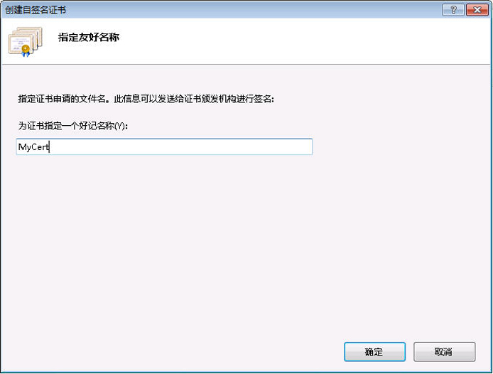
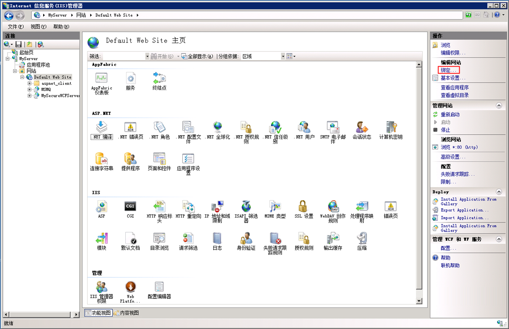
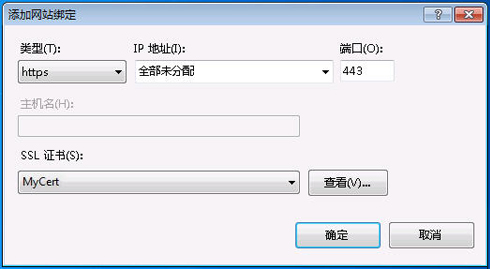

# 如何：使用 SSL 配置承载 IIS 的 WCF 服务
本主题介绍如何设置 IIS 承载的 WCF 服务以使用 HTTP 传输安全性。  HTTP 传输安全性要求 SSL 证书以便向 IIS 注册。  如果您没有 SSL 证书，则可以使用 IIS 生成测试证书。  接下来，您必须将一个 SSL 绑定添加到网站，并且配置该网站的身份验证属性。  最后，您需要配置 WCF 服务以使用 HTTPS。  
  
### 创建自签名证书  
  
1.  打开 Internet 信息服务管理器 \(inetmgr.exe\)，在左侧树视图中选择您的计算机名称。  在屏幕的右侧选择“服务器证书”  
  
       
  
2.  在“服务器证书”窗口中单击**“创建自签名证书...”**链接。  
  
       
  
3.  输入自签名证书的友好名称，然后单击**“确定”**。  
  
       
  
     现在，新创建的自签名证书的详细信息将显示在**“服务器证书”**窗口中。  
  
       
  
     生成的证书将安装在“受信任的根证书颁发机构”存储区中。  
  
### 添加 SSL 绑定  
  
1.  还是在 Internet 信息服务管理器中，在屏幕左侧的树视图中展开**“站点”**文件夹，然后展开**“默认网站”**文件夹。  
  
2.  在窗口右上角的**“操作”**部分中单击**“绑定...”**链接。  
  
       
  
3.  在“站点绑定”窗口中，单击**“添加”**按钮。  
  
       
  
4.  在**“添加站点绑定”**对话框中，选择您刚创建的自签名证书的类型和友好名称。  
  
       
  
### 配置 SSL 的虚拟目录  
  
1.  仍在 Internet 信息服务管理器中，选择包含您 WCF 安全服务的虚拟目录。  
  
2.  在窗口的中心窗格中，在 IIS 部分中选择**“SSL 设置”**。  
  
       
  
3.  在“SSL 设置”窗格中，选中**“要求 SSL”**复选框，然后在屏幕右侧的**“操作”**部分中单击**“应用”**链接。  
  
       
  
### 为 HTTP 传输安全配置 WCF 服务  
  
1.  在 WCF 服务的 web.config 中，配置 HTTP 绑定以便使用传输安全，如下面的 XML 中所示。  
  
    ```  
    <bindings>  
          <basicHttpBinding>  
            <binding name="secureHttpBinding">  
              <security mode="Transport">  
                <transport clientCredentialType="None"/>  
              </security>  
            </binding>  
          </basicHttpBinding>  
        </bindings>  
  
    ```  
  
2.  指定您的服务和服务终结点，如下面的 XML 中所示。  
  
    ```  
    <services>  
          <service name="MySecureWCFService.Service1">  
            <endpoint address=""  
                      binding="basicHttpBinding"  
                      bindingConfiguration="secureHttpBinding"  
                      contract="MySecureWCFService.IService1"/>  
  
            <endpoint address="mex"  
                      binding="mexHttpsBinding"  
                      contract="IMetadataExchange" />  
          </service>  
        </services>  
  
    ```  
  
## 示例  
 以下是使用 HTTP 传输安全的 WCF 服务的 web.config 文件的完整示例  
  
```  
<?xml version="1.0"?>  
<configuration>  
  
  <system.web>  
    <compilation debug="true" targetFramework="4.0" />  
  </system.web>  
  <system.serviceModel>  
    <services>  
      <service name="MySecureWCFService.Service1">  
        <endpoint address=""  
                  binding="basicHttpBinding"  
                  bindingConfiguration="secureHttpBinding"  
                  contract="MySecureWCFService.IService1"/>  
  
        <endpoint address="mex"  
                  binding="mexHttpsBinding"  
                  contract="IMetadataExchange" />  
      </service>  
    </services>  
    <bindings>  
      <basicHttpBinding>  
        <binding name="secureHttpBinding">  
          <security mode="Transport">  
            <transport clientCredentialType="None"/>  
          </security>  
        </binding>  
      </basicHttpBinding>  
    </bindings>  
    <behaviors>  
      <serviceBehaviors>  
        <behavior>  
          <!-- To avoid disclosing metadata information, set the value below to false and remove the metadata endpoint above before deployment -->  
          <serviceMetadata httpsGetEnabled="true"/>  
          <!-- To receive exception details in faults for debugging purposes, set the value below to true.  Set to false before deployment to avoid disclosing exception information -->  
          <serviceDebug includeExceptionDetailInFaults="false"/>  
        </behavior>  
      </serviceBehaviors>  
    </behaviors>  
    <serviceHostingEnvironment multipleSiteBindingsEnabled="true" />  
  </system.serviceModel>  
 <system.webServer>  
    <modules runAllManagedModulesForAllRequests="true"/>  
  </system.webServer>  
  
</configuration>  
  
```  
  
<!-- TODO: review snippet reference  [!CODE [Microsoft.Win32.RegistryKey#4](Microsoft.Win32.RegistryKey#4)]  -->  
  
## 请参阅  
 [在 Internet 信息服务中承载](../../../../docs/framework/wcf/feature-details/hosting-in-internet-information-services.md)   
 [Internet 信息服务承载说明](../../../../docs/framework/wcf/samples/internet-information-service-hosting-instructions.md)   
 [Internet 信息服务承载最佳实践](../../../../docs/framework/wcf/feature-details/internet-information-services-hosting-best-practices.md)   
 [使用内联代码的 IIS 承载](../../../../docs/framework/wcf/samples/iis-hosting-using-inline-code.md)