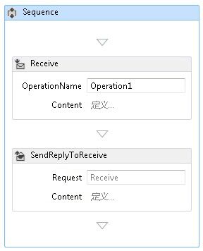
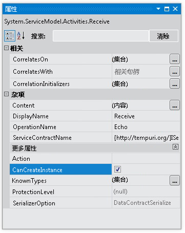
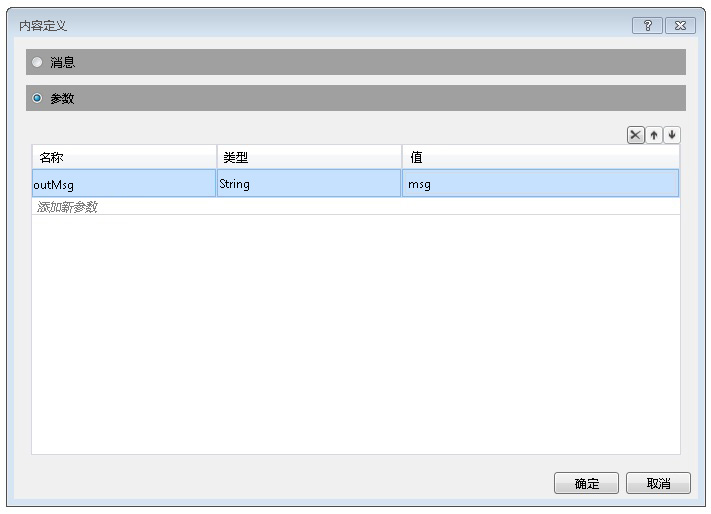

# 如何：使用消息传递活动创建工作流服务
此主题说明如何使用消息传递活动创建简单工作流服务，  本主题着重介绍工作流服务的创建机制，其中的服务仅包含消息传递活动。  在实际服务中，工作流包含其他许多活动。  该服务实现一个名为 Echo 的操作，来获取一个字符串并将该字符串返回到调用方。  本主题是一系列主题（包含两个主题）中的第一个。  下一个主题[如何：从工作流应用程序访问服务](../../../../docs/framework/wcf/feature-details/how-to-access-a-service-from-a-workflow-application.md)讨论如何创建可以调用在本主题中创建的服务的工作流应用程序。  
  
### 创建工作流服务项目  
  
1.  启动 [!INCLUDE[vs_current_long](../../../../includes/vs-current-long-md.md)]。  
  
2.  单击**“文件”**菜单，选择**“新建”**，然后选择**“项目”**显示**“新建项目”**对话框。  从所安装模板的列表中选择**“工作流”**，然后从项目类型列表中选择**“WCF 工作流服务应用程序”**。  将项目命名为 `MyWFService` 并保存在默认位置，如以下插图所示。  
  
     单击**“确定”**按钮关闭**“新建项目”**对话框。  
  
3.  创建项目之后，将在设计器中打开 Service1.xamlx 文件，如以下插图所示。  
  
       
  
     右击标记为**“顺序服务”**的活动，然后选择**“删除”**。  
  
### 实现工作流服务  
  
1.  在屏幕左侧选择**“工具箱”**选项卡显示工具箱，然后单击图钉保持窗口打开。  展开工具箱的**“消息传递”**部分显示消息传递活动和消息传递活动模板，如以下插图所示。  
  
       
  
2.  将**“ReceiveAndSendReply”**模板拖放到工作流设计器中。  这样可以创建带有<xref:System.ServiceModel.Activities.Sequence> **“Receive”** 活动的  活动，其后为 <xref:System.ServiceModel.Activities.SendReply> 活动，如以下插图所示。  
  
       
  
     请注意，已将 <xref:System.ServiceModel.Activities.SendReply> 活动的<xref:System.ServiceModel.Activities.SendReply.Request%2A> 属性设置为 `Receive`，即<xref:System.ServiceModel.Activities.Receive> 活动要答复的<xref:System.ServiceModel.Activities.SendReply> 活动的名称。  
  
3.  在 <xref:System.ServiceModel.Activities.Receive> 活动中，在标记为`“OperationName”`的文本框中键入 **Echo**。  此步骤定义服务所实现操作的名称。  
  
       
  
4.  选中 <xref:System.ServiceModel.Activities.Receive> 活动后，如果属性窗口尚未打开，则单击**“视图”**菜单并选择**“属性窗口”**打开该窗口。  在**“属性窗口”**中向下滚动，直至看到**“CanCreateInstance”**，然后选中相应的复选框，如以下插图所示。  此设置使工作流服务主机可以在接收消息时创建服务的新实例（如果需要）。  
  
       
  
5.  选择 <xref:System.ServiceModel.Activities.Sequence> 活动，然后单击设计器左下角的**“变量”**按钮。  这样将显示变量编辑器。  单击**“创建变量”**链接添加变量，用于存储发送到该操作的字符串。  将变量命名为 `msg`，并将其**“变量”**类型设置为“字符串”，如以下插图所示。  
  
       
  
     再次单击**“变量”**按钮关闭变量编辑器。  
  
6.  单击 活动的**“内容”**文本框中的<xref:System.ServiceModel.Activities.Receive> **“定义...”**链接显示**“内容定义”**对话框。  选中**“参数”**单选按钮，单击**“添加新参数”**链接，在`“名称”`文本框中键入 **inMsg**，在**“类型”**下拉列表框中选择**“字符串”**，然后在`“分配给”`文本框中键入 **msg**，如以下插图所示。  
  
       
  
     此步骤指定由 Receive 活动接收字符串参数，并且将该数据绑定到 `msg` 变量。  单击**“确定”**关闭**“内容定义”**对话框。  
  
7.  单击 **“定义...”** 活动的**“内容”**框中的<xref:System.ServiceModel.Activities.SendReply> 链接显示**“内容定义”**对话框。  选中**“参数”**单选按钮，单击**“添加新参数”**链接，在`“名称”`文本框中键入 **msg**，在**“类型”**下拉列表框中选择**“字符串”**，然后在`“值”`文本框中键入 **msg**，如以下插图所示。  
  
       
  
     此步骤指定由 <xref:System.ServiceModel.Activities.SendReply> 活动发送消息或消息协定类型，并且将该数据绑定到 `msg` 变量。  由于此活动是 <xref:System.ServiceModel.Activities.SendReply> 活动，因此这意味着 `msg` 中的数据用于填充活动发送回客户端的消息。  单击**“确定”**关闭**“内容定义”**对话框。  
  
8.  单击**“生成”**菜单并选择**“生成解决方案”**保存并生成解决方案。  
  
## 配置工作流服务项目  
 现在工作流服务是完整的。  本节介绍如何配置工作流服务解决方案以易于承载和运行。  此解决方案使用 ASP.NET Development Server 承载服务。  
  
#### 设置项目启动选项  
  
1.  在**“解决方案资源管理器”**中，右击**“MyWFService”**，然后选择**“属性”**显示**“项目属性”**对话框。  
  
2.  选择**“Web”**选项卡，在**“启动操作”**下选择**“特定页”**，然后在文本框中键入 `Service1.xamlx`，如以下插图所示。  
  
       
  
     此步骤在 ASP.NET Development Server 中承载 Service1.xamlx 中定义的服务。  
  
3.  按 Ctrl \+ F5 启动服务。  ASP.NET Development Server 图标显示在桌面的右下角，如以下图像所示。  
  
       
  
     此外，Internet Explorer 显示服务的 WCF 服务帮助页。  
  
       
  
4.  继续了解[如何：从工作流应用程序访问服务](../../../../docs/framework/wcf/feature-details/how-to-access-a-service-from-a-workflow-application.md)主题，以创建调用此服务的工作流客户端。  
  
## 请参阅  
 [工作流服务](../../../../docs/framework/wcf/feature-details/workflow-services.md)   
 [承载工作流服务概述](../../../../docs/framework/wcf/feature-details/hosting-workflow-services-overview.md)   
 [消息传递活动](../../../../docs/framework/wcf/feature-details/messaging-activities.md)