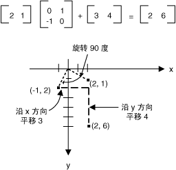

# 变换的矩阵表示形式
m×n 矩阵是排列在 m 行和 n 列中的一系列数。  下图显示几个矩阵。  
  
   
  
 您可以通过将单个元素相加来加合两个尺寸相同的矩阵。  下图显示了两个矩阵相加的示例。  
  
   
  
 m×n 矩阵可与一个 n×p 矩阵相乘，结果为一个 m×p 矩阵。  第一个矩阵的列数必须与第二个矩阵的行数相同。  例如，一个 4×2 矩阵与一个 2×3 矩阵相乘，产生一个 4×3 矩阵。  
  
 矩阵的行列的平面点可视为矢量。  例如，\(2, 5\) 是具有两个组件的矢量，\(3, 7, 1\) 是具有三个组件的矢量。  两个矢量的点积定义如下：  
  
 \(a, b\) • \(c, d\) \= ac \+ bd  
  
 \(a, b, c\) • \(d, e, f\) \= ad \+ be \+ cf  
  
 例如，\(2, 3\) 和 \(5, 4\) 的点积为 \(2\)\(5\) \+ \(3\)\(4\) \= 22。  \(2, 5, 1\) 和 \(4, 3, 1\) 的点积为 \(2\)\(4\) \+ \(5\)\(3\) \+ \(1\)\(1\) \= 24。  请注意，两个矢量的点积是一个数字，而不是另一个矢量。  另外请注意，只有当两个矢量的组件数相同时，才能计算点积。  
  
 将 A\(i, j\) 作为矩阵 A 中第 i 行、第 j 列的项。  例如，A（3, 2）是矩阵 A 中第 3 行、第 2 列的项。  假定 A、B 和 C 是矩阵，且 AB \= C，  则 C 的项计算如下：  
  
 C\(i, j\) \=（A 的第 i 行）•（B 的第 j 列）  
  
 下图显示了矩阵相乘的几个示例。  
  
   
  
 如果将平面中的点视为 1×2 矩阵，则可通过将该点乘以一个 2×2 矩阵来将该点变换。  下图显示了应用于点 \(2, 1\) 的几个变换。  
  
   
  
 前图中显示的所有变换都是线性变换。  某些其他变换（如平移）不是线性的，不能表示为与 2×2 矩阵相乘的形式。  假定您要从点 \(2, 1\) 开始，将其旋转 90 度，在 x 方向将其平移 3 个单位，在 y 方向将其平移 4 个单位。  可通过先使用矩阵乘法再使用矩阵加法来完成此操作。  
  
   
  
 后面跟一平移（与 1×2 矩阵相加）的线性变换（与 2×2 矩阵相乘）称为仿射变换。  将仿射变换存储于一对矩阵（一个用于线性部分，一个用于平移）的替换方案是将整个变换存储于 3×3 矩阵。  若要使其起作用，平面上的点必须存储于具有虚拟第三坐标的 1×3 矩阵中。  通常的方法是使所有的第三坐标等于 1。  例如，矩阵 \[2 1 1\] 代表点 \(2, 1\)。  下图演示了表示为与单个 3×3 矩阵相乘的仿射变换（旋转 90 度；在 x 方向上平移 3 个单位，在 y 方向上平移 4 个单位）。  
  
   
  
 在前面的示例中，点 \(2, 1\) 映射到了点 \(2, 6\)。  请注意，3×3 矩阵的第三列包含数字 0，0，1。  对于仿射变换的 3×3 矩阵而言，情况将总是如此。  重要的数字是列 1 和列 2 中的 6 个数字。  矩阵左上角的 2×2 部分表示变换的线性部分，第 3 行中的前两项表示平移。  
  
   
  
 在 [!INCLUDE[ndptecgdiplus](../../../../includes/ndptecgdiplus-md.md)] 中，可以在 <xref:System.Drawing.Drawing2D.Matrix> 对象中存储仿射变换。  由于表示仿射变换的矩阵的第三列总是（0，0，1），因此在构造 <xref:System.Drawing.Drawing2D.Matrix> 对象时，只需指定前两列中的 6 个数。  `Matrix myMatrix = new Matrix(0, 1, -1, 0, 3, 4)` 语句构造上面图形中显示的矩阵。  
  
## 复合变换  
 复合变换是一个接一个的变换序列。  请考虑下面列表中的矩阵和变换：  
  
|||  
|-|-|  
|矩阵 A|旋转 90 度|  
|矩阵 B|在 x 方向上缩放 2 倍|  
|矩阵 C|在 y 方向上平移 3 个单位|  
  
 如果从由矩阵 \[2 1 1\] 表示的点 \(2, 1\) 开始，并先后乘以 A、B、C，则点 \(2, 1\) 将按列出的顺序经历三种变换。  
  
 \[2 1 1\]ABC \= \[\-2 5 1\]  
  
 可以不将复合变换的三部分存储于三个独立的矩阵，而是一起乘以 A、B 和 C 来得到存储整个复合变换的单个的 3×3 矩阵。  假定 ABC \= D，  则一个点乘以 D 得出的结果与一个点先后乘以 A、B、C 的结果相同。  
  
 \[2 1 1\]D \= \[\-2 5 1\]  
  
 下图显示了矩阵 A、B、C 和 D。  
  
   
  
 复合变换的矩阵可通过将几个单独的变换矩阵相乘而得到，这就意味着任何仿射变换的序列均可存储于单个的 <xref:System.Drawing.Drawing2D.Matrix> 对象中。  
  
> [!CAUTION]
>  复合变换的顺序非常重要。  一般说来，先旋转、再缩放、然后平移，与先缩放、再旋转、然后平移是不同的。  同样，矩阵相乘的顺序也是重要的。  一般说来，ABC 与 BAC 不同。  
  
 <xref:System.Drawing.Drawing2D.Matrix> 类提供了几种构建复合变换的方法：<xref:System.Drawing.Drawing2D.Matrix.Multiply%2A>、<xref:System.Drawing.Drawing2D.Matrix.Rotate%2A>、<xref:System.Drawing.Drawing2D.Matrix.RotateAt%2A>、<xref:System.Drawing.Drawing2D.Matrix.Scale%2A>、<xref:System.Drawing.Drawing2D.Matrix.Shear%2A> 和 <xref:System.Drawing.Drawing2D.Matrix.Translate%2A>。  下面的示例创建了复合变换（先旋转 30 度，再在 y 方向上缩放 2 倍，然后在 x 方向平移 5 个单位）的矩阵。  
  
 [!code-csharp[System.Drawing.CoordinateSystems#11](../../../../samples/snippets/csharp/VS_Snippets_Winforms/System.Drawing.CoordinateSystems/CS/Class1.cs#11)]
 [!code-vb[System.Drawing.CoordinateSystems#11](../../../../samples/snippets/visualbasic/VS_Snippets_Winforms/System.Drawing.CoordinateSystems/VB/Class1.vb#11)]  
  
 下图显示该矩阵。  
  
   
  
## 请参阅  
 [坐标系和坐标变换](../../../../docs/framework/winforms/advanced/coordinate-systems-and-transformations.md)   
 [在托管 GDI\+ 中使用变换](../../../../docs/framework/winforms/advanced/using-transformations-in-managed-gdi.md)