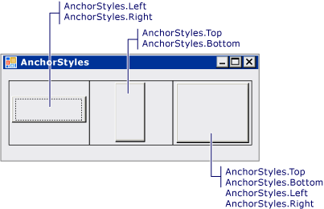

# 如何：在 TableLayoutPanel 控件中锚定和停靠子控件
<xref:System.Windows.Forms.TableLayoutPanel> 控件支持其子控件中的 <xref:System.Windows.Forms.Control.Anchor%2A> 和 <xref:System.Windows.Forms.Control.Dock%2A> 属性。  
  
### 在 TableLayoutPanel 单元格中对齐子控件  
  
1.  在窗体上创建一个 <xref:System.Windows.Forms.TableLayoutPanel> 控件。  
  
2.  将 <xref:System.Windows.Forms.TableLayoutPanel> 控件的 <xref:System.Windows.Forms.TableLayoutPanel.ColumnCount%2A> 和 <xref:System.Windows.Forms.TableLayoutPanel.RowCount%2A> 属性的值设置为 1。  
  
3.  在 <xref:System.Windows.Forms.TableLayoutPanel> 控件中创建一个 <xref:System.Windows.Forms.Button> 控件。  <xref:System.Windows.Forms.Button> 占据单元格的左上角。  
  
4.  将 <xref:System.Windows.Forms.Button> 控件的 <xref:System.Windows.Forms.Control.Anchor%2A> 属性值更改为 `Left`。  <xref:System.Windows.Forms.Button> 控件移动，以便与单元格的左边框对齐。  
  
    > [!NOTE]
    >  此行为与其他容器控件的行为不同。  在其他容器控件中，设置 <xref:System.Windows.Forms.Control.Anchor%2A> 属性后子控件并不移动，而且锚定控件与父容器边界之间的距离在设置 <xref:System.Windows.Forms.Control.Anchor%2A> 属性后是固定的。  
  
5.  将 <xref:System.Windows.Forms.Button> 控件的 <xref:System.Windows.Forms.Control.Anchor%2A> 属性值更改为 `Top, Left`。  <xref:System.Windows.Forms.Button> 控件移动，以占据单元格的左上角。  
  
6.  使用 `Top, Right` 值重复步骤 5，将 <xref:System.Windows.Forms.Button> 控件移动到单元格的右上角。  使用 `Bottom, Left` 值和 `Bottom, Right` 值重复该步骤。  
  
### 若要对齐 TableLayoutPanel 单元格中的某个子控件  
  
1.  将 <xref:System.Windows.Forms.Button> 控件的 <xref:System.Windows.Forms.Control.Anchor%2A> 属性值更改为 `Left, Right`。  调整 <xref:System.Windows.Forms.Button> 控件的大小，以便在单元格中拉伸。  
  
    > [!NOTE]
    >  此行为与其他容器控件的行为不同。  在其他容器控件中，将 <xref:System.Windows.Forms.Control.Anchor%2A> 属性设置为 `Left, Right` 或 `Top, Bottom` 以后，并不调整子控件的大小。  
  
2.  将 <xref:System.Windows.Forms.Button> 控件的 <xref:System.Windows.Forms.Control.Anchor%2A> 属性值更改为 `Top, Bottom`。  调整 <xref:System.Windows.Forms.Button> 控件的大小，以便在单元格中自上而下进行拉伸。  
  
3.  将 <xref:System.Windows.Forms.Button> 控件的 <xref:System.Windows.Forms.Control.Anchor%2A> 属性值更改为 `Top, Bottom, Left, Right`。  调整 <xref:System.Windows.Forms.Button> 控件的大小以填充单元格。  
  
4.  将 <xref:System.Windows.Forms.Button> 控件的 <xref:System.Windows.Forms.Control.Anchor%2A> 属性值更改为 `None`。  调整 <xref:System.Windows.Forms.Button> 控件控件的大小并在单元格中居中。  
  
5.  将 <xref:System.Windows.Forms.Button> 控件的 <xref:System.Windows.Forms.Control.Dock%2A> 属性值更改为 <xref:System.Windows.Forms.DockStyle>。  <xref:System.Windows.Forms.Button> 控件移动，以便与单元格的左边框对齐。  <xref:System.Windows.Forms.Button> 控件的宽度不变，但调整其高度以垂直填充单元格。  
  
    > [!NOTE]
    >  这与其他容器控件中发生的行为相同。  
  
6.  将 <xref:System.Windows.Forms.Button> 控件的 <xref:System.Windows.Forms.Control.Dock%2A> 属性值更改为 <xref:System.Windows.Forms.DockStyle>。  调整 <xref:System.Windows.Forms.Button> 控件的大小以填充单元格。  
  
## 示例  
 下图显示了在五个单独的 <xref:System.Windows.Forms.TableLayoutPanel> 单元格中锚定的五个按钮。  
  
   
  
 下图显示了在四个单独的 <xref:System.Windows.Forms.TableLayoutPanel> 单元格的角落中锚定的四个按钮。  
  
   
  
 下图显示了在三个单独的 <xref:System.Windows.Forms.TableLayoutPanel> 单元格中通过锚定而拉伸的三个按钮。  
  
   
  
 下面的代码示例演示 <xref:System.Windows.Forms.TableLayoutPanel> 控件中 <xref:System.Windows.Forms.Button> 控件的 <xref:System.Windows.Forms.Control.Anchor%2A> 属性值的所有组合。  
  
 [!code-csharp[System.Windows.Forms.TableLayoutPanel.AnchorExampleForm#1](../../../../samples/snippets/csharp/VS_Snippets_Winforms/System.Windows.Forms.TableLayoutPanel.AnchorExampleForm/CS/TlpAnchorExampleForm.cs#1)]
 [!code-vb[System.Windows.Forms.TableLayoutPanel.AnchorExampleForm#1](../../../../samples/snippets/visualbasic/VS_Snippets_Winforms/System.Windows.Forms.TableLayoutPanel.AnchorExampleForm/VB/TlpAnchorExampleForm.vb#1)]  
  
## 编译代码  
 此示例需要：  
  
-   对 System、System.Data、System.Drawing 和 System.Windows.Forms 程序集的引用。  
  
 有关从 [!INCLUDE[vbprvb](../../../../includes/vbprvb-md.md)] 或 [!INCLUDE[csprcs](../../../../includes/csprcs-md.md)] 的命令行生成此示例的信息，请参阅[从命令行生成](../Topic/Building%20from%20the%20Command%20Line%20\(Visual%20Basic\).md) 或[在命令行上使用 csc.exe 生成](../../../../ocs/csharp/language-reference/compiler-options/command-line-building-with-csc-exe.md)。  还可以通过将代码粘贴到新项目，在 [!INCLUDE[vsprvs](../../../../includes/vsprvs-md.md)] 中生成此示例。  另请参阅[如何：使用 Visual Studio 编译和运行完整的 Windows 窗体代码示例](http://msdn.microsoft.com/library/Bb129228\(v=vs.110\))。  
  
## 请参阅  
 <xref:System.Windows.Forms.TableLayoutPanel>   
 [TableLayoutPanel 控件](../../../../docs/framework/winforms/controls/tablelayoutpanel-control-windows-forms.md)