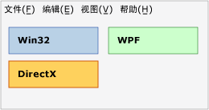
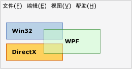
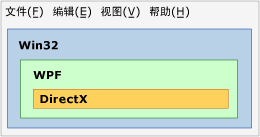
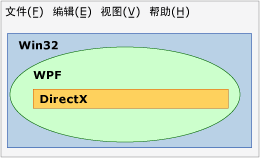

# 技术区概述
如果在应用程序中使用多种表示技术（例如 WPF、Win32 或 DirectX），则这些表示技术必须共享公共顶级窗口中的呈现区域。  本主题介绍可能会影响 WPF 互操作应用程序的表示和输入的问题。  
  
## 区域  
 在顶级窗口内，您可以形成这样的概念：每个包含互操作应用程序的技术之一的 HWND 都有自己的区域（也称为“空域”）。  窗口内的每个像素都只属于一个 HWND，这组成了该 HWND 的区域。  （严格地说，如果有多个 [!INCLUDE[TLA2#tla_winclient](../../../../includes/tla2sharptla-winclient-md.md)] HWND，便会有多个 [!INCLUDE[TLA2#tla_winclient](../../../../includes/tla2sharptla-winclient-md.md)] 区域，但为了便于此讨论，可以假定只有一个区域。）  区域暗含了这样一层含义：尝试在应用程序生存期内呈现于该像素之上的所有层或其他窗口都必须是同一呈现级技术的一部分。  尝试在 [!INCLUDE[TLA2#tla_win32](../../../../includes/tla2sharptla-win32-md.md)] 之上呈现 [!INCLUDE[TLA2#tla_winclient](../../../../includes/tla2sharptla-winclient-md.md)] 像素会导致意外的结果，应当尽量在互操作 [!INCLUDE[TLA2#tla_api#plural](../../../../includes/tla2sharptla-apisharpplural-md.md)] 中禁止。  
  
### 区域示例  
 下图显示一个混合使用 [!INCLUDE[TLA2#tla_win32](../../../../includes/tla2sharptla-win32-md.md)]、[!INCLUDE[TLA2#tla_dx](../../../../includes/tla2sharptla-dx-md.md)] 和 [!INCLUDE[TLA2#tla_winclient](../../../../includes/tla2sharptla-winclient-md.md)] 的应用程序。  每种技术都使用其自己单独的一组非重叠像素，因此没有区域问题。  
  
   
  
 假设此应用程序使用鼠标指针位置来创建尝试在这三个区域中任何一个区域上呈现的动画。  无论动画本身采用哪一种技术，该技术都会与其他两种技术的区域发生冲突。  下图显示了在一个 Win32 区域上呈现 WPF 圆形的尝试。  
  
   
  
 如果您尝试在不同的技术之间使用透明度\/Alpha 混合，则也会发生冲突。  在下图中，[!INCLUDE[TLA2#tla_winclient](../../../../includes/tla2sharptla-winclient-md.md)] 框与 [!INCLUDE[TLA2#tla_win32](../../../../includes/tla2sharptla-win32-md.md)] 和 [!INCLUDE[TLA2#tla_dx](../../../../includes/tla2sharptla-dx-md.md)] 区域发生冲突。  因为该 [!INCLUDE[TLA2#tla_winclient](../../../../includes/tla2sharptla-winclient-md.md)] 框中的像素是半透明的，所以它们必须由 [!INCLUDE[TLA2#tla_dx](../../../../includes/tla2sharptla-dx-md.md)] 和 [!INCLUDE[TLA2#tla_winclient](../../../../includes/tla2sharptla-winclient-md.md)] 联合拥有，但这是不可能的。  因此，这是另一种冲突情况，不能生成。  
  
   
  
 前面三个示例使用矩形区域，但也可以是不同形状。  例如，区域可以具有一个孔。  下图显示了一个带有矩形孔的 [!INCLUDE[TLA2#tla_win32](../../../../includes/tla2sharptla-win32-md.md)] 区域，这是合并的 [!INCLUDE[TLA2#tla_winclient](../../../../includes/tla2sharptla-winclient-md.md)] 和 [!INCLUDE[TLA2#tla_dx](../../../../includes/tla2sharptla-dx-md.md)] 区域的大小。  
  
   
  
 区域也可以根本不是矩形，或者是可通过 [!INCLUDE[TLA2#tla_win32](../../../../includes/tla2sharptla-win32-md.md)] HRGN（区域）描述的任何形状。  
  
   
  
## 透明度和顶级窗口  
 Windows 中的窗口管理器实际上仅处理 [!INCLUDE[TLA2#tla_win32](../../../../includes/tla2sharptla-win32-md.md)] HWND。  因此，每个 [!INCLUDE[TLA2#tla_winclient](../../../../includes/tla2sharptla-winclient-md.md)] <xref:System.Windows.Window> 都是 HWND。  <xref:System.Windows.Window> HWND 必须遵守适用于任何 HWND 的通用规则。  在该 HWND 内，[!INCLUDE[TLA2#tla_winclient](../../../../includes/tla2sharptla-winclient-md.md)] 代码可以执行整个 [!INCLUDE[TLA2#tla_winclient](../../../../includes/tla2sharptla-winclient-md.md)] [!INCLUDE[TLA2#tla_api#plural](../../../../includes/tla2sharptla-apisharpplural-md.md)] 支持的任何操作。  但是，对于与桌面上的其他 HWND 的交互，[!INCLUDE[TLA2#tla_winclient](../../../../includes/tla2sharptla-winclient-md.md)] 必须遵守 [!INCLUDE[TLA2#tla_win32](../../../../includes/tla2sharptla-win32-md.md)] 处理和呈现规则。  [!INCLUDE[TLA2#tla_winclient](../../../../includes/tla2sharptla-winclient-md.md)] 通过使用 [!INCLUDE[TLA2#tla_win32](../../../../includes/tla2sharptla-win32-md.md)] [!INCLUDE[TLA2#tla_api#plural](../../../../includes/tla2sharptla-apisharpplural-md.md)] 来支持非矩形窗口，HRGN 用于非矩形窗口，分层窗口用于每个像素的 Alpha。  
  
 不支持常量 Alpha 和颜色键。  [!INCLUDE[TLA2#tla_win32](../../../../includes/tla2sharptla-win32-md.md)] 分层窗口的功能因平台而异。  
  
 分层窗口可以通过指定要应用于窗口中的每个像素的 Alpha 值来使整个窗口半透明。  （[!INCLUDE[TLA2#tla_win32](../../../../includes/tla2sharptla-win32-md.md)] 实际上支持每个像素的 Alpha，但这在实际的程序中很难使用，因为在此模式下您需要自己绘制任何子 HWND，包括对话框和下拉菜单）。  
  
 [!INCLUDE[TLA2#tla_winclient](../../../../includes/tla2sharptla-winclient-md.md)] 支持 HRGN；但是，对于此功能，没有相应的托管 [!INCLUDE[TLA2#tla_api#plural](../../../../includes/tla2sharptla-apisharpplural-md.md)]。  您可以使用平台调用和 <xref:System.Windows.Interop.HwndSource> 来调用相关的 [!INCLUDE[TLA2#tla_win32](../../../../includes/tla2sharptla-win32-md.md)] [!INCLUDE[TLA2#tla_api#plural](../../../../includes/tla2sharptla-apisharpplural-md.md)]。  有关更多信息，请参见[从托管代码调用本机函数](../Topic/Calling%20Native%20Functions%20from%20Managed%20Code.md)。  
  
 [!INCLUDE[TLA2#tla_winclient](../../../../includes/tla2sharptla-winclient-md.md)] 分层窗口在不同操作系统上具有不同的功能。  这是因为 [!INCLUDE[TLA2#tla_winclient](../../../../includes/tla2sharptla-winclient-md.md)] 使用 [!INCLUDE[TLA2#tla_dx](../../../../includes/tla2sharptla-dx-md.md)] 进行呈现，而分层窗口主要是针对 [!INCLUDE[TLA2#tla_gdi](../../../../includes/tla2sharptla-gdi-md.md)] 呈现（而不是 [!INCLUDE[TLA2#tla_dx](../../../../includes/tla2sharptla-dx-md.md)] 呈现）设计的。  
  
-   [!INCLUDE[TLA2#tla_winclient](../../../../includes/tla2sharptla-winclient-md.md)] 支持 [!INCLUDE[TLA#tla_longhorn](../../../../includes/tlasharptla-longhorn-md.md)] 及更高版本上的硬件加速分层窗口。  [!INCLUDE[TLA2#tla_winxp](../../../../includes/tla2sharptla-winxp-md.md)] 上的硬件加速分层窗口需要来自 [!INCLUDE[TLA#tla_dx](../../../../includes/tlasharptla-dx-md.md)] 的支持，因此功能将依赖于该计算机上的 [!INCLUDE[TLA#tla_dx](../../../../includes/tlasharptla-dx-md.md)] 版本。  
  
-   [!INCLUDE[TLA2#tla_winclient](../../../../includes/tla2sharptla-winclient-md.md)] 不支持透明度颜色键，因为 [!INCLUDE[TLA2#tla_winclient](../../../../includes/tla2sharptla-winclient-md.md)] 无法保证准确地呈现您所请求的颜色，尤其在呈现采用了硬件加速时，更有可能产生颜色偏离。  
  
-   如果应用程序在 [!INCLUDE[TLA2#tla_winxp](../../../../includes/tla2sharptla-winxp-md.md)] 上运行，则 [!INCLUDE[TLA2#tla_dx](../../../../includes/tla2sharptla-dx-md.md)] 图面之上的分层窗口会在 [!INCLUDE[TLA2#tla_dx](../../../../includes/tla2sharptla-dx-md.md)] 应用程序呈现时闪烁。  （实际的呈现序列是 [!INCLUDE[TLA#tla_gdi](../../../../includes/tlasharptla-gdi-md.md)] 隐藏分层窗口，然后 [!INCLUDE[TLA2#tla_dx](../../../../includes/tla2sharptla-dx-md.md)] 进行绘制，之后 [!INCLUDE[TLA#tla_gdi](../../../../includes/tlasharptla-gdi-md.md)] 再重新显示分层窗口。）  非 [!INCLUDE[TLA2#tla_winclient](../../../../includes/tla2sharptla-winclient-md.md)] 分层窗口也有此限制。  
  
## 请参阅  
 [WPF 和 Win32 互操作](../../../../docs/framework/wpf/advanced/wpf-and-win32-interoperation.md)   
 [演练：在 Win32 中承载 WPF 时钟](../../../../docs/framework/wpf/advanced/walkthrough-hosting-a-wpf-clock-in-win32.md)   
 [在 WPF 中承载 Win32 内容](../../../../docs/framework/wpf/advanced/hosting-win32-content-in-wpf.md)