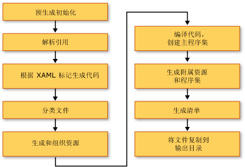

# 生成 WPF 应用程序 (WPF)
可以将 [!INCLUDE[TLA#tla_wpf](../../../../includes/tlasharptla-wpf-md.md)] 应用程序生成为 [!INCLUDE[dnprdnshort](../../../../includes/dnprdnshort-md.md)] 可执行文件 \(.exe\)、库 \(.dll\) 或这两种类型的程序集的组合。  本主题介绍如何生成 [!INCLUDE[TLA2#tla_wpf](../../../../includes/tla2sharptla-wpf-md.md)] 应用程序，并介绍生成过程的关键步骤。  
  
   
  
<a name="Building_a_WPF_Application_using_Command_Line"></a>   
## 生成 WPF 应用程序  
 可以通过以下方式编译 WPF 应用程序：  
  
-   命令行。  应用程序必须只包含代码（不是 XAML）和应用程序定义文件。  有关更多信息，请参见[在命令行上使用 csc.exe 生成](../../../../ocs/csharp/language-reference/compiler-options/command-line-building-with-csc-exe.md)或[从命令行生成 \(Visual Basic\)](../Topic/Building%20from%20the%20Command%20Line%20\(Visual%20Basic\).md)。  
  
-   Microsoft Build Engine \(MSBuild\)。  除代码和 XAML 文件之外，应用程序还必须包含 MSBuild 项目文件。  有关更多信息，请参见 [MSBuild](../Topic/MSBuild1.md)。  
  
-   Visual Studio。  Visual Studio 是一个集成开发环境，可以通过 MSBuild 来编译 WPF 应用程序，并包含用于创建 UI 的可视化设计器。  有关更多信息，请参见 [Visual Studio 中的应用程序开发](http://msdn.microsoft.com/zh-cn/97490c1b-a247-41fb-8f2c-bc4c201eff68)和 [WPF 设计器](http://msdn.microsoft.com/zh-cn/c6c65214-8411-4e16-b254-163ed4099c26)。  
  
<a name="The_Windows_Presentation_Foundation_Build_Pipeline"></a>   
## WPF 生成管道  
 生成 [!INCLUDE[TLA2#tla_wpf](../../../../includes/tla2sharptla-wpf-md.md)] 项目时，将调用特定于语言的目标和特定于 [!INCLUDE[TLA2#tla_wpf](../../../../includes/tla2sharptla-wpf-md.md)] 的目标的组合。  执行这些目标的过程称为生成管线，下图阐释了其主要步骤。  
  
   
  
<a name="Pre_Build_Initializations"></a>   
### 预生成初始化  
 进行生成之前，[!INCLUDE[TLA2#tla_msbuild](../../../../includes/tla2sharptla-msbuild-md.md)] 会确定重要工具和库的位置，其中包括：  
  
-   [!INCLUDE[TLA2#tla_winfx](../../../../includes/tla2sharptla-winfx-md.md)]。  
  
-   [!INCLUDE[TLA2#tla_wcsdk](../../../../includes/tla2sharptla-wcsdk-md.md)] 目录。  
  
-   [!INCLUDE[TLA2#tla_wpf](../../../../includes/tla2sharptla-wpf-md.md)] 引用程序集的位置。  
  
-   程序集搜索路径的属性。  
  
 [!INCLUDE[TLA2#tla_msbuild](../../../../includes/tla2sharptla-msbuild-md.md)] 搜索程序集的第一个位置是引用程序集目录 \(%ProgramFiles%\\Reference Assemblies\\Microsoft\\Framework\\v3.0\\\)。  在执行此步骤的过程中，生成过程还初始化各种属性和项组，并且执行任何必要的清理工作。  
  
<a name="Resolving_references"></a>   
### 解析引用  
 生成过程定位并绑定生成应用程序项目所需的程序集。  此逻辑包含在 `ResolveAssemblyReference` 任务中。  在项目文件中声明为 `Reference` 的所有程序集都被提供给该任务，同时提供给该任务的还有关于搜索路径的信息以及系统上已经安装的程序集中的元数据。  该任务查找程序集，并且使用已安装的程序集的元数据来筛选掉那些无需显示在输出清单中的核心 [!INCLUDE[TLA2#tla_wpf](../../../../includes/tla2sharptla-wpf-md.md)] 程序集。  这样做的目的是避免在 ClickOnce 清单中出现多余的信息。  例如，因为可以将 PresentationFramework.dll 视为在 [!INCLUDE[TLA2#tla_wpf](../../../../includes/tla2sharptla-wpf-md.md)] 上为其生成的应用程序的代表性程序集，而且因为所有 [!INCLUDE[TLA2#tla_wpf](../../../../includes/tla2sharptla-wpf-md.md)] 程序集在每台安装了 [!INCLUDE[TLA2#tla_winfx](../../../../includes/tla2sharptla-winfx-md.md)] 的计算机上都存在于同一位置，所以无需在清单中包含有关所有 [!INCLUDE[TLA2#tla_winfx](../../../../includes/tla2sharptla-winfx-md.md)] 引用程序集的所有信息。  
  
<a name="Markup_Compilation___Pass_1"></a>   
### 标记编译 — 第 1 趟  
 在此步骤中，将分析和编译 [!INCLUDE[TLA2#tla_xaml](../../../../includes/tla2sharptla-xaml-md.md)] 文件，以使运行时无需花费时间来分析 [!INCLUDE[TLA2#tla_xml](../../../../includes/tla2sharptla-xml-md.md)] 和验证属性值。  编译后的 [!INCLUDE[TLA2#tla_xaml](../../../../includes/tla2sharptla-xaml-md.md)] 文件被预先标记化，以便在运行时能够以比加载 [!INCLUDE[TLA2#tla_xaml](../../../../includes/tla2sharptla-xaml-md.md)] 文件快得多的速度加载它。  
  
 在执行此步骤的过程中，对于每个作为 `Page` 生成项的 [!INCLUDE[TLA2#tla_xaml](../../../../includes/tla2sharptla-xaml-md.md)] 文件，都将发生下列活动：  
  
1.  标记编译器对 [!INCLUDE[TLA2#tla_xaml](../../../../includes/tla2sharptla-xaml-md.md)] 文件进行分析。  
  
2.  为该 [!INCLUDE[TLA2#tla_xaml](../../../../includes/tla2sharptla-xaml-md.md)] 创建编译表示形式并将其复制到 obj\\Release 文件夹。  
  
3.  创建新的分部类的 CodeDOM 表示形式并将其复制到 obj\\Release 文件夹。  
  
 此外，为每个 [!INCLUDE[TLA2#tla_xaml](../../../../includes/tla2sharptla-xaml-md.md)] 文件生成特定于语言的代码文件。例如，为 [!INCLUDE[TLA2#tla_visualb](../../../../includes/tla2sharptla-visualb-md.md)] 项目中的 Page1.xaml 页生成 Page1.g.vb；为 [!INCLUDE[TLA2#tla_cshrp](../../../../includes/tla2sharptla-cshrp-md.md)] 项目中的 Page1.xaml 页生成 Page1.g.cs。  文件名中的“.g”指示该文件是生成的代码，其中包含标记文件的顶级元素（例如，`Page` 或 `Window`）的分部类声明。  该类使用 [!INCLUDE[TLA2#tla_cshrp](../../../../includes/tla2sharptla-cshrp-md.md)] 中的 `partial` 修饰符（或 [!INCLUDE[TLA2#tla_visualb](../../../../includes/tla2sharptla-visualb-md.md)] 中的 `Extends` 修饰符）进行声明，以指示在其他位置（通常是在代码隐藏文件 Page1.xaml.cs 中）存在该类的另一个声明。  
  
 该分部类从适当的基类（例如页的 <xref:System.Windows.Controls.Page>）进行扩展，并且实现 <xref:System.Windows.Markup.IComponentConnector?displayProperty=fullName> 接口。  <xref:System.Windows.Markup.IComponentConnector> 接口具有相应的方法，可用来初始化组件以及连接其内容中的元素上的名称和事件。  因此，生成的代码文件具有如下所示的方法实现：  
  
```csharp  
public void InitializeComponent() {  
    if (_contentLoaded) {  
        return;  
    }  
    _contentLoaded = true;  
    System.Uri resourceLocater =   
        new System.Uri(  
            "window1.xaml",   
            System.UriKind.RelativeOrAbsolute);  
    System.Windows.Application.LoadComponent(this, resourceLocater);  
}  
```  
  
```vb  
Public Sub InitializeComponent() _  
  
    If _contentLoaded Then  
        Return  
    End If  
  
    _contentLoaded = True  
    Dim resourceLocater As System.Uri = _  
        New System.Uri("mainwindow.xaml", System.UriKind.Relative)  
  
    System.Windows.Application.LoadComponent(Me, resourceLocater)  
  
End Sub  
```  
  
 默认情况下，标记编译在与 [!INCLUDE[TLA2#tla_msbuild](../../../../includes/tla2sharptla-msbuild-md.md)] 引擎相同的 <xref:System.AppDomain> 中运行。  这样可以显著提高性能。  可以使用 `AlwaysCompileMarkupFilesInSeparateDomain` 属性切换此行为。  其优点是可以通过卸载单独的 <xref:System.AppDomain> 来卸载所有引用程序集。  
  
<a name="Pass_2_of_Markup_Compilation"></a>   
### 标记编译 — 第 2 趟  
 并非所有 [!INCLUDE[TLA2#tla_xaml](../../../../includes/tla2sharptla-xaml-md.md)] 页都在标记编译的第 1 轮即进行编译。  包含本地定义类型引用（引用同一项目中其他位置的代码中定义的类型）的 [!INCLUDE[TLA2#tla_xaml](../../../../includes/tla2sharptla-xaml-md.md)] 文件此时将免于编译。  这是因为这些本地定义的类型仅存在于源中，并且尚未进行编译。  分析器使用试探法来确定这一点，这需要在标记文件中查找 `x:Name` 之类的项。  如果找到这样的实例，则标记文件的编译将推迟至代码文件编译之后完成，此时，第二趟标记编译将处理这些文件。  
  
<a name="File_Classification"></a>   
### 文件分类  
 生成过程根据用于存放输出文件的应用程序集的不同，将这些文件放入不同的资源组中。  在典型的非本地化应用程序中，所有被标记为 `Resource` 的数据文件都放置在主程序集（可执行文件或库）中。  如果在项目中设置了 `UICulture`，则所有经过编译的 [!INCLUDE[TLA2#tla_xaml](../../../../includes/tla2sharptla-xaml-md.md)] 文件以及那些被专门标记为特定于语言的资源都放在附属资源程序集中。  此外，所有非特定语言的资源都放在主程序集中。  在生成过程的这一步骤中，将做出这一决定。  
  
 项目文件中的 `ApplicationDefinition`、`Page` 和 `Resource` 生成操作可以使用 `Localizable` 元数据（可接受的值为 `true` 和 `false`）进行扩充，此元数据指示该文件是特定于语言的还是非特定语言的。  
  
<a name="Core_Compilation"></a>   
### 核心编译  
 核心编译步骤包括代码文件的编译。  这是在特定于语言的目标文件 Microsoft.CSharp.targets 和 Microsoft.VisualBasic.targets 中的逻辑协调下进行的。  如果试探法确定标记编译器运行一趟就足够了，则生成主程序集。  但是，如果项目中的一个或多个 [!INCLUDE[TLA2#tla_xaml](../../../../includes/tla2sharptla-xaml-md.md)] 文件具有对本地定义类型的引用，则生成一个临时 .dll 文件，以便可以在第二趟标记编译完成之后创建最终的应用程序集。  
  
<a name="Manifest_generation"></a>   
### 清单生成  
 在生成过程的末尾，当所有应用程序集和内容文件都准备好之后，将生成应用程序的 [!INCLUDE[TLA2#tla_clickonce](../../../../includes/tla2sharptla-clickonce-md.md)] 清单。  
  
 部署清单文件描述部署模型：当前版本、更新行为、发行者标识以及数字签名。  此清单应该由处理部署的管理员创作。  对于 [!INCLUDE[TLA#tla_xbap#plural](../../../../includes/tlasharptla-xbapsharpplural-md.md)]，文件扩展名为 .xbap；对于安装的应用程序，文件扩展名为 .application。  前者由 `HostInBrowser` 项目属性指示，因此，清单将应用程序标识为浏览器承载的应用程序。  
  
 应用程序清单（.exe.manifest 文件）描述应用程序集和依赖库，并列出应用程序所需的权限。  此文件应该由应用程序开发人员创作。  为了启动 [!INCLUDE[TLA2#tla_clickonce](../../../../includes/tla2sharptla-clickonce-md.md)] 应用程序，用户应该打开应用程序的部署清单文件。  
  
 对于 [!INCLUDE[TLA2#tla_xbap#plural](../../../../includes/tla2sharptla-xbapsharpplural-md.md)]，始终会创建这些清单文件。  对于安装的应用程序，除非在项目文件中使用值 `true` 指定 `GenerateManifests` 属性，否则不会创建它们。  
  
 除了分配给典型的 Internet 区域应用程序的那些权限以外，[!INCLUDE[TLA2#tla_xbap#plural](../../../../includes/tla2sharptla-xbapsharpplural-md.md)] 还获得了两项额外的权限：<xref:System.Security.Permissions.WebBrowserPermission> 和 <xref:System.Security.Permissions.MediaPermission>。  [!INCLUDE[TLA2#tla_wpf](../../../../includes/tla2sharptla-wpf-md.md)] 生成系统在应用程序清单中声明这些权限。  
  
<a name="Incremental_Build_Support"></a>   
## 增量生成支持  
 [!INCLUDE[TLA2#tla_wpf](../../../../includes/tla2sharptla-wpf-md.md)] 生成系统为增量生成提供了支持。  它相当智能地检测对标记或代码所做的更改，并且仅编辑那些受到更改影响的项目。  增量生成机制使用下列文件：  
  
-   一个 $\(*程序集名称*\)\_MarkupCompiler.Cache 文件，用于保持当前编译器状态。  
  
-   一个 $\(*程序集名称*\)\_MarkupCompiler.lref 文件，用于缓存包含对本地定义类型的引用的 [!INCLUDE[TLA2#tla_xaml](../../../../includes/tla2sharptla-xaml-md.md)] 文件。  
  
 下面是一组对增量生成进行管理的规则：  
  
-   文件是生成系统检测是否存在更改的最小单位。  因此，对于代码文件而言，生成系统无法断定是否更改了某个类型或是否添加了代码。  对于项目文件而言，同样如此。  
  
-   增量生成机制必须知道 [!INCLUDE[TLA2#tla_xaml](../../../../includes/tla2sharptla-xaml-md.md)] 页定义了类还是使用其他类。  
  
-   如果 `Reference` 项更改，则重新编译所有页。  
  
-   如果代码文件更改，则重新编译所有包含本地定义类型引用的页。  
  
-   如果 [!INCLUDE[TLA2#tla_xaml](../../../../includes/tla2sharptla-xaml-md.md)] 文件更改，则：  
  
    -   如果 [!INCLUDE[TLA2#tla_xaml](../../../../includes/tla2sharptla-xaml-md.md)] 在项目中声明为 `Page`，则：如果 [!INCLUDE[TLA2#tla_xaml](../../../../includes/tla2sharptla-xaml-md.md)] 不包含本地定义类型引用，则重新编译该 [!INCLUDE[TLA2#tla_xaml](../../../../includes/tla2sharptla-xaml-md.md)] 以及所有包含本地引用的 [!INCLUDE[TLA2#tla_xaml](../../../../includes/tla2sharptla-xaml-md.md)] 页；如果 [!INCLUDE[TLA2#tla_xaml](../../../../includes/tla2sharptla-xaml-md.md)] 包含本地引用，则重新编译所有包含本地引用的 [!INCLUDE[TLA2#tla_xaml](../../../../includes/tla2sharptla-xaml-md.md)] 页。  
  
    -   如果 [!INCLUDE[TLA2#tla_xaml](../../../../includes/tla2sharptla-xaml-md.md)] 在项目中声明为 `ApplicationDefinition`，则：重新编译所有 [!INCLUDE[TLA2#tla_xaml](../../../../includes/tla2sharptla-xaml-md.md)] 页（原因：每个 [!INCLUDE[TLA2#tla_xaml](../../../../includes/tla2sharptla-xaml-md.md)] 都包含对可能已经更改的 <xref:System.Windows.Application> 类型的引用）。  
  
-   如果项目文件将代码文件声明为应用程序定义而不是 [!INCLUDE[TLA2#tla_xaml](../../../../includes/tla2sharptla-xaml-md.md)] 文件，则：  
  
    -   检查项目文件中的 `ApplicationClassName` 值是否已经更改（是否存在新的应用程序类型？）。  如果该值已更改，则重新编译整个应用程序。  
  
    -   否则，重新编译所有包含本地引用的 [!INCLUDE[TLA2#tla_xaml](../../../../includes/tla2sharptla-xaml-md.md)] 页。  
  
-   如果项目文件已更改，则：应用前面的所有规则，了解哪些内容需要重新编译。  对下列属性所做的更改将触发彻底的重新编译操作：`AssemblyName`、`IntermediateOutputPath`、`RootNamespace` 和 `HostInBrowser`。  
  
 下列重新编译方案可能适用：  
  
-   重新编译整个应用程序。  
  
-   仅重新编译那些包含本地定义类型引用的 [!INCLUDE[TLA2#tla_xaml](../../../../includes/tla2sharptla-xaml-md.md)] 文件。  
  
-   不重新编译任何内容（如果项目中没有任何内容发生更改）。  
  
## 请参阅  
 [部署 WPF 应用程序](../../../../docs/framework/wpf/app-development/deploying-a-wpf-application-wpf.md)   
 [WPF MSBuild 参考](../Topic/WPF%20MSBuild%20Reference.md)   
 [WPF 中的 Pack URI](../../../../docs/framework/wpf/app-development/pack-uris-in-wpf.md)   
 [WPF 应用程序资源、内容和数据文件](../../../../docs/framework/wpf/app-development/wpf-application-resource-content-and-data-files.md)