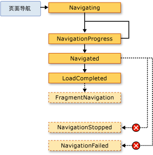
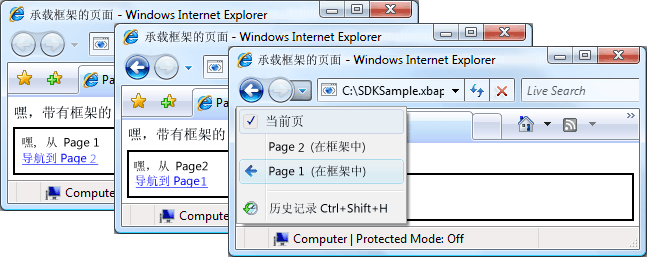
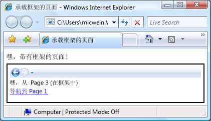
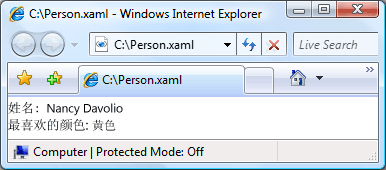

# 导航概述
[!INCLUDE[TLA#tla_wpf](../../../../includes/tlasharptla-wpf-md.md)] 支持可用于两种类型应用程序的浏览器样式的导航功能：独立应用程序和 [!INCLUDE[TLA#tla_xbap#plural](../../../../includes/tlasharptla-xbapsharpplural-md.md)]。为了将用于导航的内容打包，[!INCLUDE[TLA2#tla_wpf](../../../../includes/tla2sharptla-wpf-md.md)] 提供了 <xref:System.Windows.Controls.Page> 类。  可以通过使用 <xref:System.Windows.Documents.Hyperlink> 以声明方式或通过使用 <xref:System.Windows.Navigation.NavigationService> 以编程方式从一个 <xref:System.Windows.Controls.Page> 导航到另一个。[!INCLUDE[TLA2#tla_wpf](../../../../includes/tla2sharptla-wpf-md.md)] 使用日志记忆已从其进行导航的页面以及导航回到这些页面。  
  
 <xref:System.Windows.Controls.Page>、<xref:System.Windows.Documents.Hyperlink>、<xref:System.Windows.Navigation.NavigationService> 和日记构成了 [!INCLUDE[TLA2#tla_wpf](../../../../includes/tla2sharptla-wpf-md.md)] 所提供的导航支持的核心。  在介绍高级导航支持（包括导航到宽松 [!INCLUDE[TLA#tla_xaml](../../../../includes/tlasharptla-xaml-md.md)] 文件、[!INCLUDE[TLA#tla_html](../../../../includes/tlasharptla-html-md.md)] 文件和对象）之前，本概述先详细讨论上面提到的这些功能。  
  
> [!NOTE]
>  在本主题中，术语“浏览器”仅指可承载 [!INCLUDE[TLA2#tla_wpf](../../../../includes/tla2sharptla-wpf-md.md)] 应用程序的浏览器，当前包括 [!INCLUDE[TLA#tla_ie](../../../../includes/tlasharptla-ie-md.md)] 和 Firefox。  在特定 [!INCLUDE[TLA2#tla_wpf](../../../../includes/tla2sharptla-wpf-md.md)] 功能仅由特定浏览器支持的场合下，将说明浏览器的版本。  
  
   
  
   
## WPF 应用程序中的导航  
 本主题提供 [!INCLUDE[TLA2#tla_wpf](../../../../includes/tla2sharptla-wpf-md.md)] 中的关键导航功能的概述。  虽然在本主题中，这些功能是以 [!INCLUDE[TLA2#tla_xbap](../../../../includes/tla2sharptla-xbap-md.md)] 为例介绍的，但它们既可用于 [!INCLUDE[TLA2#tla_xbap#plural](../../../../includes/tla2sharptla-xbapsharpplural-md.md)]，也可用于独立应用程序。  
  
> [!NOTE]
>  本主题不讨论如何生成和部署 [!INCLUDE[TLA2#tla_xbap#plural](../../../../includes/tla2sharptla-xbapsharpplural-md.md)]。  有关 [!INCLUDE[TLA2#tla_xbap#plural](../../../../includes/tla2sharptla-xbapsharpplural-md.md)] 的更多信息，请参见 [WPF XAML 浏览器应用程序概述](../../../../docs/framework/wpf/app-development/wpf-xaml-browser-applications-overview.md)。  
  
 本节说明并演示导航的以下方面：  
  
-   [实现页](#CreatingAXAMLPage)  
  
-   [配置起始页](#Configuring_a_Start_Page)  
  
-   [配置宿主窗口的标题、宽度和高度](#ConfiguringAXAMLPage)  
  
-   [超链接导航](#NavigatingBetweenXAMLPages)  
  
-   [片段导航](#FragmentNavigation)  
  
-   [导航服务](#NavigationService)  
  
-   [利用导航服务的编程导航](#Programmatic_Navigation_with_the_Navigation_Service)  
  
-   [导航生存期](#Navigation_Lifetime)  
  
-   [利用日记记住导航](#NavigationHistory)  
  
-   [页生存期和日记](#PageLifetime)  
  
-   [利用导航历史记录保留内容状态](#RetainingContentStateWithNavigationHistory)  
  
-   [Cookie](#Cookies)  
  
-   [结构化导航](#Structured_Navigation)  
  
   
### 实现页  
 在 [!INCLUDE[TLA2#tla_wpf](../../../../includes/tla2sharptla-wpf-md.md)] 中，可以导航到多种内容，包括 [!INCLUDE[TLA2#tla_winfx](../../../../includes/tla2sharptla-winfx-md.md)] 对象、自定义对象、枚举值、用户控件、[!INCLUDE[TLA2#tla_xaml](../../../../includes/tla2sharptla-xaml-md.md)] 文件和 [!INCLUDE[TLA#tla_html](../../../../includes/tlasharptla-html-md.md)] 文件。  但是，打包内容的最常用和最方便的方式还是使用 <xref:System.Windows.Controls.Page>。  另外，<xref:System.Windows.Controls.Page> 还实现了特定于导航的功能，以增强其外观并简化开发过程。  
  
 利用 <xref:System.Windows.Controls.Page>，可以使用类似于下面的标记来以声明方式实现 [!INCLUDE[TLA2#tla_xaml](../../../../includes/tla2sharptla-xaml-md.md)] 内容的可导航页。  
  
 [!code-xml[NavigationOverviewSnippets#Page1XAML](../../../../samples/snippets/csharp/VS_Snippets_Wpf/NavigationOverviewSnippets/CSharp/Page1.xaml#page1xaml)]  
  
 在 [!INCLUDE[TLA2#tla_xaml](../../../../includes/tla2sharptla-xaml-md.md)] 标记中实现的 <xref:System.Windows.Controls.Page> 将 `Page` 作为其根元素，并且需要 [!INCLUDE[TLA2#tla_wpf](../../../../includes/tla2sharptla-wpf-md.md)] [!INCLUDE[TLA#tla_xml](../../../../includes/tlasharptla-xml-md.md)] 命名空间声明。  `Page` 元素包含要导航到并显示的内容。  通过设置 `Page.Content` 属性元素可以添加内容，如下面的标记所示。  
  
 [!code-xml[NavigationOverviewSnippets#Page2XAML](../../../../samples/snippets/csharp/VS_Snippets_Wpf/NavigationOverviewSnippets/CSharp/Page2.xaml#page2xaml)]  
  
 `Page.Content` 只能包含一个子元素；在前面的示例中，内容为单个字符串“Hello, Page\!”。实际上，通常使用布局控件作为子元素（请参见[布局](../../../../docs/framework/wpf/advanced/layout.md)）来包含和创作内容。  
  
 `Page` 元素的子元素视作 <xref:System.Windows.Controls.Page> 的内容，因此，不需要使用显式 `Page.Content` 声明。  下面是与上例等效的声明性标记。  
  
 [!code-xml[NavigationOverviewSnippets#Page3XAML](../../../../samples/snippets/csharp/VS_Snippets_Wpf/NavigationOverviewSnippets/CSharp/Page3.xaml#page3xaml)]  
  
 此例中，以 `Page` 元素的子元素自动设置了 `Page.Content`。  有关更多信息，请参见 [WPF 内容模型](../../../../docs/framework/wpf/controls/wpf-content-model.md)。  
  
 纯标记 <xref:System.Windows.Controls.Page> 对于显示内容很有用。  但是，<xref:System.Windows.Controls.Page> 也可显示允许用户与页进行交互的控件，它还可通过处理事件和调用应用程序逻辑来响应用户交互。  交互式 <xref:System.Windows.Controls.Page> 是使用标记和代码隐藏的组合实现的，如下面的示例所示。  
  
 [!code-xml[XBAPAppDefSnippets#HomePageMARKUP](../../../../samples/snippets/csharp/VS_Snippets_Wpf/XBAPAppDefSnippets/CSharp/HomePage.xaml#homepagemarkup)]  
  
 [!code-csharp[XBAPAppDefSnippets#HomePageCODEBEHIND](../../../../samples/snippets/csharp/VS_Snippets_Wpf/XBAPAppDefSnippets/CSharp/HomePage.xaml.cs#homepagecodebehind)]
 [!code-vb[XBAPAppDefSnippets#HomePageCODEBEHIND](../../../../samples/snippets/visualbasic/VS_Snippets_Wpf/XBAPAppDefSnippets/VisualBasic/HomePage.xaml.vb#homepagecodebehind)]  
  
 为了使标记文件和代码隐藏文件配合工作，需要以下配置：  
  
-   在标记中，`Page` 元素必须包含 `x:Class` 特性。  生成应用程序时，标记文件中如果存在 `x:Class`，则 [!INCLUDE[TLA#tla_msbuild](../../../../includes/tlasharptla-msbuild-md.md)] 将创建一个从 <xref:System.Windows.Controls.Page> 派生的 `partial` 类，并且该类的名称是由 `x:Class` 特性指定的。  这要求添加 [!INCLUDE[TLA2#tla_xaml](../../../../includes/tla2sharptla-xaml-md.md)] 架构的 [!INCLUDE[TLA2#tla_xml](../../../../includes/tla2sharptla-xml-md.md)] 命名空间声明 \(`xmlns:x="http://schemas.microsoft.com/winfx/2006/xaml"`\)。  生成的 `partial` 类实现 `InitializeComponent`，调用该方法可注册事件并设置在标记中实现的属性。  
  
-   在代码隐藏中，该类必须是 `partial` 类，必须具有标记中的 `x:Class` 特性所指定的名称，且必须派生自 <xref:System.Windows.Controls.Page>。  这样，代码隐藏文件就与应用程序生成时为标记文件生成的 `partial` 类相关联（请参见[生成 WPF 应用程序](../../../../docs/framework/wpf/app-development/building-a-wpf-application-wpf.md)）。  
  
-   在代码隐藏中，<xref:System.Windows.Controls.Page> 类必须实现调用 `InitializeComponent` 方法的构造函数。  标记文件的已生成的 `partial` 类实现 `InitializeComponent`，以便注册事件和设置在标记中定义的属性。  
  
> [!NOTE]
>  在使用 [!INCLUDE[TLA#tla_visualstu](../../../../includes/tlasharptla-visualstu-md.md)] 将新的 <xref:System.Windows.Controls.Page> 添加到项目时，<xref:System.Windows.Controls.Page> 是同时使用标记和代码隐藏实现的，它包含必要的配置来创建此处所述的标记文件和代码隐藏文件之间的关联。  
  
 只要有 <xref:System.Windows.Controls.Page>，就可以导航到该页。  若要指定应用程序导航到的第一个 <xref:System.Windows.Controls.Page>，需要配置起始 <xref:System.Windows.Controls.Page>。  
  
   
### 配置起始页  
 [!INCLUDE[TLA2#tla_xbap#plural](../../../../includes/tla2sharptla-xbapsharpplural-md.md)] 要求在浏览器中承载一定量的应用程序基础结构。  在 [!INCLUDE[TLA2#tla_wpf](../../../../includes/tla2sharptla-wpf-md.md)] 中，<xref:System.Windows.Application> 类是建立所需应用程序基础结构的应用程序定义的一部分（请参见[应用程序管理概述](../../../../docs/framework/wpf/app-development/application-management-overview.md)）。  
  
 应用程序定义通常是同时使用标记和代码隐藏实现的，其中标记文件配置为 [!INCLUDE[TLA2#tla_msbuild](../../../../includes/tla2sharptla-msbuild-md.md)] `ApplicationDefinition` 项。下面是某个 [!INCLUDE[TLA2#tla_xbap](../../../../includes/tla2sharptla-xbap-md.md)] 的应用程序定义。  
  
 [!code-xml[XBAPAppDefSnippets#XBAPApplicationDefinitionMARKUP](../../../../samples/snippets/csharp/VS_Snippets_Wpf/XBAPAppDefSnippets/CSharp/App.xaml#xbapapplicationdefinitionmarkup)]  
  
 [!code-csharp[XBAPAppDefSnippets#XBAPApplicationDefinitionCODEBEHIND](../../../../samples/snippets/csharp/VS_Snippets_Wpf/XBAPAppDefSnippets/CSharp/App.xaml.cs#xbapapplicationdefinitioncodebehind)]
 [!code-vb[XBAPAppDefSnippets#XBAPApplicationDefinitionCODEBEHIND](../../../../samples/snippets/visualbasic/VS_Snippets_Wpf/XBAPAppDefSnippets/VisualBasic/Application.xaml.vb#xbapapplicationdefinitioncodebehind)]  
  
 [!INCLUDE[TLA2#tla_xbap](../../../../includes/tla2sharptla-xbap-md.md)] 可使用其应用程序定义指定起始 <xref:System.Windows.Controls.Page>（它是启动 [!INCLUDE[TLA2#tla_xbap](../../../../includes/tla2sharptla-xbap-md.md)] 时自动加载的 <xref:System.Windows.Controls.Page>）。  指定方法是将 <xref:System.Windows.Application.StartupUri%2A> 属性设置为所需的 <xref:System.Windows.Controls.Page> 的 [!INCLUDE[TLA#tla_uri](../../../../includes/tlasharptla-uri-md.md)]。  
  
> [!NOTE]
>  大多数情况下，<xref:System.Windows.Controls.Page> 都编译到应用程序中，或者与应用程序一起部署。  在这些情况下，标识 <xref:System.Windows.Controls.Page> 的 [!INCLUDE[TLA2#tla_uri](../../../../includes/tla2sharptla-uri-md.md)] 为 pack [!INCLUDE[TLA2#tla_uri](../../../../includes/tla2sharptla-uri-md.md)]，这是符合 pack 方案的 [!INCLUDE[TLA2#tla_uri](../../../../includes/tla2sharptla-uri-md.md)]。  Pack [!INCLUDE[TLA2#tla_uri#plural](../../../../includes/tla2sharptla-urisharpplural-md.md)] 将在 [WPF 中的 Pack URI](../../../../docs/framework/wpf/app-development/pack-uris-in-wpf.md) 中进一步讨论。此外，还可以使用 http 方案导航到内容，下面将讨论这个问题。  
  
 可以在标记中以声明方式设置 <xref:System.Windows.Application.StartupUri%2A>，如下面的示例所示。  
  
 [!code-xml[NavigationOverviewSnippets#XBAPApplicationDefinitionMARKUP](../../../../samples/snippets/csharp/VS_Snippets_Wpf/NavigationOverviewSnippets/CSharp/App.xaml#xbapapplicationdefinitionmarkup)]  
  
 此例中，`StartupUri` 特性设置为标识 HomePage.xaml 的相对 pack [!INCLUDE[TLA2#tla_uri](../../../../includes/tla2sharptla-uri-md.md)]。  当 [!INCLUDE[TLA2#tla_xbap](../../../../includes/tla2sharptla-xbap-md.md)] 启动时，将自动导航到 HomePage.xaml 并显示该文件。  下图演示了这一点，图中显示从 Web 服务器启动的一个 [!INCLUDE[TLA2#tla_xbap](../../../../includes/tla2sharptla-xbap-md.md)]。  
  
   
  
> [!NOTE]
>  有关 [!INCLUDE[TLA2#tla_xbap#plural](../../../../includes/tla2sharptla-xbapsharpplural-md.md)] 的开发和部署的更多信息，请参见 [WPF XAML 浏览器应用程序概述](../../../../docs/framework/wpf/app-development/wpf-xaml-browser-applications-overview.md)和[部署 WPF 应用程序](../../../../docs/framework/wpf/app-development/deploying-a-wpf-application-wpf.md)。  
  
   
### 配置宿主窗口的标题、宽度和高度  
 从上图中，您可能已注意到，浏览器和选项卡面板的标题都是 [!INCLUDE[TLA2#tla_xbap](../../../../includes/tla2sharptla-xbap-md.md)] 的 [!INCLUDE[TLA2#tla_uri](../../../../includes/tla2sharptla-uri-md.md)]。  除了冗长之外，该标题既没有吸引力，又没有什么意义。  因此，<xref:System.Windows.Controls.Page> 提供了一种方法，可以通过设置 <xref:System.Windows.Controls.Page.WindowTitle%2A> 属性来更改标题。  此外，通过设置 <xref:System.Windows.Controls.Page.WindowWidth%2A> 和 <xref:System.Windows.Controls.Page.WindowHeight%2A> 还可以分别设置浏览器窗口的宽度和高度。  
  
 在标记中可以以声明方式设置 <xref:System.Windows.Controls.Page.WindowTitle%2A>、<xref:System.Windows.Controls.Page.WindowWidth%2A> 和 <xref:System.Windows.Controls.Page.WindowHeight%2A>，如下面的示例所示。  
  
 [!code-xml[NavigationOverviewSnippets#HomePageMARKUP](../../../../samples/snippets/csharp/VS_Snippets_Wpf/NavigationOverviewSnippets/CSharp/HomePage.xaml#homepagemarkup)]  
  
 下图演示了结果。  
  
   
  
   
### 超链接导航  
 典型的 [!INCLUDE[TLA2#tla_xbap](../../../../includes/tla2sharptla-xbap-md.md)] 由多个页组成。  从一页导航到另一页最简单的方法是使用 <xref:System.Windows.Documents.Hyperlink>。  通过下面的标记中所示的 `Hyperlink` 元素，可以以声明方式将 <xref:System.Windows.Documents.Hyperlink> 添加到 <xref:System.Windows.Controls.Page>。  
  
 [!code-xml[NavigationOverviewSnippets#HyperlinkXAML1](../../../../samples/snippets/csharp/VS_Snippets_Wpf/NavigationOverviewSnippets/CSharp/PageWithHyperlink.xaml#hyperlinkxaml1)]  
[!code-xml[NavigationOverviewSnippets#HyperlinkXAML2](../../../../samples/snippets/csharp/VS_Snippets_Wpf/NavigationOverviewSnippets/CSharp/PageWithHyperlink.xaml#hyperlinkxaml2)]  
[!code-xml[NavigationOverviewSnippets#HyperlinkXAML3](../../../../samples/snippets/csharp/VS_Snippets_Wpf/NavigationOverviewSnippets/CSharp/PageWithHyperlink.xaml#hyperlinkxaml3)]  
  
 `Hyperlink` 元素需要以下组成部分：  
  
-   要导航到的 <xref:System.Windows.Controls.Page> 的 pack [!INCLUDE[TLA2#tla_uri](../../../../includes/tla2sharptla-uri-md.md)]，它由 `NavigateUri` 特性指定。  
  
-   通过用户单击即可启动导航的内容，如文本和图像（有关 `Hyperlink` 元素可包含的内容，请参见 <xref:System.Windows.Documents.Hyperlink>）。  
  
 下图演示一个 [!INCLUDE[TLA2#tla_xbap](../../../../includes/tla2sharptla-xbap-md.md)]，它有一个含 <xref:System.Windows.Documents.Hyperlink> 的 <xref:System.Windows.Controls.Page>。  
  
   
  
 如您所料，如果单击 <xref:System.Windows.Documents.Hyperlink>，[!INCLUDE[TLA2#tla_xbap](../../../../includes/tla2sharptla-xbap-md.md)] 就会导航到 `NavigateUri` 特性所标识的 <xref:System.Windows.Controls.Page>。  此外，[!INCLUDE[TLA2#tla_xbap](../../../../includes/tla2sharptla-xbap-md.md)] 将表示前一个 <xref:System.Windows.Controls.Page> 的对应条目添加到 [!INCLUDE[TLA2#tla_ie](../../../../includes/tla2sharptla-ie-md.md)] 的“最新网页”列表中。  下图对此进行演示。  
  
   
  
 除了支持从一个 <xref:System.Windows.Controls.Page> 导航到另一页之外，<xref:System.Windows.Documents.Hyperlink> 还支持片段导航。  
  
   
### 片段导航  
 片段导航是导航到当前 <xref:System.Windows.Controls.Page> 或另一个 <xref:System.Windows.Controls.Page> 中的内容片段。  在 [!INCLUDE[TLA2#tla_wpf](../../../../includes/tla2sharptla-wpf-md.md)] 中，内容片段是由命名元素包含的内容。  命名元素是设置了 `Name` 特性的元素。  下面的标记演示一个包含内容片段的命名 `TextBlock` 元素。  
  
 [!code-xml[NavigationOverviewSnippets#PageWithContentFragmentsMARKUP1](../../../../samples/snippets/csharp/VS_Snippets_Wpf/NavigationOverviewSnippets/CSharp/PageWithFragments.xaml#pagewithcontentfragmentsmarkup1)]  
[!code-xml[NavigationOverviewSnippets#PageWithContentFragmentsMARKUP2](../../../../samples/snippets/csharp/VS_Snippets_Wpf/NavigationOverviewSnippets/CSharp/PageWithFragments.xaml#pagewithcontentfragmentsmarkup2)]  
[!code-xml[NavigationOverviewSnippets#PageWithContentFragmentsMARKUP3](../../../../samples/snippets/csharp/VS_Snippets_Wpf/NavigationOverviewSnippets/CSharp/PageWithFragments.xaml#pagewithcontentfragmentsmarkup3)]  
  
 对于可导航到内容片段的 <xref:System.Windows.Documents.Hyperlink>，`NavigateUri` 特性必须包含以下内容：  
  
-   包含要导航到的内容片段的 <xref:System.Windows.Controls.Page> 的 [!INCLUDE[TLA2#tla_uri](../../../../includes/tla2sharptla-uri-md.md)]。  
  
-   一个“\#”字符。  
  
-   <xref:System.Windows.Controls.Page> 中包含内容片段的元素的名称。  
  
 片段 [!INCLUDE[TLA2#tla_uri](../../../../includes/tla2sharptla-uri-md.md)] 的格式如下。  
  
 *页 URI* `#` *元素名称*  
  
 下面演示一个 `Hyperlink` 示例，它配置为导航到内容片段。  
  
 [!code-xml[NavigationOverviewSnippets#PageThatNavigatesXAML1](../../../../samples/snippets/csharp/VS_Snippets_Wpf/NavigationOverviewSnippets/CSharp/PageThatNavigatesToFragment.xaml#pagethatnavigatesxaml1)]  
[!code-xml[NavigationOverviewSnippets#PageThatNavigatesXAML2](../../../../samples/snippets/csharp/VS_Snippets_Wpf/NavigationOverviewSnippets/CSharp/PageThatNavigatesToFragment.xaml#pagethatnavigatesxaml2)]  
[!code-xml[NavigationOverviewSnippets#PageThatNavigatesXAML3](../../../../samples/snippets/csharp/VS_Snippets_Wpf/NavigationOverviewSnippets/CSharp/PageThatNavigatesToFragment.xaml#pagethatnavigatesxaml3)]  
  
> [!NOTE]
>  本节介绍 [!INCLUDE[TLA2#tla_wpf](../../../../includes/tla2sharptla-wpf-md.md)] 中片段导航的默认实现。  [!INCLUDE[TLA2#tla_wpf](../../../../includes/tla2sharptla-wpf-md.md)] 也允许您实现自己的在某种程度上需要处理 <xref:System.Windows.Navigation.NavigationService.FragmentNavigation?displayProperty=fullName> 事件的片段导航方案。  
  
> [!IMPORTANT]
>  只有在松散 [!INCLUDE[TLA2#tla_xaml](../../../../includes/tla2sharptla-xaml-md.md)] 页（以 `Page` 作为根元素的纯标记 [!INCLUDE[TLA2#tla_xaml](../../../../includes/tla2sharptla-xaml-md.md)] 文件）可以通过 [!INCLUDE[TLA2#tla_http](../../../../includes/tla2sharptla-http-md.md)] 浏览时，才能导航到这些页中的片段。  
>   
>  但是，松散 [!INCLUDE[TLA2#tla_xaml](../../../../includes/tla2sharptla-xaml-md.md)] 页可以导航到自己的片段。  
  
   
### 导航服务  
 虽然 <xref:System.Windows.Documents.Hyperlink> 允许用户发起转向特定 <xref:System.Windows.Controls.Page> 的导航，但是定位和下载该页的工作仍由 <xref:System.Windows.Navigation.NavigationService> 类执行。  从根本上说，<xref:System.Windows.Navigation.NavigationService> 提供了代表客户端代码（如 <xref:System.Windows.Documents.Hyperlink>）处理导航请求的功能。  此外，对于跟踪和影响导航请求，<xref:System.Windows.Navigation.NavigationService> 实现了更高级别的支持。  
  
 单击 <xref:System.Windows.Documents.Hyperlink> 时，[!INCLUDE[TLA2#tla_wpf](../../../../includes/tla2sharptla-wpf-md.md)] 将调用 <xref:System.Windows.Navigation.NavigationService.Navigate%2A?displayProperty=fullName> 来定位和下载位于指定 pack [!INCLUDE[TLA2#tla_uri](../../../../includes/tla2sharptla-uri-md.md)] 的 <xref:System.Windows.Controls.Page>。  下载的 <xref:System.Windows.Controls.Page> 将转换为对象树，其根对象为下载的 <xref:System.Windows.Controls.Page> 的实例。  对根 <xref:System.Windows.Controls.Page> 对象的引用存储在 <xref:System.Windows.Navigation.NavigationService.Content%2A?displayProperty=fullName> 属性中。  导航过的内容的 pack [!INCLUDE[TLA2#tla_uri](../../../../includes/tla2sharptla-uri-md.md)] 存储在 <xref:System.Windows.Navigation.NavigationService.Source%2A?displayProperty=fullName> 属性中，而 <xref:System.Windows.Navigation.NavigationService.CurrentSource%2A?displayProperty=fullName> 存储所导航的上一页的 pack [!INCLUDE[TLA2#tla_uri](../../../../includes/tla2sharptla-uri-md.md)]。  
  
> [!NOTE]
>  一个 [!INCLUDE[TLA2#tla_wpf](../../../../includes/tla2sharptla-wpf-md.md)] 应用程序可以有多个当前活动的 <xref:System.Windows.Navigation.NavigationService>。  有关更多信息，请参见本主题后面的[导航宿主](#Navigation_Hosts)。  
  
   
### 利用导航服务的编程导航  
 如果导航是在标记中使用 <xref:System.Windows.Documents.Hyperlink> 以声明方式实现的，则无需了解 <xref:System.Windows.Navigation.NavigationService>，这是因为 <xref:System.Windows.Documents.Hyperlink> 代表您使用 <xref:System.Windows.Navigation.NavigationService>。  这意味着，只要 <xref:System.Windows.Documents.Hyperlink> 的直接或间接父级为导航宿主（请参见[导航宿主](#Navigation_Hosts)），<xref:System.Windows.Documents.Hyperlink> 就能够找到和使用导航宿主的导航服务来处理导航请求。  
  
 但是，某些情况下，需要直接使用 <xref:System.Windows.Navigation.NavigationService>，这些情况包括：  
  
-   需要使用非默认构造函数启动 <xref:System.Windows.Controls.Page> 页。  
  
-   需要在导航到 <xref:System.Windows.Controls.Page> 之前设置其属性。  
  
-   需要导航到的 <xref:System.Windows.Controls.Page> 只能在运行时确定。  
  
 在这些情况下，需要编写代码，以编程方式调用 <xref:System.Windows.Navigation.NavigationService> 对象的 <xref:System.Windows.Navigation.NavigationService.Navigate%2A> 方法来发起导航。  这样就需要获得对 <xref:System.Windows.Navigation.NavigationService> 的引用。  
  
#### 获取对 NavigationService 的引用  
 由于[导航宿主](#Navigation_Hosts)一节中所提及的原因，[!INCLUDE[TLA2#tla_wpf](../../../../includes/tla2sharptla-wpf-md.md)] 应用程序可以有多个 <xref:System.Windows.Navigation.NavigationService>。  这意味着，代码需要一种方法来找到 <xref:System.Windows.Navigation.NavigationService>，通常就是导航到当前 <xref:System.Windows.Controls.Page> 的 <xref:System.Windows.Navigation.NavigationService>。通过调用 `static` <xref:System.Windows.Navigation.NavigationService.GetNavigationService%2A?displayProperty=fullName> 方法，您可以获取对 <xref:System.Windows.Navigation.NavigationService> 的引用。  若要获得导航到特定 <xref:System.Windows.Controls.Page> 的 <xref:System.Windows.Navigation.NavigationService>，请将对 <xref:System.Windows.Controls.Page> 的引用传递为 <xref:System.Windows.Navigation.NavigationService.GetNavigationService%2A> 方法的参数。  下面的代码演示如何获取当前 <xref:System.Windows.Controls.Page> 的 <xref:System.Windows.Navigation.NavigationService>。  
  
 [!code-csharp[NavigationOverviewSnippets#GetNSCODEBEHIND1](../../../../samples/snippets/csharp/VS_Snippets_Wpf/NavigationOverviewSnippets/CSharp/GetNSPage.xaml.cs#getnscodebehind1)]  
[!code-csharp[NavigationOverviewSnippets#GetNSCODEBEHIND2](../../../../samples/snippets/csharp/VS_Snippets_Wpf/NavigationOverviewSnippets/CSharp/GetNSPage.xaml.cs#getnscodebehind2)]
[!code-vb[NavigationOverviewSnippets#GetNSCODEBEHIND2](../../../../samples/snippets/visualbasic/VS_Snippets_Wpf/NavigationOverviewSnippets/VisualBasic/GetNSPage.xaml.vb#getnscodebehind2)]  
  
 <xref:System.Windows.Controls.Page> 实现了 <xref:System.Windows.Controls.Page.NavigationService%2A> 属性，作为查找 <xref:System.Windows.Controls.Page> 的 <xref:System.Windows.Navigation.NavigationService> 的快捷方法。  这将在下面的示例中显示。  
  
 [!code-csharp[NavigationOverviewSnippets#GetNSShortcutCODEBEHIND1](../../../../samples/snippets/csharp/VS_Snippets_Wpf/NavigationOverviewSnippets/CSharp/GetNSPageShortCut.xaml.cs#getnsshortcutcodebehind1)]  
[!code-csharp[NavigationOverviewSnippets#GetNSShortcutCODEBEHIND2](../../../../samples/snippets/csharp/VS_Snippets_Wpf/NavigationOverviewSnippets/CSharp/GetNSPageShortCut.xaml.cs#getnsshortcutcodebehind2)]
[!code-vb[NavigationOverviewSnippets#GetNSShortcutCODEBEHIND2](../../../../samples/snippets/visualbasic/VS_Snippets_Wpf/NavigationOverviewSnippets/VisualBasic/GetNSPageShortCut.xaml.vb#getnsshortcutcodebehind2)]  
  
> [!NOTE]
>  当 <xref:System.Windows.Controls.Page> 引发 <xref:System.Windows.FrameworkElement.Loaded> 事件时，<xref:System.Windows.Controls.Page> 只能获得一个对其 <xref:System.Windows.Navigation.NavigationService> 的引用。  
  
#### 对页对象的编程导航  
 下面的示例演示如何使用 <xref:System.Windows.Navigation.NavigationService> 以编程方式导航到 <xref:System.Windows.Controls.Page>。  由于要导航到的 <xref:System.Windows.Controls.Page> 只能使用单个非默认构造函数来实例化，因此需要编程导航。  下面的标记和代码演示具有非默认构造函数的 <xref:System.Windows.Controls.Page>。  
  
 [!code-xml[NavigationOverviewSnippets#PageWithNonDefaultConstructorXAML](../../../../samples/snippets/csharp/VS_Snippets_Wpf/NavigationOverviewSnippets/CSharp/PageWithNonDefaultConstructor.xaml#pagewithnondefaultconstructorxaml)]  
  
 [!code-csharp[NavigationOverviewSnippets#PageWithNonDefaultConstructorCODEBEHIND](../../../../samples/snippets/csharp/VS_Snippets_Wpf/NavigationOverviewSnippets/CSharp/PageWithNonDefaultConstructor.xaml.cs#pagewithnondefaultconstructorcodebehind)]
 [!code-vb[NavigationOverviewSnippets#PageWithNonDefaultConstructorCODEBEHIND](../../../../samples/snippets/visualbasic/VS_Snippets_Wpf/NavigationOverviewSnippets/VisualBasic/PageWithNonDefaultConstructor.xaml.vb#pagewithnondefaultconstructorcodebehind)]  
  
 下面的标记和代码演示导航到具有非默认构造函数的 <xref:System.Windows.Controls.Page> 的 <xref:System.Windows.Controls.Page>。  
  
 [!code-xml[NavigationOverviewSnippets#NSNavigationPageXAML](../../../../samples/snippets/csharp/VS_Snippets_Wpf/NavigationOverviewSnippets/CSharp/NSNavigationPage.xaml#nsnavigationpagexaml)]  
  
 [!code-csharp[NavigationOverviewSnippets#NSNavigationPageCODEBEHIND](../../../../samples/snippets/csharp/VS_Snippets_Wpf/NavigationOverviewSnippets/CSharp/NSNavigationPage.xaml.cs#nsnavigationpagecodebehind)]
 [!code-vb[NavigationOverviewSnippets#NSNavigationPageCODEBEHIND](../../../../samples/snippets/visualbasic/VS_Snippets_Wpf/NavigationOverviewSnippets/VisualBasic/NSNavigationPage.xaml.vb#nsnavigationpagecodebehind)]  
  
 单击此 <xref:System.Windows.Controls.Page> 上的 <xref:System.Windows.Documents.Hyperlink> 后，通过使用非默认构造函数并调用 <xref:System.Windows.Navigation.NavigationService.Navigate%2A?displayProperty=fullName> 方法将要导航到的 <xref:System.Windows.Controls.Page> 实例化，从而启动导航。  <xref:System.Windows.Navigation.NavigationService.Navigate%2A> 接受对 <xref:System.Windows.Navigation.NavigationService> 将导航到的对象的引用，而不接受 pack [!INCLUDE[TLA2#tla_uri](../../../../includes/tla2sharptla-uri-md.md)]。  
  
#### 利用 Pack URI 的编程导航  
 如果需要以编程方式构造 pack [!INCLUDE[TLA2#tla_uri](../../../../includes/tla2sharptla-uri-md.md)]（例如，如果只能在运行时确定 pack [!INCLUDE[TLA2#tla_uri](../../../../includes/tla2sharptla-uri-md.md)]），可以使用 <xref:System.Windows.Navigation.NavigationService.Navigate%2A?displayProperty=fullName> 方法。  这将在下面的示例中显示。  
  
 [!code-xml[NavigationOverviewSnippets#NSUriNavigationPageXAML](../../../../samples/snippets/csharp/VS_Snippets_Wpf/NavigationOverviewSnippets/CSharp/NSUriNavigationPage.xaml#nsurinavigationpagexaml)]  
  
 [!code-csharp[NavigationOverviewSnippets#NSUriNavigationPageCODEBEHIND](../../../../samples/snippets/csharp/VS_Snippets_Wpf/NavigationOverviewSnippets/CSharp/NSUriNavigationPage.xaml.cs#nsurinavigationpagecodebehind)]
 [!code-vb[NavigationOverviewSnippets#NSUriNavigationPageCODEBEHIND](../../../../samples/snippets/visualbasic/VS_Snippets_Wpf/NavigationOverviewSnippets/VisualBasic/NSUriNavigationPage.xaml.vb#nsurinavigationpagecodebehind)]  
  
#### 刷新当前页  
 如果 <xref:System.Windows.Controls.Page> 的 pack [!INCLUDE[TLA2#tla_uri](../../../../includes/tla2sharptla-uri-md.md)] 与存储在 <xref:System.Windows.Navigation.NavigationService.Source%2A?displayProperty=fullName> 属性中的 pack [!INCLUDE[TLA2#tla_uri](../../../../includes/tla2sharptla-uri-md.md)] 相同，则不会下载该页。  若要强制 [!INCLUDE[TLA2#tla_wpf](../../../../includes/tla2sharptla-wpf-md.md)] 再次下载当前页，可以调用 <xref:System.Windows.Navigation.NavigationService.Refresh%2A?displayProperty=fullName> 方法，如下例所示。  
  
 [!code-xml[NavigationOverviewSnippets#NSRefreshNavigationPageXAML1](../../../../samples/snippets/csharp/VS_Snippets_Wpf/NavigationOverviewSnippets/CSharp/NSRefreshNavigationPage.xaml#nsrefreshnavigationpagexaml1)]  
  
 [!code-csharp[NavigationOverviewSnippets#NSRefreshNavigationPageCODEBEHIND1](../../../../samples/snippets/csharp/VS_Snippets_Wpf/NavigationOverviewSnippets/CSharp/NSRefreshNavigationPage.xaml.cs#nsrefreshnavigationpagecodebehind1)]
 [!code-vb[NavigationOverviewSnippets#NSRefreshNavigationPageCODEBEHIND1](../../../../samples/snippets/visualbasic/VS_Snippets_Wpf/NavigationOverviewSnippets/VisualBasic/NSRefreshNavigationPage.xaml.vb#nsrefreshnavigationpagecodebehind1)]  
[!code-csharp[NavigationOverviewSnippets#NSRefreshNavigationPageCODEBEHIND2](../../../../samples/snippets/csharp/VS_Snippets_Wpf/NavigationOverviewSnippets/CSharp/NSRefreshNavigationPage.xaml.cs#nsrefreshnavigationpagecodebehind2)]
[!code-vb[NavigationOverviewSnippets#NSRefreshNavigationPageCODEBEHIND2](../../../../samples/snippets/visualbasic/VS_Snippets_Wpf/NavigationOverviewSnippets/VisualBasic/NSRefreshNavigationPage.xaml.vb#nsrefreshnavigationpagecodebehind2)]  
  
   
### 导航生存期  
 正如您看到的那样，发起导航的方式有很多。  发起导航时，或正在进行导航时，都可以使用 <xref:System.Windows.Navigation.NavigationService> 实现的下列事件来跟踪和影响导航：  
  
-   <xref:System.Windows.Navigation.NavigationService.Navigating>.  在请求新导航时发生。  可用于取消导航。  
  
-   <xref:System.Windows.Navigation.NavigationService.NavigationProgress>.  在下载过程中定期发生，以提供导航进度信息。  
  
-   <xref:System.Windows.Navigation.NavigationService.Navigated>.  在已定位和下载页后发生。  
  
-   <xref:System.Windows.Navigation.NavigationService.NavigationStopped>.  在导航停止（通过调用 <xref:System.Windows.Navigation.NavigationService.StopLoading%2A>）时发生，或者在当前导航进行过程中请求新的导航时发生。  
  
-   <xref:System.Windows.Navigation.NavigationService.NavigationFailed>.  在导航到所请求内容出错时发生。  
  
-   <xref:System.Windows.Navigation.NavigationService.LoadCompleted>.  在导航到的页已加载、分析并已开始呈现时发生。  
  
-   <xref:System.Windows.Navigation.NavigationService.FragmentNavigation>.  在开始导航到内容片段时发生，具体情况为：  
  
    -   如果所需片段在当前内容中，则立即发生。  
  
    -   如果所需片段在其他内容中，则在加载源内容之后发生。  
  
 导航事件的引发顺序如下图所示。  
  
   
  
 通常，<xref:System.Windows.Controls.Page> 与这些事件无关。  应用程序与这些事件的关系可能更大，因此，<xref:System.Windows.Application> 类也会引发这些事件：  
  
-   <xref:System.Windows.Application.Navigating?displayProperty=fullName>  
  
-   <xref:System.Windows.Application.NavigationProgress?displayProperty=fullName>  
  
-   <xref:System.Windows.Application.Navigated?displayProperty=fullName>  
  
-   <xref:System.Windows.Application.NavigationFailed?displayProperty=fullName>  
  
-   <xref:System.Windows.Application.NavigationStopped?displayProperty=fullName>  
  
-   <xref:System.Windows.Application.LoadCompleted?displayProperty=fullName>  
  
-   <xref:System.Windows.Application.FragmentNavigation?displayProperty=fullName>  
  
 每当 <xref:System.Windows.Navigation.NavigationService> 引发事件时，<xref:System.Windows.Application> 类就会引发相应的事件。  <xref:System.Windows.Controls.Frame> 和 <xref:System.Windows.Navigation.NavigationWindow> 提供相同的事件，以检测二者各自范围内的导航。  
  
 某些情况下，<xref:System.Windows.Controls.Page> 可能需要这些事件。  例如，<xref:System.Windows.Controls.Page> 可能处理 <xref:System.Windows.Navigation.NavigationService.Navigating?displayProperty=fullName> 事件以确定是否取消从自己发出的导航。  这将在下面的示例中显示。  
  
 [!code-xml[NavigationOverviewSnippets#CancelNavigationPageXAML](../../../../samples/snippets/csharp/VS_Snippets_Wpf/NavigationOverviewSnippets/CSharp/CancelNavigationPage.xaml#cancelnavigationpagexaml)]  
  
 [!code-csharp[NavigationOverviewSnippets#CancelNavigationPageCODEBEHIND](../../../../samples/snippets/csharp/VS_Snippets_Wpf/NavigationOverviewSnippets/CSharp/CancelNavigationPage.xaml.cs#cancelnavigationpagecodebehind)]
 [!code-vb[NavigationOverviewSnippets#CancelNavigationPageCODEBEHIND](../../../../samples/snippets/visualbasic/VS_Snippets_Wpf/NavigationOverviewSnippets/VisualBasic/CancelNavigationPage.xaml.vb#cancelnavigationpagecodebehind)]  
  
 如上例所示，如果针对 <xref:System.Windows.Controls.Page> 中的某个导航事件注册了相应的处理程序，则还必须注销该事件处理程序。  否则，对于 [!INCLUDE[TLA2#tla_wpf](../../../../includes/tla2sharptla-wpf-md.md)] 导航使用日记记住 <xref:System.Windows.Controls.Page> 导航来说，可能会产生副作用。  
  
   
### 利用日记记住导航  
 [!INCLUDE[TLA2#tla_wpf](../../../../includes/tla2sharptla-wpf-md.md)] 使用两个堆栈来记住导航过的页：一个后退堆栈和一个前进堆栈。  从当前 <xref:System.Windows.Controls.Page> 导航到新 <xref:System.Windows.Controls.Page>，或者前进到现有 <xref:System.Windows.Controls.Page> 时，当前 <xref:System.Windows.Controls.Page> 将添加到后退堆栈中。  从当前 <xref:System.Windows.Controls.Page> 导航到上一 <xref:System.Windows.Controls.Page> 时，当前 <xref:System.Windows.Controls.Page> 将添加到前进堆栈中。  后退堆栈、前进堆栈和用于管理它们的功能统称为日记。  后退堆栈和前进堆栈中的每一项都是 <xref:System.Windows.Navigation.JournalEntry> 类的实例，称为“日记条目”。  
  
#### 从 Internet Explorer 中导航日记  
 从概念上讲，日记的操作与 [!INCLUDE[TLA2#tla_ie](../../../../includes/tla2sharptla-ie-md.md)] 中的**“返回”**和**“前进”**按钮一样。  下图对此进行演示。  
  
   
  
 对于 [!INCLUDE[TLA2#tla_ie](../../../../includes/tla2sharptla-ie-md.md)] 承载的 [!INCLUDE[TLA2#tla_xbap#plural](../../../../includes/tla2sharptla-xbapsharpplural-md.md)]，[!INCLUDE[TLA2#tla_wpf](../../../../includes/tla2sharptla-wpf-md.md)] 将日记集成到 [!INCLUDE[TLA2#tla_ie](../../../../includes/tla2sharptla-ie-md.md)] 的导航 [!INCLUDE[TLA2#tla_ui](../../../../includes/tla2sharptla-ui-md.md)] 中。  这样，用户就可使用 [!INCLUDE[TLA2#tla_ie](../../../../includes/tla2sharptla-ie-md.md)] 中的**“后退”**、**“前进”**和**“最新网页”**按钮在 [!INCLUDE[TLA2#tla_xbap](../../../../includes/tla2sharptla-xbap-md.md)] 的页中导航。日记没有通过其用于 [!INCLUDE[TLA2#tla_ie7](../../../../includes/tla2sharptla-ie7-md.md)] 或 Internet Explorer 8 的相同方式集成到 [!INCLUDE[TLA2#tla_ie6](../../../../includes/tla2sharptla-ie6-md.md)] 中。  而是由 [!INCLUDE[TLA2#tla_wpf](../../../../includes/tla2sharptla-wpf-md.md)] 呈现一个替代导航 [!INCLUDE[TLA2#tla_ui](../../../../includes/tla2sharptla-ui-md.md)]。  
  
> [!IMPORTANT]
>  在 [!INCLUDE[TLA2#tla_ie](../../../../includes/tla2sharptla-ie-md.md)] 中，当用户导航至其他地方，然后后退到 [!INCLUDE[TLA2#tla_xbap](../../../../includes/tla2sharptla-xbap-md.md)] 时，只有那些未保持活动的页的对应日记条目才保留在日记中。  有关如何使页保持活动的讨论，请参见本主题后面的[页生存期和日记](#PageLifetime)。  
  
 默认情况下，出现在 [!INCLUDE[TLA2#tla_ie](../../../../includes/tla2sharptla-ie-md.md)] 的**“最新网页”**列表中的每一个 <xref:System.Windows.Controls.Page> 的对应文本是该 <xref:System.Windows.Controls.Page> 的 [!INCLUDE[TLA2#tla_uri](../../../../includes/tla2sharptla-uri-md.md)]。  很多情况下，这对用户没有多大意义。  您可以使用以下选项之一来更改该文本：  
  
1.  附加的 `JournalEntry.Name` 特性值。  
  
2.  `Page.Title` 特性值。  
  
3.  当前 <xref:System.Windows.Controls.Page> 的 `Page.WindowTitle` 特性值和 [!INCLUDE[TLA2#tla_uri](../../../../includes/tla2sharptla-uri-md.md)]。  
  
4.  当前 <xref:System.Windows.Controls.Page> 的 [!INCLUDE[TLA2#tla_uri](../../../../includes/tla2sharptla-uri-md.md)]。  （默认值）  
  
 这些选项的列出顺序与用于查找文本的优先顺序一致。  例如，如果设置了 `JournalEntry.Name`，则忽略其他值。  
  
 下面的示例使用 `Page.Title` 特性来更改日记条目的显示文本。  
  
 [!code-xml[NavigationOverviewSnippets#PageTitleMARKUP1](../../../../samples/snippets/csharp/VS_Snippets_Wpf/NavigationOverviewSnippets/CSharp/PageWithTitle.xaml#pagetitlemarkup1)]  
[!code-xml[NavigationOverviewSnippets#PageTitleMARKUP2](../../../../samples/snippets/csharp/VS_Snippets_Wpf/NavigationOverviewSnippets/CSharp/PageWithTitle.xaml#pagetitlemarkup2)]  
  
 [!code-csharp[NavigationOverviewSnippets#PageTitleCODEBEHIND1](../../../../samples/snippets/csharp/VS_Snippets_Wpf/NavigationOverviewSnippets/CSharp/PageWithTitle.xaml.cs#pagetitlecodebehind1)]
 [!code-vb[NavigationOverviewSnippets#PageTitleCODEBEHIND1](../../../../samples/snippets/visualbasic/VS_Snippets_Wpf/NavigationOverviewSnippets/VisualBasic/PageWithTitle.xaml.vb#pagetitlecodebehind1)]  
[!code-csharp[NavigationOverviewSnippets#PageTitleCODEBEHIND2](../../../../samples/snippets/csharp/VS_Snippets_Wpf/NavigationOverviewSnippets/CSharp/PageWithTitle.xaml.cs#pagetitlecodebehind2)]
[!code-vb[NavigationOverviewSnippets#PageTitleCODEBEHIND2](../../../../samples/snippets/visualbasic/VS_Snippets_Wpf/NavigationOverviewSnippets/VisualBasic/PageWithTitle.xaml.vb#pagetitlecodebehind2)]  
  
#### 使用 WPF 导航日记  
 用户可以使用 [!INCLUDE[TLA2#tla_ie](../../../../includes/tla2sharptla-ie-md.md)] 中的**“后退”**、**“前进”**和**“最新网页”**来导航日记，也可以使用 [!INCLUDE[TLA2#tla_wpf](../../../../includes/tla2sharptla-wpf-md.md)] 提供的声明机制和编程机制来导航日记。  这样做的一个原因是在页中提供自定义导航 [!INCLUDE[TLA2#tla_ui#plural](../../../../includes/tla2sharptla-uisharpplural-md.md)]。  
  
 使用 <xref:System.Windows.Input.NavigationCommands> 公开的导航命令可以以声明方式添加日记导航支持。  下面的示例演示如何使用 `BrowseBack` 导航命令。  
  
 [!code-xml[NavigationOverviewSnippets#NavigationCommandsPageXAML1](../../../../samples/snippets/csharp/VS_Snippets_Wpf/NavigationOverviewSnippets/CSharp/NavigationCommandsPage.xaml#navigationcommandspagexaml1)]  
[!code-xml[NavigationOverviewSnippets#NavigationCommandsPageXAML2](../../../../samples/snippets/csharp/VS_Snippets_Wpf/NavigationOverviewSnippets/CSharp/NavigationCommandsPage.xaml#navigationcommandspagexaml2)]  
[!code-xml[NavigationOverviewSnippets#NavigationCommandsPageXAML3](../../../../samples/snippets/csharp/VS_Snippets_Wpf/NavigationOverviewSnippets/CSharp/NavigationCommandsPage.xaml#navigationcommandspagexaml3)]  
[!code-xml[NavigationOverviewSnippets#NavigationCommandsPageXAML4](../../../../samples/snippets/csharp/VS_Snippets_Wpf/NavigationOverviewSnippets/CSharp/NavigationCommandsPage.xaml#navigationcommandspagexaml4)]  
  
 使用 <xref:System.Windows.Navigation.NavigationService> 类的以下成员之一可以以编程方式导航日记：  
  
-   <xref:System.Windows.Navigation.NavigationService.GoBack%2A>  
  
-   <xref:System.Windows.Navigation.NavigationService.GoForward%2A>  
  
-   <xref:System.Windows.Navigation.NavigationService.CanGoBack%2A>  
  
-   <xref:System.Windows.Navigation.NavigationService.CanGoForward%2A>  
  
 此外，也可以以编程方式操作日记，本主题后面的[利用导航历史记录保留内容状态](#RetainingContentStateWithNavigationHistory)将对此进行讨论。  
  
   
### 页生存期和日记  
 请考虑这样一个 [!INCLUDE[TLA2#tla_xbap](../../../../includes/tla2sharptla-xbap-md.md)]，它具有多个包含丰富内容的页，这些内容包括图形、动画和媒体。  这类页面可能占用大量内存，使用视频和音频媒体时这种现象尤为明显。  如果日记“记忆”导航过的页，则此类 [!INCLUDE[TLA2#tla_xbap](../../../../includes/tla2sharptla-xbap-md.md)] 可能很快就会明显消耗大量内存。  
  
 因此，日记的默认行为是在每个日记条目中存储 <xref:System.Windows.Controls.Page> 元数据，而不是存储对 <xref:System.Windows.Controls.Page> 对象的引用。  在导航到日记条目时，其 <xref:System.Windows.Controls.Page> 元数据用于创建指定 <xref:System.Windows.Controls.Page> 的新实例。  因此，导航过的每一个 <xref:System.Windows.Controls.Page> 都有如下图所示的生存期。  
  
   
  
 虽然使用默认日记行为可以减少内存消耗，但是可能导致逐页呈现性能降低；重新实例化 <xref:System.Windows.Controls.Page> 可能消耗大量时间，尤其是在有大量内容的情况下。  如果需要在日记中保留 <xref:System.Windows.Controls.Page> 实例，可以采用两种技术来实现。  第一种是，调用 <xref:System.Windows.Navigation.NavigationService.Navigate%2A?displayProperty=fullName> 方法，从而以编程方式导航到 <xref:System.Windows.Controls.Page> 对象。  
  
 第二，通过将 <xref:System.Windows.Controls.Page.KeepAlive%2A> 属性设置为 `true`（默认为 `false`），可以指定 [!INCLUDE[TLA2#tla_wpf](../../../../includes/tla2sharptla-wpf-md.md)] 在日记中保留 <xref:System.Windows.Controls.Page> 的实例。  如下例所示，可以在标记中以声明方式设置 <xref:System.Windows.Controls.Page.KeepAlive%2A>。  
  
 [!code-xml[NavigationOverviewSnippets#KeepAlivePageXAML](../../../../samples/snippets/csharp/VS_Snippets_Wpf/NavigationOverviewSnippets/CSharp/KeepAlivePage.xaml#keepalivepagexaml)]  
  
 活动状态的 <xref:System.Windows.Controls.Page> 的生存期与非活动状态的页稍有不同。  在首次导航到活动状态的 <xref:System.Windows.Controls.Page> 时，它的实例化方式与非活动状态的 <xref:System.Windows.Controls.Page> 相同。  但是，由于 <xref:System.Windows.Controls.Page> 的实例已保留在日记中，因此，只要它还在日记中，就不会再次实例化。  因此，如果 <xref:System.Windows.Controls.Page> 具有需要在每次导航到 <xref:System.Windows.Controls.Page> 时都调用的初始化逻辑，就应将该逻辑从构造函数移到 <xref:System.Windows.FrameworkElement.Loaded> 事件的处理程序中。  如下图所示，每当导航到 <xref:System.Windows.Controls.Page> 和从其导航到别处时，仍然会分别引发 <xref:System.Windows.FrameworkElement.Loaded> 和 <xref:System.Windows.FrameworkElement.Unloaded> 事件。  
  
   
  
 如果 <xref:System.Windows.Controls.Page> 不处于活动状态，不应执行以下任何操作：  
  
-   存储对该页或其任何部分的引用。  
  
-   不是由该页实现的事件注册事件处理程序。  
  
 如果执行上面的任一操作，则会创建强制 <xref:System.Windows.Controls.Page> 保留在内存中的引用，即使该页从日记中移除后，它仍保留在内存中。  
  
 通常，应首选默认 <xref:System.Windows.Controls.Page> 行为，即不使 <xref:System.Windows.Controls.Page> 保持为活动状态。  不过，这涉及到将在下一节中讨论的状态问题。  
  
   
### 利用导航历史记录保留内容状态  
 如果 <xref:System.Windows.Controls.Page> 不活动，并且它具有用于收集用户数据的控件，则当用户离开再返回 <xref:System.Windows.Controls.Page> 时，数据会发生什么情况？  从用户体验的角度讲，用户希望看到自己此前输入的数据。  遗憾的是，因为每次导航都会创建 <xref:System.Windows.Controls.Page> 的新实例，所以收集数据的控件将重新实例化，从而丢失数据。  
  
 所幸的是，日记为跨 <xref:System.Windows.Controls.Page> 导航记忆数据（包括控件数据）提供了支持。  具体地说，每个 <xref:System.Windows.Controls.Page> 的日记条目都用作关联的 <xref:System.Windows.Controls.Page> 状态的临时容器。  下面的步骤概述在从 <xref:System.Windows.Controls.Page> 导航到其他位置时是如何使用此支持的：  
  
1.  当前 <xref:System.Windows.Controls.Page> 的条目添加到日记中。  
  
2.  该 <xref:System.Windows.Controls.Page> 的状态随该页的日记条目存储，该日记条目添加到后退堆栈中。  
  
3.  导航到新的 <xref:System.Windows.Controls.Page>。  
  
 在使用日记导航回 <xref:System.Windows.Controls.Page> 时，将执行以下步骤：  
  
1.  <xref:System.Windows.Controls.Page>（后退堆栈的顶级日记条目）实例化。  
  
2.  <xref:System.Windows.Controls.Page> 刷新为随该 <xref:System.Windows.Controls.Page> 的日记条目一起存储的状态。  
  
3.  导航回该 <xref:System.Windows.Controls.Page>。  
  
 如果 <xref:System.Windows.Controls.Page> 上使用了以下控件，[!INCLUDE[TLA2#tla_wpf](../../../../includes/tla2sharptla-wpf-md.md)] 会自动使用此支持：  
  
-   <xref:System.Windows.Controls.CheckBox>  
  
-   <xref:System.Windows.Controls.ComboBox>  
  
-   <xref:System.Windows.Controls.Expander>  
  
-   <xref:System.Windows.Controls.Frame>  
  
-   <xref:System.Windows.Controls.ListBox>  
  
-   <xref:System.Windows.Controls.ListBoxItem>  
  
-   <xref:System.Windows.Controls.MenuItem>  
  
-   <xref:System.Windows.Controls.ProgressBar>  
  
-   <xref:System.Windows.Controls.RadioButton>  
  
-   <xref:System.Windows.Controls.Slider>  
  
-   <xref:System.Windows.Controls.TabControl>  
  
-   <xref:System.Windows.Controls.TabItem>  
  
-   <xref:System.Windows.Controls.TextBox>  
  
 如果 <xref:System.Windows.Controls.Page> 使用这些控件，则在进行跨 <xref:System.Windows.Controls.Page> 导航时，会记住输入这些控件的数据，如下图中的**“Favorite Color”（喜好颜色）**<xref:System.Windows.Controls.ListBox> 所示。  
  
   
  
 如果 <xref:System.Windows.Controls.Page> 含有上面列表中未列出的控件，或者状态存储在自定义对象中，则需要编写代码使日记能够记忆跨 <xref:System.Windows.Controls.Page> 导航状态。  
  
 如果需要记忆少量跨 <xref:System.Windows.Controls.Page> 导航状态，可以使用通过 <xref:System.Windows.FrameworkPropertyMetadata.Journal%2A?displayProperty=fullName> 元数据标志配置的依赖项属性（请参见 <xref:System.Windows.DependencyProperty>）。  
  
 如果 <xref:System.Windows.Controls.Page> 需要跨导航记住的状态包含较多数据，则将状态封装在单个类中，然后实现 <xref:System.Windows.Navigation.IProvideCustomContentState> 接口，可以减少代码量。  
  
 如果需要在单个 <xref:System.Windows.Controls.Page> 的各状态之间导航，而又不离开 <xref:System.Windows.Controls.Page> 本身，则可以使用 <xref:System.Windows.Navigation.IProvideCustomContentState> 和 <xref:System.Windows.Navigation.NavigationService.AddBackEntry%2A?displayProperty=fullName>。  
  
   
### Cookie  
 [!INCLUDE[TLA2#tla_wpf](../../../../includes/tla2sharptla-wpf-md.md)] 应用程序存储数据的另一种方法是通过 Cookie，Cookie 是使用 <xref:System.Windows.Application.SetCookie%2A> 和 <xref:System.Windows.Application.GetCookie%2A> 方法创建、更新和删除的。  可在 [!INCLUDE[TLA2#tla_wpf](../../../../includes/tla2sharptla-wpf-md.md)] 中创建的 Cookie 与其他类型的 Web 应用程序所使用的 Cookie 没有区别；Cookie 是由应用程序存储在客户端计算机上的任意数据片段，这些数据是在应用程序会话期间，或者跨应用程序会话存储的。  Cookie 数据通常采用如下格式的名称\/值对形式。  
  
 *名称* `=` *值*  
  
 当数据随 <xref:System.Uri>（应为其设置 Cookie 的位置）一起传给 <xref:System.Windows.Application.SetCookie%2A> 时，在内存中就会创建 Cookie，它仅在当前应用程序会话的持续时间内可用。  此类型的 Cookie 称为“会话 Cookie”。  
  
 若要跨应用程序会话存储 Cookie，必须使用下面的格式将到期日期添加到 Cookie。  
  
 *名称* `=` *值* `; expires=DAY, DD-MMM-YYYY HH:MM:SS GMT`  
  
 带有到期日期的 Cookie 将一直存储在当前安装的 [!INCLUDE[TLA#tla_mswin](../../../../includes/tlasharptla-mswin-md.md)] 的 Temporary Internet Files 文件夹中，直到该 Cookie 到期。  这种 Cookie 称为“永久性 Cookie”，这是因为它跨应用程序会话存在。  
  
 调用 <xref:System.Windows.Application.GetCookie%2A> 方法，传入通过 <xref:System.Windows.Application.SetCookie%2A> 方法设置 Cookie 的位置的 <xref:System.Uri>，即可检索会话 Cookie 和永久性 Cookie。  
  
 [!INCLUDE[TLA2#tla_wpf](../../../../includes/tla2sharptla-wpf-md.md)] 从以下几个方面支持 Cookie：  
  
-   [!INCLUDE[TLA2#tla_wpf](../../../../includes/tla2sharptla-wpf-md.md)] 独立应用程序和 [!INCLUDE[TLA2#tla_xbap#plural](../../../../includes/tla2sharptla-xbapsharpplural-md.md)] 都可以创建和管理 Cookie。  
  
-   由 [!INCLUDE[TLA2#tla_xbap](../../../../includes/tla2sharptla-xbap-md.md)] 创建的 Cookie 可以从浏览器进行访问。  
  
-   同一个域的 [!INCLUDE[TLA2#tla_xbap#plural](../../../../includes/tla2sharptla-xbapsharpplural-md.md)] 可以创建和共享 Cookie。  
  
-   同一个域的 [!INCLUDE[TLA2#tla_xbap#plural](../../../../includes/tla2sharptla-xbapsharpplural-md.md)] 和 [!INCLUDE[TLA2#tla_html](../../../../includes/tla2sharptla-html-md.md)] 页可以创建和共享 Cookie。  
  
-   当 [!INCLUDE[TLA2#tla_xbap#plural](../../../../includes/tla2sharptla-xbapsharpplural-md.md)] 和松散 [!INCLUDE[TLA2#tla_xaml](../../../../includes/tla2sharptla-xaml-md.md)] 页发出 Web 请求时，将调度 Cookie。  
  
-   顶级 [!INCLUDE[TLA2#tla_xbap#plural](../../../../includes/tla2sharptla-xbapsharpplural-md.md)] 和承载在 IFRAME 中的 [!INCLUDE[TLA2#tla_xbap#plural](../../../../includes/tla2sharptla-xbapsharpplural-md.md)] 可以访问 Cookie。  
  
-   [!INCLUDE[TLA2#tla_wpf](../../../../includes/tla2sharptla-wpf-md.md)] 中的 Cookie 支持对于所有支持的浏览器都相同。  
  
-   在 [!INCLUDE[TLA2#tla_ie](../../../../includes/tla2sharptla-ie-md.md)] 中，[!INCLUDE[TLA2#tla_wpf](../../../../includes/tla2sharptla-wpf-md.md)] 符合与 Cookie 有关的 P3P 策略，尤其是对于第一方和第三方 [!INCLUDE[TLA2#tla_xbap#plural](../../../../includes/tla2sharptla-xbapsharpplural-md.md)]。  
  
   
### 结构化导航  
 如果需要将数据从一个 <xref:System.Windows.Controls.Page> 传到另一页，可以将数据作为参数传给 <xref:System.Windows.Controls.Page> 的非默认构造函数。  注意，如果要使用此方法，必须使 <xref:System.Windows.Controls.Page> 保持为活动状态；否则，当下次导航到该 <xref:System.Windows.Controls.Page> 时，[!INCLUDE[TLA2#tla_wpf](../../../../includes/tla2sharptla-wpf-md.md)] 将使用默认构造函数重新实例化该 <xref:System.Windows.Controls.Page>。  
  
 另一种办法是，<xref:System.Windows.Controls.Page> 可实现用需要传入的数据设置的属性。  但是，当 <xref:System.Windows.Controls.Page> 需要将数据传回导航到它的 <xref:System.Windows.Controls.Page> 时，就比较麻烦。  问题是导航本质上不支持可保证在从 <xref:System.Windows.Controls.Page> 离开之后将再返回到该页的机制。  导航实质上不支持调用\/返回语义。  为了解决此问题，[!INCLUDE[TLA2#tla_wpf](../../../../includes/tla2sharptla-wpf-md.md)] 提供了 <xref:System.Windows.Navigation.PageFunction%601> 类，使用该类可确保以可预知的结构化方式返回到 <xref:System.Windows.Controls.Page>。  有关更多信息，请参见[结构化导航概述](../../../../docs/framework/wpf/app-development/structured-navigation-overview.md)。  
  
   
## NavigationWindow 类  
 至此，您已经了解了最有可能用于构建带有可导航内容的应用程序的全部导航服务。  这些服务是以 [!INCLUDE[TLA2#tla_xbap#plural](../../../../includes/tla2sharptla-xbapsharpplural-md.md)] 为例讨论的，但它们并不局限于 [!INCLUDE[TLA2#tla_xbap#plural](../../../../includes/tla2sharptla-xbapsharpplural-md.md)]。  现代操作系统和 [!INCLUDE[TLA2#tla_mswin](../../../../includes/tla2sharptla-mswin-md.md)] 应用程序利用当今用户的浏览器体验，将浏览器样式导航并入独立应用程序中。常见示例包括：  
  
-   **Word Thesaurus**：导航访问单词选择。  
  
-   **文件资源管理器**：导航访问文件和文件夹。  
  
-   **向导**：将复杂任务拆分成多页，在这些页之间可以进行导航。  向导的一个示例是 Windows 组件向导，它处理添加和移除 [!INCLUDE[TLA2#tla_mswin](../../../../includes/tla2sharptla-mswin-md.md)] 功能的工作。  
  
 若要将浏览器样式导航并入独立应用程序，可以使用 <xref:System.Windows.Navigation.NavigationWindow> 类。  <xref:System.Windows.Navigation.NavigationWindow> 派生自 <xref:System.Windows.Window>，并且将其扩展为同样支持 [!INCLUDE[TLA2#tla_xbap#plural](../../../../includes/tla2sharptla-xbapsharpplural-md.md)] 所提供的导航方式。可以将 <xref:System.Windows.Navigation.NavigationWindow> 用作独立应用程序的主窗口或者对话框之类的辅助窗口。  
  
 若要实现 <xref:System.Windows.Navigation.NavigationWindow>，与 [!INCLUDE[TLA2#tla_wpf](../../../../includes/tla2sharptla-wpf-md.md)] 中的大多数顶级类（<xref:System.Windows.Window>、<xref:System.Windows.Controls.Page> 等等）一样，请使用标记和代码隐藏的组合。  这将在下面的示例中显示。  
  
 [!code-xml[IntroToNavNavigationWindowSnippets#NavigationWindowMARKUP](../../../../samples/snippets/csharp/VS_Snippets_Wpf/IntroToNavNavigationWindowSnippets/CSharp/MainWindow.xaml#navigationwindowmarkup)]  
  
 [!code-csharp[IntroToNavNavigationWindowSnippets#NavigationWindowCODEBEHIND](../../../../samples/snippets/csharp/VS_Snippets_Wpf/IntroToNavNavigationWindowSnippets/CSharp/MainWindow.xaml.cs#navigationwindowcodebehind)]
 [!code-vb[IntroToNavNavigationWindowSnippets#NavigationWindowCODEBEHIND](../../../../samples/snippets/visualbasic/VS_Snippets_Wpf/IntroToNavNavigationWindowSnippets/VisualBasic/MainWindow.xaml.vb#navigationwindowcodebehind)]  
  
 这段代码创建一个 <xref:System.Windows.Navigation.NavigationWindow>，当 <xref:System.Windows.Navigation.NavigationWindow> 打开时，它自动导航到 <xref:System.Windows.Controls.Page> \(HomePage.xaml\)。  如果该 <xref:System.Windows.Navigation.NavigationWindow> 为主应用程序窗口，则可以使用 `StartupUri` 特性启动它。  下面的标记对此进行演示。  
  
 [!code-xml[IntroToNavNavigationWindowSnippets#AppLaunchNavWindow](../../../../samples/snippets/csharp/VS_Snippets_Wpf/IntroToNavNavigationWindowSnippets/CSharp/App.xaml#applaunchnavwindow)]  
  
 下图演示作为独立应用程序主窗口的 <xref:System.Windows.Navigation.NavigationWindow>。  
  
   
  
 从图中可以看到，尽管在上例的 <xref:System.Windows.Navigation.NavigationWindow> 实现代码中未设置标题，但 <xref:System.Windows.Navigation.NavigationWindow> 仍然有一个标题。  该标题是使用 <xref:System.Windows.Controls.Page.WindowTitle%2A> 属性设置的，如下面的代码所示。  
  
 [!code-xml[IntroToNavNavigationWindowSnippets#HomePageMARKUP1](../../../../samples/snippets/csharp/VS_Snippets_Wpf/IntroToNavNavigationWindowSnippets/CSharp/HomePage.xaml#homepagemarkup1)]  
[!code-xml[IntroToNavNavigationWindowSnippets#HomePageMARKUP2](../../../../samples/snippets/csharp/VS_Snippets_Wpf/IntroToNavNavigationWindowSnippets/CSharp/HomePage.xaml#homepagemarkup2)]  
  
 设置 <xref:System.Windows.Controls.Page.WindowWidth%2A> 和 <xref:System.Windows.Controls.Page.WindowHeight%2A> 属性也会影响 <xref:System.Windows.Navigation.NavigationWindow>。  
  
 通常，如果需要自定义 <xref:System.Windows.Navigation.NavigationWindow> 的行为或外观，则可以实现自己的 NavigationWindow。  如果两者都不需要自定义，则可以使用快捷的方法。  如果指定 <xref:System.Windows.Controls.Page> 的 pack [!INCLUDE[TLA2#tla_uri](../../../../includes/tla2sharptla-uri-md.md)] 作为独立应用程序的 <xref:System.Windows.Application.StartupUri%2A>，则 <xref:System.Windows.Application> 将自动创建一个 <xref:System.Windows.Navigation.NavigationWindow> 来承载 <xref:System.Windows.Controls.Page>。  下面的标记演示如何实现。  
  
 [!code-xml[IntroToNavNavigationWindowSnippets#AppLaunchPage](../../../../samples/snippets/csharp/VS_Snippets_Wpf/IntroToNavNavigationWindowSnippets/CSharp/AnotherApp.xaml#applaunchpage)]  
  
 如果希望对话框之类的辅助应用程序窗口作为 <xref:System.Windows.Navigation.NavigationWindow>，则可以使用下例中的代码打开该窗口。  
  
 [!code-csharp[IntroToNavNavigationWindowSnippets#CreateNWDialogBox](../../../../samples/snippets/csharp/VS_Snippets_Wpf/IntroToNavNavigationWindowSnippets/CSharp/DialogOwnerWindow.xaml.cs#createnwdialogbox)]
 [!code-vb[IntroToNavNavigationWindowSnippets#CreateNWDialogBox](../../../../samples/snippets/visualbasic/VS_Snippets_Wpf/IntroToNavNavigationWindowSnippets/VisualBasic/DialogOwnerWindow.xaml.vb#createnwdialogbox)]  
  
 下图演示了结果。  
  
   
  
 正如您看到的那样，<xref:System.Windows.Navigation.NavigationWindow> 显示 [!INCLUDE[TLA2#tla_ie](../../../../includes/tla2sharptla-ie-md.md)] 样式的**“后退”**和**“前进”**按钮，这两个按钮允许用户导航访问日记。  这些按钮提供了相同的用户体验，如下图所示。  
  
   
  
 如果页提供了自己的日记导航支持和用户界面，则通过将 <xref:System.Windows.Navigation.NavigationWindow.ShowsNavigationUI%2A> 属性的值设置为 `false` 可以隐藏 <xref:System.Windows.Navigation.NavigationWindow> 所显示的**“后退”**和**“前进”**按钮。  
  
 或者，使用 [!INCLUDE[TLA2#tla_wpf](../../../../includes/tla2sharptla-wpf-md.md)] 中的自定义支持也可以替换 <xref:System.Windows.Navigation.NavigationWindow> 自身的 [!INCLUDE[TLA2#tla_ui](../../../../includes/tla2sharptla-ui-md.md)]。  
  
   
## Frame 类  
 浏览器和 <xref:System.Windows.Navigation.NavigationWindow> 都是承载可导航内容的窗口。  某些情况下，应用程序含有的内容不需要由整个窗口承载。  而应由其他内容承载这些内容。  使用 <xref:System.Windows.Controls.Frame> 类可以将可导航内容插入其他内容。  <xref:System.Windows.Controls.Frame> 提供与 <xref:System.Windows.Navigation.NavigationWindow> 和 [!INCLUDE[TLA2#tla_xbap#plural](../../../../includes/tla2sharptla-xbapsharpplural-md.md)] 相同的支持。  
  
 下面的示例演示如何使用 `Frame` 元素以声明方式将 <xref:System.Windows.Controls.Frame> 添加到 <xref:System.Windows.Controls.Page>。  
  
 [!code-xml[NavigationOverviewSnippets#FrameHostPageXAML1](../../../../samples/snippets/csharp/VS_Snippets_Wpf/NavigationOverviewSnippets/CSharp/FrameHostPage.xaml#framehostpagexaml1)]  
[!code-xml[NavigationOverviewSnippets#FrameHostPageXAML2](../../../../samples/snippets/csharp/VS_Snippets_Wpf/NavigationOverviewSnippets/CSharp/FrameHostPage.xaml#framehostpagexaml2)]  
[!code-xml[NavigationOverviewSnippets#FrameHostPageXAML3](../../../../samples/snippets/csharp/VS_Snippets_Wpf/NavigationOverviewSnippets/CSharp/FrameHostPage.xaml#framehostpagexaml3)]  
  
 这段标记将 `Frame` 元素的 `Source` 特性设置为 <xref:System.Windows.Controls.Frame> 最初应导航到的 <xref:System.Windows.Controls.Page> 的 pack [!INCLUDE[TLA2#tla_uri](../../../../includes/tla2sharptla-uri-md.md)]。  下图演示一个 [!INCLUDE[TLA2#tla_xbap](../../../../includes/tla2sharptla-xbap-md.md)]，它具有一个 <xref:System.Windows.Controls.Page>，该页有一个在多页之间导航的 <xref:System.Windows.Controls.Frame>。  
  
   
  
 您并非只能在 <xref:System.Windows.Controls.Page> 的内容中使用 <xref:System.Windows.Controls.Frame>。  在 <xref:System.Windows.Window> 的内容中承载 <xref:System.Windows.Controls.Frame> 也很常见。  
  
 默认情况下，只有缺少其他日记时，<xref:System.Windows.Controls.Frame> 才使用自己的日记。  如果 <xref:System.Windows.Controls.Frame> 是承载在 <xref:System.Windows.Navigation.NavigationWindow> 或 [!INCLUDE[TLA2#tla_xbap](../../../../includes/tla2sharptla-xbap-md.md)] 中的内容的一部分，则 <xref:System.Windows.Controls.Frame> 将使用属于 <xref:System.Windows.Navigation.NavigationWindow> 或 [!INCLUDE[TLA2#tla_xbap](../../../../includes/tla2sharptla-xbap-md.md)] 的日记。不过，有时 <xref:System.Windows.Controls.Frame> 可能需要负责自己的日记。  这样做的一个原因是允许在 <xref:System.Windows.Controls.Frame> 所承载的页中进行日记导航。  下图对此进行演示。  
  
   
  
 本例中，通过将 <xref:System.Windows.Controls.Frame> 的 <xref:System.Windows.Controls.Frame.JournalOwnership%2A> 属性设置为 <xref:System.Windows.Navigation.JournalOwnership> 可以将 <xref:System.Windows.Controls.Frame> 配置为使用自己的日记。  下面的标记对此进行演示。  
  
 [!code-xml[NavigationOverviewSnippets#FrameHostPageOwnJournalXAML1](../../../../samples/snippets/csharp/VS_Snippets_Wpf/NavigationOverviewSnippets/CSharp/FrameHostPageOwnJournal.xaml#framehostpageownjournalxaml1)]  
[!code-xml[NavigationOverviewSnippets#FrameHostPageOwnJournalXAML2](../../../../samples/snippets/csharp/VS_Snippets_Wpf/NavigationOverviewSnippets/CSharp/FrameHostPageOwnJournal.xaml#framehostpageownjournalxaml2)]  
[!code-xml[NavigationOverviewSnippets#FrameHostPageOwnJournalXAML3](../../../../samples/snippets/csharp/VS_Snippets_Wpf/NavigationOverviewSnippets/CSharp/FrameHostPageOwnJournal.xaml#framehostpageownjournalxaml3)]  
  
 下图演示在使用自己日记的 <xref:System.Windows.Controls.Frame> 中进行导航的效果。  
  
   
  
 请注意，日记条目是由 <xref:System.Windows.Controls.Frame> 中的导航 [!INCLUDE[TLA2#tla_ui](../../../../includes/tla2sharptla-ui-md.md)] 而不是 [!INCLUDE[TLA2#tla_ie](../../../../includes/tla2sharptla-ie-md.md)] 显示的。  
  
> [!NOTE]
>  如果 <xref:System.Windows.Controls.Frame> 是 <xref:System.Windows.Window> 中承载的内容的一部分，则 <xref:System.Windows.Controls.Frame> 使用自己的日记，因此，会显示自己的导航 [!INCLUDE[TLA2#tla_ui](../../../../includes/tla2sharptla-ui-md.md)]。  
  
 如果用户体验要求 <xref:System.Windows.Controls.Frame> 提供自己的日记，而不显示导航 [!INCLUDE[TLA2#tla_ui](../../../../includes/tla2sharptla-ui-md.md)]，则通过将 <xref:System.Windows.Controls.Frame.NavigationUIVisibility%2A> 设置为 <xref:System.Windows.Visibility> 可以隐藏导航 [!INCLUDE[TLA2#tla_ui](../../../../includes/tla2sharptla-ui-md.md)]。  下面的标记对此进行演示。  
  
 [!code-xml[NavigationOverviewSnippets#FrameHostPageHidesUIXAML1](../../../../samples/snippets/csharp/VS_Snippets_Wpf/NavigationOverviewSnippets/CSharp/FrameHostPageOwnHiddenJournal.xaml#framehostpagehidesuixaml1)]  
[!code-xml[NavigationOverviewSnippets#FrameHostPageHidesUIXAML2](../../../../samples/snippets/csharp/VS_Snippets_Wpf/NavigationOverviewSnippets/CSharp/FrameHostPageOwnHiddenJournal.xaml#framehostpagehidesuixaml2)]  
[!code-xml[NavigationOverviewSnippets#FrameHostPageHidesUIXAML3](../../../../samples/snippets/csharp/VS_Snippets_Wpf/NavigationOverviewSnippets/CSharp/FrameHostPageOwnHiddenJournal.xaml#framehostpagehidesuixaml3)]  
  
   
## 导航宿主  
 <xref:System.Windows.Controls.Frame> 和 <xref:System.Windows.Navigation.NavigationWindow> 是称为导航宿主的类。  “导航宿主”是可以作为导航目标并显示内容的类。  为了实现这一点，每个导航宿主都使用自己 <xref:System.Windows.Navigation.NavigationService> 和日记。  导航宿主的基本构造如下图所示。  
  
   
  
 实质上，这样，<xref:System.Windows.Navigation.NavigationWindow> 和 <xref:System.Windows.Controls.Frame> 就可以提供 [!INCLUDE[TLA2#tla_xbap](../../../../includes/tla2sharptla-xbap-md.md)] 承载在浏览器中时所提供的导航支持。  
  
 除了使用 <xref:System.Windows.Navigation.NavigationService> 和日记外，导航宿主还实现了 <xref:System.Windows.Navigation.NavigationService> 所实现的成员。  下图对此进行演示。  
  
   
  
 这允许您直接对它们进行导航支持编程。  如果需要为承载在 <xref:System.Windows.Window> 中的 <xref:System.Windows.Controls.Frame> 提供自定义导航 [!INCLUDE[TLA2#tla_ui](../../../../includes/tla2sharptla-ui-md.md)]，则可以考虑此方法。此外，这两种类型都实现了与导航相关的其他成员，包括 `BackStack` \(<xref:System.Windows.Navigation.NavigationWindow.BackStack%2A?displayProperty=fullName>, <xref:System.Windows.Controls.Frame.BackStack%2A?displayProperty=fullName>\) 和 `ForwardStack` \(<xref:System.Windows.Navigation.NavigationWindow.ForwardStack%2A?displayProperty=fullName>, <xref:System.Windows.Controls.Frame.ForwardStack%2A?displayProperty=fullName>\)，它们可分别用来枚举后退堆栈和前进堆栈中的日记条目。  
  
 如前所述，一个应用程序中可存在多个日记。  下图演示可能出现此情况的示例。  
  
   
  
   
## 导航到非 XAML 页内容  
 本主题中，已使用 <xref:System.Windows.Controls.Page> 和 pack [!INCLUDE[TLA2#tla_xbap#plural](../../../../includes/tla2sharptla-xbapsharpplural-md.md)] 演示 [!INCLUDE[TLA2#tla_wpf](../../../../includes/tla2sharptla-wpf-md.md)] 的各种导航功能。  但是，编译到应用程序中的 <xref:System.Windows.Controls.Page> 并不是可作为导航目标的内容的唯一类型，并且 pack [!INCLUDE[TLA2#tla_xbap#plural](../../../../includes/tla2sharptla-xbapsharpplural-md.md)] 也不是用来标识内容的唯一方法。  
  
 如本节所示，还可以导航到松散 [!INCLUDE[TLA2#tla_xaml](../../../../includes/tla2sharptla-xaml-md.md)] 文件、[!INCLUDE[TLA2#tla_html](../../../../includes/tla2sharptla-html-md.md)] 文件和对象。  
  
   
### 导航到松散 XAML 文件  
 松散 [!INCLUDE[TLA2#tla_xaml](../../../../includes/tla2sharptla-xaml-md.md)] 文件是具有以下特点的文件：  
  
-   只包含 [!INCLUDE[TLA2#tla_xaml](../../../../includes/tla2sharptla-xaml-md.md)]（即，无代码）。  
  
-   具有适当的命名空间声明。  
  
-   具有 .xaml 文件扩展名。  
  
 例如，考虑作为松散 [!INCLUDE[TLA2#tla_xaml](../../../../includes/tla2sharptla-xaml-md.md)] 文件 Person.xaml 存储的以下内容。  
  
 [!code-xml[NavigationOverviewSnippets#LooseXAML](../../../../samples/snippets/csharp/VS_Snippets_Wpf/NavigationOverviewSnippets/CSharp/Person.xaml#loosexaml)]  
  
 双击该文件时，浏览器将打开，然后导航到这些内容并显示。  下图对此进行演示。  
  
   
  
 可以显示来自以下位置的宽松 [!INCLUDE[TLA2#tla_xaml](../../../../includes/tla2sharptla-xaml-md.md)] 文件：  
  
-   本地机器、Intranet 或 Internet 上的网站。  
  
-   [!INCLUDE[TLA#tla_unc](../../../../includes/tlasharptla-unc-md.md)] 文件共享。  
  
-   本地磁盘。  
  
 宽松 [!INCLUDE[TLA2#tla_xaml](../../../../includes/tla2sharptla-xaml-md.md)] 文件可添加到浏览器的收藏夹中，或作为浏览器的主页。  
  
> [!NOTE]
>  有关如何发布和启动宽松 [!INCLUDE[TLA2#tla_xaml](../../../../includes/tla2sharptla-xaml-md.md)] 页的更多信息，请参见[部署 WPF 应用程序](../../../../docs/framework/wpf/app-development/deploying-a-wpf-application-wpf.md)。  
  
 宽松 [!INCLUDE[TLA2#tla_xaml](../../../../includes/tla2sharptla-xaml-md.md)] 方面的一个限制是，只能承载以部分信任能安全运行的内容。  例如，`Window` 不能作为宽松 [!INCLUDE[TLA2#tla_xaml](../../../../includes/tla2sharptla-xaml-md.md)] 文件的根元素。  有关更多信息，请参见 [WPF 部分信任安全](../../../../docs/framework/wpf/wpf-partial-trust-security.md)。  
  
   
### 使用框架导航到 HTML 文件  
 您可能已想到，还可以导航到 [!INCLUDE[TLA2#tla_html](../../../../includes/tla2sharptla-html-md.md)]。  您只需提供一个使用 http 方案的 [!INCLUDE[TLA2#tla_uri](../../../../includes/tla2sharptla-uri-md.md)] 即可。  例如，下面的 [!INCLUDE[TLA2#tla_xaml](../../../../includes/tla2sharptla-xaml-md.md)] 演示一个导航到 [!INCLUDE[TLA2#tla_html](../../../../includes/tla2sharptla-html-md.md)] 页的 <xref:System.Windows.Controls.Frame>。  
  
 [!code-xml[NavigationOverviewSnippets#FrameHtmlNavMARKUP](../../../../samples/snippets/csharp/VS_Snippets_Wpf/NavigationOverviewSnippets/CSharp/FrameHTMLNavPage.xaml#framehtmlnavmarkup)]  
  
 导航到 [!INCLUDE[TLA2#tla_html](../../../../includes/tla2sharptla-html-md.md)] 需要特殊的权限。  例如，不能从在 Internet 区域部分信任安全沙箱中运行的 [!INCLUDE[TLA2#tla_xbap](../../../../includes/tla2sharptla-xbap-md.md)] 进行导航。有关更多信息，请参见 [WPF 部分信任安全](../../../../docs/framework/wpf/wpf-partial-trust-security.md)。  
  
   
### 使用 WebBrowser 控件导航到 HTML 文件  
 <xref:System.Windows.Controls.WebBrowser> 控件支持 [!INCLUDE[TLA2#tla_html](../../../../includes/tla2sharptla-html-md.md)] 文档承载、导航和脚本\/托管代码互操作性。  有关 <xref:System.Windows.Controls.WebBrowser> 控件的详细信息，请参见 <xref:System.Windows.Controls.WebBrowser>。  
  
 与 <xref:System.Windows.Controls.Frame> 一样，使用 <xref:System.Windows.Controls.WebBrowser> 导航至 [!INCLUDE[TLA2#tla_html](../../../../includes/tla2sharptla-html-md.md)] 需要特殊的权限。  例如，从不完全可信的应用程序，您只能导航到位于源站点上的 [!INCLUDE[TLA2#tla_html](../../../../includes/tla2sharptla-html-md.md)]。  有关更多信息，请参见 [WPF 部分信任安全](../../../../docs/framework/wpf/wpf-partial-trust-security.md)。  
  
   
### 导航到自定义对象  
 如果有存储为自定义对象的数据，那么显示该数据的一种方法是创建一个 <xref:System.Windows.Controls.Page>，并且其内容绑定到这些对象（请参见[数据绑定概述](../../../../docs/framework/wpf/data/data-binding-overview.md)）。  如果不希望只为显示这些对象而造成创建整页的开销，可以改为直接导航到这些对象。  
  
 考虑下面代码中实现的 `Person` 类。  
  
 [!code-csharp[NavigateToObjectSnippets#PersonClassCODE](../../../../samples/snippets/csharp/VS_Snippets_Wpf/NavigateToObjectSnippets/CSharp/Person.cs#personclasscode)]
 [!code-vb[NavigateToObjectSnippets#PersonClassCODE](../../../../samples/snippets/visualbasic/VS_Snippets_Wpf/NavigateToObjectSnippets/VisualBasic/Person.vb#personclasscode)]  
  
 为了导航到该对象，可以调用 <xref:System.Windows.Navigation.NavigationWindow.Navigate%2A?displayProperty=fullName> 方法，如下面的代码所示。  
  
 [!code-xml[NavigateToObjectSnippets#PageThatNavsToObject1](../../../../samples/snippets/csharp/VS_Snippets_Wpf/NavigateToObjectSnippets/CSharp/HomePage.xaml#pagethatnavstoobject1)]  
[!code-xml[NavigateToObjectSnippets#PageThatNavsToObject2](../../../../samples/snippets/csharp/VS_Snippets_Wpf/NavigateToObjectSnippets/CSharp/HomePage.xaml#pagethatnavstoobject2)]  
[!code-xml[NavigateToObjectSnippets#PageThatNavsToObject3](../../../../samples/snippets/csharp/VS_Snippets_Wpf/NavigateToObjectSnippets/CSharp/HomePage.xaml#pagethatnavstoobject3)]  
  
 [!code-csharp[NavigateToObjectSnippets#PageThatNavsToObjectCODEBEHIND](../../../../samples/snippets/csharp/VS_Snippets_Wpf/NavigateToObjectSnippets/CSharp/HomePage.xaml.cs#pagethatnavstoobjectcodebehind)]
 [!code-vb[NavigateToObjectSnippets#PageThatNavsToObjectCODEBEHIND](../../../../samples/snippets/visualbasic/VS_Snippets_Wpf/NavigateToObjectSnippets/VisualBasic/HomePage.xaml.vb#pagethatnavstoobjectcodebehind)]  
  
 下图演示了结果。  
  
   
  
 从图中可以看到，显示的内容没有用处。  实际上，显示的值是 **Person** 对象的 `ToString` 方法的返回值；默认情况下，这是 [!INCLUDE[TLA2#tla_wpf](../../../../includes/tla2sharptla-wpf-md.md)] 唯一可用于表示对象的值。  重写 `ToString` 方法可以返回更有意义的信息，但该信息仍只是字符串值。  可使用的一种利用 [!INCLUDE[TLA2#tla_wpf](../../../../includes/tla2sharptla-wpf-md.md)] 演示功能的方法是使用数据模板。  可以实现一个数据模板，[!INCLUDE[TLA2#tla_wpf](../../../../includes/tla2sharptla-wpf-md.md)] 可将其与某种特定类型的对象相关联。  下面的代码演示 `Person` 对象的数据模板。  
  
 [!code-xml[NavigateToObjectSnippets#DataTemplateMARKUP](../../../../samples/snippets/csharp/VS_Snippets_Wpf/NavigateToObjectSnippets/CSharp/App.xaml#datatemplatemarkup)]  
  
 在这里，数据模板使用 `DataType` 特性中的 `x:Type` 标记扩展与 `Person` 类型关联。  该数据模板随后将 `TextBlock` 元素（请参见 <xref:System.Windows.Controls.TextBlock>）绑定到 `Person` 类的属性。  下图演示 `Person` 对象更新后的外观。  
  
   
  
 此方法的一个优点是一致性，这是因为能重用数据模板，从而在应用程序的任何位置一致地显示对象。  
  
 有关数据模板的更多信息，请参见[数据模板化概述](../../../../docs/framework/wpf/data/data-templating-overview.md)。  
  
   
## 安全性  
 通过 [!INCLUDE[TLA2#tla_wpf](../../../../includes/tla2sharptla-wpf-md.md)] 导航支持，可以在 Internet 上导航到 [!INCLUDE[TLA2#tla_xbap#plural](../../../../includes/tla2sharptla-xbapsharpplural-md.md)]，应用程序也可以承载第三方内容。  为了防止应用程序和用户受到有害行为的干扰，[!INCLUDE[TLA2#tla_wpf](../../../../includes/tla2sharptla-wpf-md.md)] 提供多种安全功能，这些功能将在 [安全性](../../../../docs/framework/wpf/security-wpf.md)和 [WPF 部分信任安全](../../../../docs/framework/wpf/wpf-partial-trust-security.md)中讨论。  
  
## 请参阅  
 <xref:System.Windows.Application.SetCookie%2A>   
 <xref:System.Windows.Application.GetCookie%2A>   
 [应用程序管理概述](../../../../docs/framework/wpf/app-development/application-management-overview.md)   
 [WPF 中的 Pack URI](../../../../docs/framework/wpf/app-development/pack-uris-in-wpf.md)   
 [结构化导航概述](../../../../docs/framework/wpf/app-development/structured-navigation-overview.md)   
 [导航拓扑概述](../../../../docs/framework/wpf/app-development/navigation-topologies-overview.md)   
 [帮助主题](../../../../docs/framework/wpf/app-development/navigation-how-to-topics.md)   
 [部署 WPF 应用程序](../../../../docs/framework/wpf/app-development/deploying-a-wpf-application-wpf.md)