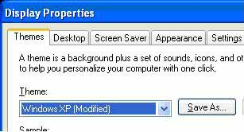

# Label
<xref:System.Windows.Controls.Label> 控件通常在[!INCLUDE[TLA#tla_ui](../../../../includes/tlasharptla-ui-md.md)] 中提供信息。  一直以来，<xref:System.Windows.Controls.Label> 只包含文本，但由于 [!INCLUDE[TLA#tla_winclient](../../../../includes/tlasharptla-winclient-md.md)] 附带的 <xref:System.Windows.Controls.Label> 是一个 <xref:System.Windows.Controls.ContentControl>，所以它可以包含文本或 <xref:System.Windows.UIElement>。  
  
 <xref:System.Windows.Controls.Label> 为快捷键提供功能性和可视化支持。  它常用于实现对控件（如 <xref:System.Windows.Controls.TextBox>）的快速键盘访问。  若要为 <xref:System.Windows.Controls.Control> 指定 <xref:System.Windows.Controls.Label>，请将 <xref:System.Windows.Controls.Label.Target%2A?displayProperty=fullName> 属性设置为当用户按下快捷键时应获得焦点的控件。  
  
 下图演示了一个目标为 <xref:System.Windows.Controls.ComboBox> 的 <xref:System.Windows.Controls.Label>“主题”。  当用户按下 时，<xref:System.Windows.Controls.ComboBox> 将获得焦点。  有关更多信息，请参见[How to: Set the Target Property of a Label](http://msdn.microsoft.com/zh-cn/b24c6977-ebcb-4855-a9bb-3fd4435af8f8)。  
  
   
  
## 本节内容  
 [How to: Set the Target Property of a Label](http://msdn.microsoft.com/zh-cn/b24c6977-ebcb-4855-a9bb-3fd4435af8f8)  
  
## 参考  
 <xref:System.Windows.Controls.Label>