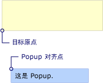
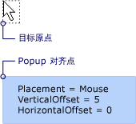
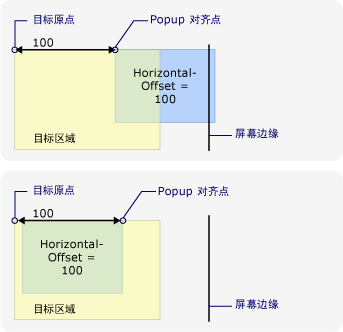
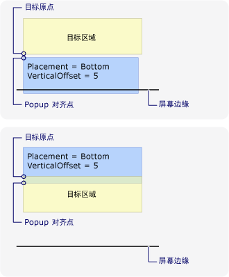
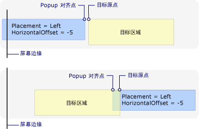

# Popup 放置行为
一个<xref:System.Windows.Controls.Primitives.Popup>控件浮动转移的应用程序的单独窗口中显示内容。 您可以指定的位置<xref:System.Windows.Controls.Primitives.Popup>相对于控件、 鼠标点击或通过使用屏幕<xref:System.Windows.Controls.Primitives.Popup.PlacementTarget%2A>，<xref:System.Windows.Controls.Primitives.Popup.Placement%2A>， <xref:System.Windows.Controls.Primitives.Popup.PlacementRectangle%2A>， <xref:System.Windows.Controls.Primitives.Popup.HorizontalOffset%2A>，和<xref:System.Windows.Controls.Primitives.Popup.VerticalOffset%2A>属性。  这些属性协同工作以使您能够灵活地指定的位置<xref:System.Windows.Controls.Primitives.Popup>。  
  
> [!NOTE]
>  <xref:System.Windows.Controls.ToolTip>和<xref:System.Windows.Controls.ContextMenu>类还定义以下五个属性和行为类似。  
  
   
  
   
## 定位弹出项  
 放置<xref:System.Windows.Controls.Primitives.Popup>可以是相对于<xref:System.Windows.UIElement>或整个屏幕。  下面的示例创建四个<xref:System.Windows.Controls.Primitives.Popup>相对于控件<xref:System.Windows.UIElement>— 在这种情况下，映像中。 所有<xref:System.Windows.Controls.Primitives.Popup>控件具有<xref:System.Windows.Controls.Primitives.Popup.PlacementTarget%2A>属性设置为`image1`，但其中每个<xref:System.Windows.Controls.Primitives.Popup>具有不同的位置属性的值。  
  
 [!code-xml[PopupPositionSnippet#3](../../../../samples/snippets/csharp/VS_Snippets_Wpf/PopupPositionSnippet/CS/Window1.xaml#3)]  
  
 下图显示的图像和<xref:System.Windows.Controls.Primitives.Popup>控件  
  
   
具有四个弹出项的图像  
  
 这个简单的示例演示如何设置<xref:System.Windows.Controls.Primitives.Popup.PlacementTarget%2A>和<xref:System.Windows.Controls.Primitives.Popup.Placement%2A>属性，但通过使用<xref:System.Windows.Controls.Primitives.Popup.PlacementRectangle%2A>， <xref:System.Windows.Controls.Primitives.Popup.HorizontalOffset%2A>，和<xref:System.Windows.Controls.Primitives.Popup.VerticalOffset%2A>属性，您有更多地控制在何处<xref:System.Windows.Controls.Primitives.Popup>位于。  
  
   
## 术语的定义︰ 一个弹出窗口的剖析  
 以下术语可了解如何<xref:System.Windows.Controls.Primitives.Popup.PlacementTarget%2A>，<xref:System.Windows.Controls.Primitives.Popup.Placement%2A>， <xref:System.Windows.Controls.Primitives.Popup.PlacementRectangle%2A>， <xref:System.Windows.Controls.Primitives.Popup.HorizontalOffset%2A>，和<xref:System.Windows.Controls.Primitives.Popup.VerticalOffset%2A>属性将互相关联起来和<xref:System.Windows.Controls.Primitives.Popup>:  
  
-   目标对象  
  
-   目标区域  
  
-   目标原点  
  
-   Popup 对齐点  
  
 这些条款方便地来指代的各个方面<xref:System.Windows.Controls.Primitives.Popup>和与之关联的控件。  
  
### 目标对象  
 *目标对象*是元素的<xref:System.Windows.Controls.Primitives.Popup>与相关联。 如果<xref:System.Windows.Controls.Primitives.Popup.PlacementTarget%2A>属性设置，则指定的目标对象。  如果<xref:System.Windows.Controls.Primitives.Popup.PlacementTarget%2A>未设置，和<xref:System.Windows.Controls.Primitives.Popup>具有一个父级的父元素是目标对象。  如果没有任何<xref:System.Windows.Controls.Primitives.Popup.PlacementTarget%2A>值并没有父级，没有目标的对象，和<xref:System.Windows.Controls.Primitives.Popup>位于相对于屏幕。  
  
 下面的示例创建<xref:System.Windows.Controls.Primitives.Popup>的子级<xref:System.Windows.Controls.Canvas>。  该示例不会设置<xref:System.Windows.Controls.Primitives.Popup.PlacementTarget%2A>属性<xref:System.Windows.Controls.Primitives.Popup>。 默认值为<xref:System.Windows.Controls.Primitives.Popup.Placement%2A>是<xref:System.Windows.Controls.Primitives.PlacementMode?displayProperty=fullName>，因此<xref:System.Windows.Controls.Primitives.Popup>如下所示<xref:System.Windows.Controls.Canvas>。  
  
 [!code-xml[PopupPositionSnippet#1](../../../../samples/snippets/csharp/VS_Snippets_Wpf/PopupPositionSnippet/CS/Window1.xaml#1)]  
  
 下面的插图阐释<xref:System.Windows.Controls.Primitives.Popup>相对于定位<xref:System.Windows.Controls.Canvas>。  
  
   
没有 placementtarget 的 popup  
  
 下面的示例创建<xref:System.Windows.Controls.Primitives.Popup>的子级<xref:System.Windows.Controls.Canvas>，但这次<xref:System.Windows.Controls.Primitives.Popup.PlacementTarget%2A>设置为`ellipse1`，因此，如下所示弹出框<xref:System.Windows.Shapes.Ellipse>。  
  
 [!code-xml[PopupPositionSnippet#2](../../../../samples/snippets/csharp/VS_Snippets_Wpf/PopupPositionSnippet/CS/Window1.xaml#2)]  
  
 下面的插图阐释<xref:System.Windows.Controls.Primitives.Popup>相对于定位<xref:System.Windows.Shapes.Ellipse>。  
  
   
Placementtarget 的 popup  
  
> [!NOTE]
>  有关<xref:System.Windows.Controls.ToolTip>，默认值为<xref:System.Windows.Controls.Primitives.Popup.Placement%2A>是<xref:System.Windows.Controls.Primitives.PlacementMode>。  有关<xref:System.Windows.Controls.ContextMenu>，默认值为<xref:System.Windows.Controls.Primitives.Popup.Placement%2A>是<xref:System.Windows.Controls.Primitives.PlacementMode>。 这些值后面部分进行说明，在"属性的工作方式在一起。"  
  
### 目标区域  
 *目标区域*是在屏幕上的区域，<xref:System.Windows.Controls.Primitives.Popup>是相对于。 在前面的示例中，<xref:System.Windows.Controls.Primitives.Popup>对齐边界的目标对象，但在某些情况下，<xref:System.Windows.Controls.Primitives.Popup>与其他边界对齐即使<xref:System.Windows.Controls.Primitives.Popup>具有目标对象。  如果<xref:System.Windows.Controls.Primitives.Popup.PlacementRectangle%2A>属性设置，则目标区域是不同于目标对象的边界。  
  
 下面的示例创建两个<xref:System.Windows.Controls.Canvas>对象时，每个包含<xref:System.Windows.Shapes.Rectangle>和<xref:System.Windows.Controls.Primitives.Popup>。  在这两种情况下，目标对象为<xref:System.Windows.Controls.Primitives.Popup>是<xref:System.Windows.Controls.Canvas>。 <xref:System.Windows.Controls.Primitives.Popup>在第一个<xref:System.Windows.Controls.Canvas>具有<xref:System.Windows.Controls.Primitives.Popup.PlacementRectangle%2A>集，使用其<xref:System.Windows.Rect.X%2A>， <xref:System.Windows.Rect.Y%2A>，<xref:System.Windows.Rect.Width%2A>，和<xref:System.Windows.Rect.Height%2A>属性分别设置为 50，50，50 和 100。 <xref:System.Windows.Controls.Primitives.Popup>在第二个<xref:System.Windows.Controls.Canvas>没有<xref:System.Windows.Controls.Primitives.Popup.PlacementRectangle%2A>设置。  结果是，第一个<xref:System.Windows.Controls.Primitives.Popup>位于下方<xref:System.Windows.Controls.Primitives.Popup.PlacementRectangle%2A>和第二个<xref:System.Windows.Controls.Primitives.Popup>位于下方<xref:System.Windows.Controls.Canvas>。 每个<xref:System.Windows.Controls.Canvas>还包含<xref:System.Windows.Shapes.Rectangle>具有相同的边界<xref:System.Windows.Controls.Primitives.Popup.PlacementRectangle%2A>是首次<xref:System.Windows.Controls.Primitives.Popup>。  请注意， <xref:System.Windows.Controls.Primitives.Popup.PlacementRectangle%2A>不会在应用程序; 中创建的可见元素，该示例创建<xref:System.Windows.Shapes.Rectangle>来表示<xref:System.Windows.Controls.Primitives.Popup.PlacementRectangle%2A>。  
  
 [!code-xml[PopupPositionSnippet#4](../../../../samples/snippets/csharp/VS_Snippets_Wpf/PopupPositionSnippet/CS/Window1.xaml#4)]  
  
 下图显示了前面示例的结果。  
  
   
具有和没有 PlacementRectangle 的 Popup  
  
### 目标原点和 Popup 对齐点  
 *目标原点*和*popup 对齐点*参考点上的目标区域和弹出窗口中，分别是，在用于定位。 您可以使用<xref:System.Windows.Controls.Primitives.Popup.HorizontalOffset%2A>和<xref:System.Windows.Controls.Primitives.Popup.VerticalOffset%2A>属性，以偏移量从目标区域弹出菜单。  <xref:System.Windows.Controls.Primitives.Popup.HorizontalOffset%2A>和<xref:System.Windows.Controls.Primitives.Popup.VerticalOffset%2A>相对于目标原点和 popup 对齐点。 值<xref:System.Windows.Controls.Primitives.Popup.Placement%2A>属性确定目标原点和 popup 对齐点的位置。  
  
 下面的示例创建<xref:System.Windows.Controls.Primitives.Popup>，并设置<xref:System.Windows.Controls.Primitives.Popup.HorizontalOffset%2A>和<xref:System.Windows.Controls.Primitives.Popup.VerticalOffset%2A>属性设置为 20。  <xref:System.Windows.Controls.Primitives.Popup.Placement%2A>属性设置为<xref:System.Windows.Controls.Primitives.PlacementMode>（默认值），因此目标原点为目标区域的左下角，而 popup 对齐点的左上角<xref:System.Windows.Controls.Primitives.Popup>。  
  
 [!code-xml[PopupPositionSnippet#5](../../../../samples/snippets/csharp/VS_Snippets_Wpf/PopupPositionSnippet/CS/Window1.xaml#5)]  
  
 下图显示了前面示例的结果。  
  
   
采用 HorizontalOffset 和 VerticalOffset 的 popup  
  
   
## 属性是如何协同工作  
 值<xref:System.Windows.Controls.Primitives.Popup.PlacementTarget%2A>， <xref:System.Windows.Controls.Primitives.Popup.PlacementRectangle%2A>，和<xref:System.Windows.Controls.Primitives.Popup.Placement%2A>需要综合考虑找出正确的目标区域、 目标原点和 popup 对齐点。  例如，如果的值<xref:System.Windows.Controls.Primitives.Popup.Placement%2A>是<xref:System.Windows.Controls.Primitives.PlacementMode>，没有目标的对象， <xref:System.Windows.Controls.Primitives.Popup.PlacementRectangle%2A>将被忽略，并且目标区域是鼠标指针的边界。 另一方面，如果<xref:System.Windows.Controls.Primitives.Popup.Placement%2A>是<xref:System.Windows.Controls.Primitives.PlacementMode>、<xref:System.Windows.Controls.Primitives.Popup.PlacementTarget%2A>或父对象会确定目标对象和<xref:System.Windows.Controls.Primitives.Popup.PlacementRectangle%2A>确定目标区域。  
  
 下表描述了目标对象、 目标区域、 目标原点和 popup 对齐点，并指示是否<xref:System.Windows.Controls.Primitives.Popup.PlacementTarget%2A>和<xref:System.Windows.Controls.Primitives.Popup.PlacementRectangle%2A>用于每种<xref:System.Windows.Controls.Primitives.PlacementMode>枚举值。  
  
|PlacementMode|目标对象|目标区域|目标原点|Popup 对齐点|  
|-------------------|-------------------|-----------------|-------------------|---------------------------|  
|<xref:System.Windows.Controls.Primitives.PlacementMode>|不适用。 <xref:System.Windows.Controls.Primitives.Popup.PlacementTarget%2A>将被忽略。|屏幕上，或<xref:System.Windows.Controls.Primitives.Popup.PlacementRectangle%2A>如果将其设置。  <xref:System.Windows.Controls.Primitives.Popup.PlacementRectangle%2A>是相对于屏幕。|目标区域的左上角。|左上角<xref:System.Windows.Controls.Primitives.Popup>。|  
|<xref:System.Windows.Controls.Primitives.PlacementMode>|不适用。 <xref:System.Windows.Controls.Primitives.Popup.PlacementTarget%2A>将被忽略。|屏幕上，或<xref:System.Windows.Controls.Primitives.Popup.PlacementRectangle%2A>如果将其设置。  <xref:System.Windows.Controls.Primitives.Popup.PlacementRectangle%2A>是相对于屏幕。|目标区域的左上角。|左上角<xref:System.Windows.Controls.Primitives.Popup>。|  
|<xref:System.Windows.Controls.Primitives.PlacementMode>|<xref:System.Windows.Controls.Primitives.Popup.PlacementTarget%2A>或父级。|目标对象，或<xref:System.Windows.Controls.Primitives.Popup.PlacementRectangle%2A>如果将其设置。  <xref:System.Windows.Controls.Primitives.Popup.PlacementRectangle%2A>是相对于目标对象。|目标区域左下角。|左上角<xref:System.Windows.Controls.Primitives.Popup>。|  
|<xref:System.Windows.Controls.Primitives.PlacementMode>|<xref:System.Windows.Controls.Primitives.Popup.PlacementTarget%2A>或父级。|目标对象，或<xref:System.Windows.Controls.Primitives.Popup.PlacementRectangle%2A>如果将其设置。  <xref:System.Windows.Controls.Primitives.Popup.PlacementRectangle%2A>是相对于目标对象。|目标区域的中心。|中心<xref:System.Windows.Controls.Primitives.Popup>。|  
|<xref:System.Windows.Controls.Primitives.PlacementMode>|<xref:System.Windows.Controls.Primitives.Popup.PlacementTarget%2A>或父级。|目标对象，或<xref:System.Windows.Controls.Primitives.Popup.PlacementRectangle%2A>如果将其设置。  <xref:System.Windows.Controls.Primitives.Popup.PlacementRectangle%2A>是相对于目标对象。|通过定义<xref:System.Windows.Controls.Primitives.CustomPopupPlacementCallback>。|通过定义<xref:System.Windows.Controls.Primitives.CustomPopupPlacementCallback>。|  
|<xref:System.Windows.Controls.Primitives.PlacementMode>|<xref:System.Windows.Controls.Primitives.Popup.PlacementTarget%2A>或父级。|目标对象，或<xref:System.Windows.Controls.Primitives.Popup.PlacementRectangle%2A>如果将其设置。  <xref:System.Windows.Controls.Primitives.Popup.PlacementRectangle%2A>是相对于目标对象。|目标区域的左上角。|右上角<xref:System.Windows.Controls.Primitives.Popup>。|  
|<xref:System.Windows.Controls.Primitives.PlacementMode>|不适用。 <xref:System.Windows.Controls.Primitives.Popup.PlacementTarget%2A>将被忽略。|鼠标指针的边界。 <xref:System.Windows.Controls.Primitives.Popup.PlacementRectangle%2A>将被忽略。|目标区域左下角。|左上角<xref:System.Windows.Controls.Primitives.Popup>。|  
|<xref:System.Windows.Controls.Primitives.PlacementMode>|不适用。 <xref:System.Windows.Controls.Primitives.Popup.PlacementTarget%2A>将被忽略。|鼠标指针的边界。 <xref:System.Windows.Controls.Primitives.Popup.PlacementRectangle%2A>将被忽略。|目标区域的左上角。|左上角<xref:System.Windows.Controls.Primitives.Popup>。|  
|<xref:System.Windows.Controls.Primitives.PlacementMode>|<xref:System.Windows.Controls.Primitives.Popup.PlacementTarget%2A>或父级。|目标对象，或<xref:System.Windows.Controls.Primitives.Popup.PlacementRectangle%2A>如果将其设置。  <xref:System.Windows.Controls.Primitives.Popup.PlacementRectangle%2A>是相对于目标对象。|目标区域的左上角。|左上角<xref:System.Windows.Controls.Primitives.Popup>。|  
|<xref:System.Windows.Controls.Primitives.PlacementMode>|<xref:System.Windows.Controls.Primitives.Popup.PlacementTarget%2A>或父级。|目标对象，或<xref:System.Windows.Controls.Primitives.Popup.PlacementRectangle%2A>如果将其设置。  <xref:System.Windows.Controls.Primitives.Popup.PlacementRectangle%2A>是相对于目标对象。|目标区域的左上角。|左上角<xref:System.Windows.Controls.Primitives.Popup>。|  
|<xref:System.Windows.Controls.Primitives.PlacementMode>|<xref:System.Windows.Controls.Primitives.Popup.PlacementTarget%2A>或父级。|目标对象，或<xref:System.Windows.Controls.Primitives.Popup.PlacementRectangle%2A>如果将其设置。  <xref:System.Windows.Controls.Primitives.Popup.PlacementRectangle%2A>是相对于目标对象。|目标区域右上角。|左上角<xref:System.Windows.Controls.Primitives.Popup>。|  
|<xref:System.Windows.Controls.Primitives.PlacementMode>|<xref:System.Windows.Controls.Primitives.Popup.PlacementTarget%2A>或父级。|目标对象，或<xref:System.Windows.Controls.Primitives.Popup.PlacementRectangle%2A>如果将其设置。  <xref:System.Windows.Controls.Primitives.Popup.PlacementRectangle%2A>是相对于目标对象。|目标区域的左上角。|左下角<xref:System.Windows.Controls.Primitives.Popup>。|  
  
 如下图所示<xref:System.Windows.Controls.Primitives.Popup>，针对每个目标区域、 目标原点和弹出项对齐点<xref:System.Windows.Controls.Primitives.PlacementMode>值。 在每个图中，目标区域为黄色，和<xref:System.Windows.Controls.Primitives.Popup>将显示为蓝色。  
  
   
位置是 Absolute 或 AbsolutePoint  
  
   
位置是底部  
  
   
位置是中心  
  
   
位置是左  
  
   
位置是鼠标  
  
   
位置是 MousePoint  
  
   
位置是 Relative 或 RelativePoint  
  
   
位置是右  
  
   
位置是顶部  
  
   
## 弹出窗口时遇到屏幕的边缘  
 出于安全原因，<xref:System.Windows.Controls.Primitives.Popup>不能被隐藏时的屏幕的边缘。 将发生以下三种情况之一时<xref:System.Windows.Controls.Primitives.Popup>到达屏幕边缘︰  
  
-   弹出项将沿屏幕边缘，将遮蔽沿<xref:System.Windows.Controls.Primitives.Popup>。  
  
-   弹出项使用不同的 popup 对齐点。  
  
-   弹出项使用不同的目标原点和 popup 对齐点。  
  
 这些选项进行了进一步描述更高版本在本部分中。  
  
 行为<xref:System.Windows.Controls.Primitives.Popup>在遇到时屏幕边缘上的值取决于<xref:System.Windows.Controls.Primitives.Popup.Placement%2A>属性，该屏幕遇到弹出窗口的边缘。 下表汇总了的行为时<xref:System.Windows.Controls.Primitives.Popup>遇到每个屏幕边缘<xref:System.Windows.Controls.Primitives.PlacementMode>值。  
  
|PlacementMode|上边缘|下边缘|左边的缘|右边缘|  
|-------------------|--------------|-----------------|---------------|----------------|  
|<xref:System.Windows.Controls.Primitives.PlacementMode>|与上边缘对齐。|与底部边缘对齐。|与左边缘对齐。|与右边缘对齐。|  
|<xref:System.Windows.Controls.Primitives.PlacementMode>|与上边缘对齐。|Popup 对齐点更改为的左下角<xref:System.Windows.Controls.Primitives.Popup>。|与左边缘对齐。|Popup 对齐点更改为右上角的<xref:System.Windows.Controls.Primitives.Popup>。|  
|<xref:System.Windows.Controls.Primitives.PlacementMode>|与上边缘对齐。|目标原点更改到目标区域的左上角，popup 对齐点更改为的左下角<xref:System.Windows.Controls.Primitives.Popup>。|与左边缘对齐。|与右边缘对齐。|  
|<xref:System.Windows.Controls.Primitives.PlacementMode>|与上边缘对齐。|与底部边缘对齐。|与左边缘对齐。|与右边缘对齐。|  
|<xref:System.Windows.Controls.Primitives.PlacementMode>|与上边缘对齐。|与底部边缘对齐。|目标原点更改到目标区域的右上角，popup 对齐点更改为的左上角<xref:System.Windows.Controls.Primitives.Popup>。|与右边缘对齐。|  
|<xref:System.Windows.Controls.Primitives.PlacementMode>|与上边缘对齐。|目标原点更改为 （鼠标指针的边界） 中的目标区域的左上角，popup 对齐点更改为的左下角<xref:System.Windows.Controls.Primitives.Popup>。|与左边缘对齐。|与右边缘对齐。|  
|<xref:System.Windows.Controls.Primitives.PlacementMode>|与上边缘对齐。|Popup 对齐点更改为的左下角<xref:System.Windows.Controls.Primitives.Popup>。|与左边缘对齐。|Popup 对齐点更改为弹出窗口的右上角。|  
|<xref:System.Windows.Controls.Primitives.PlacementMode>|与上边缘对齐。|与底部边缘对齐。|与左边缘对齐。|与右边缘对齐。|  
|<xref:System.Windows.Controls.Primitives.PlacementMode>|与上边缘对齐。|Popup 对齐点更改为的左下角<xref:System.Windows.Controls.Primitives.Popup>。|与左边缘对齐。|Popup 对齐点更改为弹出窗口的右上角。|  
|<xref:System.Windows.Controls.Primitives.PlacementMode>|与上边缘对齐。|与底部边缘对齐。|与左边缘对齐。|目标原点更改到目标区域的左上角，popup 对齐点更改为右上角的<xref:System.Windows.Controls.Primitives.Popup>。|  
|<xref:System.Windows.Controls.Primitives.PlacementMode>|目标原点更改到目标区域的左下角，popup 对齐点更改为的左上角<xref:System.Windows.Controls.Primitives.Popup>。 实际上，这等同于当<xref:System.Windows.Controls.Primitives.Popup.Placement%2A>是<xref:System.Windows.Controls.Primitives.PlacementMode>。|与底部边缘对齐。|与左边缘对齐。|与右边缘对齐。|  
  
### 与屏幕边缘对齐  
 一个<xref:System.Windows.Controls.Primitives.Popup>可以对齐到屏幕的边缘通过重新定位自身因此整个<xref:System.Windows.Controls.Primitives.Popup>屏幕上是否可见。  此操作时，可能会与目标原点和 popup 对齐点之间的距离不同的值中<xref:System.Windows.Controls.Primitives.Popup.HorizontalOffset%2A>和<xref:System.Windows.Controls.Primitives.Popup.VerticalOffset%2A>。 当<xref:System.Windows.Controls.Primitives.Popup.Placement%2A>是<xref:System.Windows.Controls.Primitives.PlacementMode>，<xref:System.Windows.Controls.Primitives.PlacementMode>，或<xref:System.Windows.Controls.Primitives.PlacementMode>、<xref:System.Windows.Controls.Primitives.Popup>会将自身调整为每个屏幕边缘。  例如，假定<xref:System.Windows.Controls.Primitives.Popup>具有<xref:System.Windows.Controls.Primitives.Popup.Placement%2A>设置为<xref:System.Windows.Controls.Primitives.PlacementMode>和<xref:System.Windows.Controls.Primitives.Popup.VerticalOffset%2A>设置为 100。  如果屏幕的底部边缘隐藏全部或部分<xref:System.Windows.Controls.Primitives.Popup>、<xref:System.Windows.Controls.Primitives.Popup>重新定位自身沿屏幕和目标原点和弹出项之间的垂直距离的下边缘对齐点将变为小于 100。 下图说明这一点。  
  
   
弹出窗口与屏幕的边缘对齐  
  
### 更改 Popup 对齐点  
 如果<xref:System.Windows.Controls.Primitives.Popup.Placement%2A>是<xref:System.Windows.Controls.Primitives.PlacementMode>， <xref:System.Windows.Controls.Primitives.PlacementMode>，或<xref:System.Windows.Controls.Primitives.PlacementMode>，popup 对齐点更改时弹出项到达的底部或右侧屏幕边缘。  
  
 下图演示当底部屏幕边缘隐藏全部或部分<xref:System.Windows.Controls.Primitives.Popup>，popup 对齐点为的左下角<xref:System.Windows.Controls.Primitives.Popup>。  
  
   
Popup 遇到屏幕的下边缘和更改 popup 对齐点  
  
 下图演示当<xref:System.Windows.Controls.Primitives.Popup>处于隐藏状态屏幕右边缘，popup 对齐点的右上角的<xref:System.Windows.Controls.Primitives.Popup>。  
  
   
弹出窗口遇到屏幕的右边缘，并更改 popup 对齐点  
  
 如果<xref:System.Windows.Controls.Primitives.Popup>遇到下边缘和屏幕右边缘 popup 对齐点为的右下角<xref:System.Windows.Controls.Primitives.Popup>。  
  
### 更改目标原点和 Popup 对齐点  
 当<xref:System.Windows.Controls.Primitives.Popup.Placement%2A>是<xref:System.Windows.Controls.Primitives.PlacementMode>，<xref:System.Windows.Controls.Primitives.PlacementMode>，<xref:System.Windows.Controls.Primitives.PlacementMode>，<xref:System.Windows.Controls.Primitives.PlacementMode>，或<xref:System.Windows.Controls.Primitives.PlacementMode>，目标原点和 popup 对齐点更改，如果遇到某些屏幕边缘。  取决于将导致更改的位置屏幕边缘<xref:System.Windows.Controls.Primitives.PlacementMode>值。  
  
 下图演示当<xref:System.Windows.Controls.Primitives.Popup.Placement%2A>是<xref:System.Windows.Controls.Primitives.PlacementMode>和<xref:System.Windows.Controls.Primitives.Popup>到达底部屏幕边缘时，目标原点为目标区域的左上角和 popup 对齐点为的左下角<xref:System.Windows.Controls.Primitives.Popup>。  
  
   
位置是底部和弹出项到达屏幕的底部边缘  
  
 下图演示当<xref:System.Windows.Controls.Primitives.Popup.Placement%2A>是<xref:System.Windows.Controls.Primitives.PlacementMode>和<xref:System.Windows.Controls.Primitives.Popup>到达左侧的屏幕边缘时，目标原点为的目标区域右上角，而 popup 对齐点的左上角<xref:System.Windows.Controls.Primitives.Popup>。  
  
   
位置是左和弹出项到达屏幕的左边的缘  
  
 下图演示当<xref:System.Windows.Controls.Primitives.Popup.Placement%2A>是<xref:System.Windows.Controls.Primitives.PlacementMode>和<xref:System.Windows.Controls.Primitives.Popup>到达屏幕右边缘时，目标原点为目标区域的左上角和 popup 对齐点为的右上角<xref:System.Windows.Controls.Primitives.Popup>。  
  
   
放置是右并且 popup 所到达屏幕的右边缘  
  
 下图演示当<xref:System.Windows.Controls.Primitives.Popup.Placement%2A>是<xref:System.Windows.Controls.Primitives.PlacementMode>和<xref:System.Windows.Controls.Primitives.Popup>到达顶部屏幕边缘时，目标原点为的目标区域左下角，而 popup 对齐点的左上角<xref:System.Windows.Controls.Primitives.Popup>。  
  
   
放置是顶部和弹出项到达屏幕的上边缘  
  
 下图演示当<xref:System.Windows.Controls.Primitives.Popup.Placement%2A>是<xref:System.Windows.Controls.Primitives.PlacementMode>和<xref:System.Windows.Controls.Primitives.Popup>到达底部屏幕边缘时，目标原点 （鼠标指针的边界） 中的目标区域的左上角且 popup 对齐点的左下角<xref:System.Windows.Controls.Primitives.Popup>。  
  
   
位置是鼠标和弹出项到达屏幕的底部边缘  
  
### 自定义的 Popup 定位  
 可以通过设置自定义目标原点和 popup 对齐点<xref:System.Windows.Controls.Primitives.Popup.Placement%2A>属性设置为<xref:System.Windows.Controls.Primitives.PlacementMode>。 然后定义<xref:System.Windows.Controls.Primitives.CustomPopupPlacementCallback>返回一组可能的位置点和主坐标轴 （按优先顺序） 的委托<xref:System.Windows.Controls.Primitives.Popup>。 显示的最大一部分的点<xref:System.Windows.Controls.Primitives.Popup>处于选中状态。  位置<xref:System.Windows.Controls.Primitives.Popup>如果自动调整<xref:System.Windows.Controls.Primitives.Popup>屏幕边缘被隐藏。 有关示例，请参阅[指定自定义 Popup 位置](../../../../docs/framework/wpf/controls/how-to-specify-a-custom-popup-position.md)。  
  
## 另请参阅  
 [弹出位置示例](http://go.microsoft.com/fwlink/?LinkID=160032)