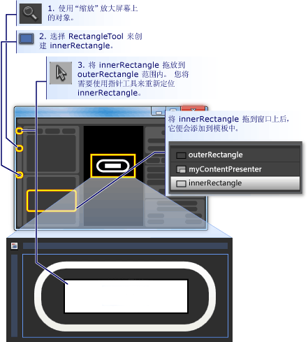
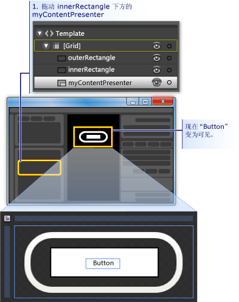
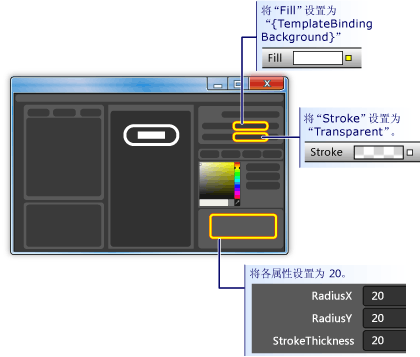
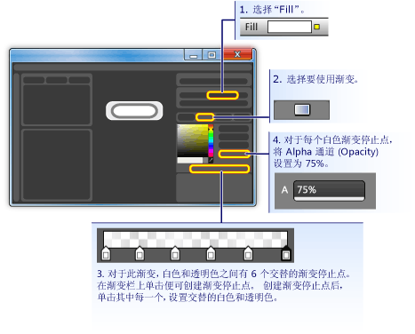
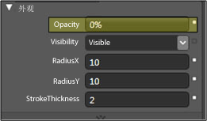
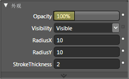
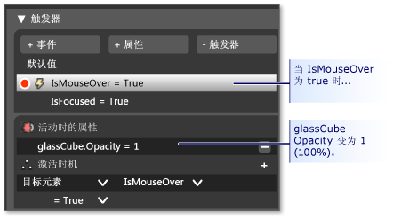
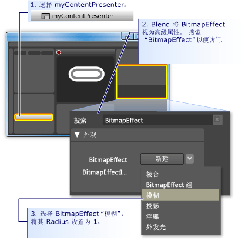

# 演练：使用 Microsoft Expression Blend 创建按钮
本演练逐步引导您完成使用 Microsoft Expression Blend 创建 [!INCLUDE[TLA2#tla_wpf](../../../../includes/tla2sharptla-wpf-md.md)] 自定义按钮的过程。  
  
> [!IMPORTANT]
>  Microsoft Expression Blend 的工作方式是：生成以后编译为可执行程序的[!INCLUDE[TLA#tla_xaml](../../../../includes/tlasharptla-xaml-md.md)]。  如果希望直接使用[!INCLUDE[TLA#tla_xaml](../../../../includes/tlasharptla-xaml-md.md)]，则可以使用另一个演练，后者的具体操作为在 [!INCLUDE[vs_current_short](../../../../includes/vs-current-short-md.md)]（而不是 Blend）中使用[!INCLUDE[TLA#tla_xaml](../../../../includes/tlasharptla-xaml-md.md)] 创建与本演练相同的应用程序。  有关更多信息，请参见[使用 XAML 创建按钮](../../../../docs/framework/wpf/controls/walkthrough-create-a-button-by-using-xaml.md)。  
  
 下图演示了您将创建的自定义按钮。  
  
   
  
## 将形状转换为按钮  
 在本演练的第一部分，您将创建自定义按钮的自定义外观。  为此，首先将一个矩形转换为按钮。  然后将其他形状添加到按钮模板，以创建一个外观更复杂的按钮。  为什么不从矩形按钮开始并对其进行自定义呢？  这是因为按钮具有您不需要的内置功能；因而对于自定义按钮，从矩形开始更简单些。  
  
#### 在 Expression Blend 中创建新项目  
  
1.  启动 Expression Blend。  （单击**“开始”**，指向**“所有程序”**，指向**“Microsoft Expression”**，然后单击**“Microsoft Expression Blend”**。）  
  
2.  如果需要，将应用程序窗口最大化。  
  
3.  在**“文件”**菜单上，单击**“新建项目”**。  
  
4.  选择**“标准应用程序\(.exe\)”**。  
  
5.  将该项目的名称指定为 `CustomButton`，然后按**“确定”**。  
  
 此时，您已具有一个空的 [!INCLUDE[TLA2#tla_wpf](../../../../includes/tla2sharptla-wpf-md.md)] 项目。  可按 F5 运行该应用程序。  正如预期的那样，该应用程序仅包含一个空窗口。  下面，您将创建一个圆角矩形并将其转换为按钮。  
  
#### 将矩形转换为按钮  
  
1.  **将窗口的 Background 属性设置为 Black**：选择窗口，单击**“属性”**选项卡，然后将 <xref:System.Windows.Controls.Control.Background%2A> 属性设置为 `Black`。  
  
       
  
2.  **在窗口上绘制一个大小与按钮相近的矩形**：在左侧的工具面板中选择矩形工具，然后在窗口中拖动出矩形。  
  
       
  
3.  **将矩形各角改为圆角**：拖动矩形的控制点，或者直接设置 <xref:System.Windows.Shapes.Rectangle.RadiusX%2A> 和 <xref:System.Windows.Shapes.Rectangle.RadiusY%2A> 属性。  将 <xref:System.Windows.Shapes.Rectangle.RadiusX%2A> 和 <xref:System.Windows.Shapes.Rectangle.RadiusY%2A> 的值均设置为 20。  
  
       
  
4.  **将该矩形更改为按钮**：选择该矩形。  在**“工具”**菜单上，单击**“创建按钮”**。  
  
       
  
5.  **指定样式\/模板的范围**：显示与以下类似的对话框。  
  
       
  
     对于**“资源名称\(项\)”**，选择**“应用于所有项”**。  这会使所生成的样式和按钮模板应用于作为按钮的所有对象。  对于**“定义范围”**，选择**“应用程序”**。  这会使所生成的样式和按钮模板的范围涵盖整个应用程序。  在这两个框中设置相应值后，按钮的样式和模板将应用于整个应用程序中的所有按钮，并且在应用程序中创建的所有按钮默认情况下都会使用此模板。  
  
## 编辑按钮模板  
 现在，您有一个已更改为按钮的矩形。  在本部分中，您将修改按钮模板，并进一步自定义按钮的外观。  
  
#### 编辑按钮模板可更改按钮外观  
  
1.  **转到编辑模板视图**：若要进一步自定义按钮外观，我们需要编辑按钮模板。  此模板是在将矩形转换为按钮时创建的。  若要编辑按钮模板，请右击该按钮，然后选择**“编辑控件部件\(模板\)”**，然后选择**“编辑模板”**。  
  
       
  
     在模板编辑器中，您会看到该按钮现在已分隔为 <xref:System.Windows.Shapes.Rectangle> 和 <xref:System.Windows.Controls.ContentPresenter>。  <xref:System.Windows.Controls.ContentPresenter> 用于呈现按钮中的内容（如字符串“Button”）。  该矩形和 <xref:System.Windows.Controls.ContentPresenter> 均放置在 <xref:System.Windows.Controls.Grid> 内部。  
  
       
  
2.  **更改模板组件的名称**：右击模板清单中的矩形，将 <xref:System.Windows.Shapes.Rectangle> 名称从“\[Rectangle\]”更改为“outerRectangle”，并将“\[ContentPresenter\]”更改为“myContentPresenter”。  
  
       
  
3.  **修改该矩形以使其内部为空（就像圆环一样）**：选择**“outerRectangle”**，将 <xref:System.Windows.Shapes.Shape.Fill%2A> 设置为“Transparent”，并将 <xref:System.Windows.Shapes.Shape.StrokeThickness%2A> 设置为 5。  
  
       
  
     然后，将 <xref:System.Windows.Shapes.Shape.Stroke%2A> 设置为模板将显示的任意颜色。  为此，请单击**“笔画”**旁边的小白框，选择**“CustomExpression”**，然后在显示的对话框中键入“{TemplateBinding Background}”。  
  
       
  
4.  **创建内部矩形**：现在，创建另一个矩形（将其命名为“innerRectangle”），并将其对称地放在**“outerRectangle”**的内部。  在执行这种操作时，可能需要进行放大，以便该按钮在编辑区域中显示得大一些。  
  
    > [!NOTE]
    >  所得的矩形可能与图中的矩形有所差别（例如，它可能有圆角）。  
  
       
  
5.  **将 ContentPresenter 移到上方**：此时，文本“Button”可能不再显示。  如果出现此问题，就表示**“innerRectangle”**位于**“myContentPresenter”**上层。  若要修复此问题，请拖动**“innerRectangle”**下面的**“myContentPresenter”**。  重新定位矩形和**“myContentPresenter”**，使其外观与下面类似。  
  
    > [!NOTE]
    >  或者，也可以将**“myContentPresenter”**放在上层，方法是：右击它，然后按**“置前”**。  
  
       
  
6.  **更改 innerRectangle 的外观：**将 <xref:System.Windows.Shapes.Rectangle.RadiusX%2A>、<xref:System.Windows.Shapes.Rectangle.RadiusY%2A> 和 <xref:System.Windows.Shapes.Shape.StrokeThickness%2A> 的值均设置为 20。  此外，再使用自定义表达式“{TemplateBinding Background}”将 <xref:System.Windows.Shapes.Shape.Fill%2A> 设置为该模板的背景，并将 <xref:System.Windows.Shapes.Shape.Stroke%2A> 设置为“transparent”。  您会看到**“innerRectangle”**的 <xref:System.Windows.Shapes.Shape.Fill%2A> 和 <xref:System.Windows.Shapes.Shape.Stroke%2A> 属性设置将与**“outerRectangle”**的设置相反。  
  
       
  
7.  **在顶层添加玻璃层**：自定义按钮外观的最后一步是在顶层添加玻璃层。  此玻璃层由第三个矩形构成。  由于玻璃层将覆盖整个按钮，因此该玻璃矩形在尺寸上与**“outerRectangle”**相近。  因而只需复制**“outerRectangle”**即可创建该矩形。  突出显示**“outerRectangle”**，并使用 Ctrl\+C 和 Ctrl\+V 进行复制。  将此新矩形命名为“glassCube”。  
  
8.  **根据需要重新定位 glassCube**：如果尚未定位**“glassCube”**，以致于它覆盖了整个按钮，请将其拖到适当的位置。  
  
9. **使 glassCube 的形状略微不同于 outerRectangle**：更改**“glassCube”**的各属性。  可从以下更改着手：将 <xref:System.Windows.Shapes.Rectangle.RadiusX%2A> 和 <xref:System.Windows.Shapes.Rectangle.RadiusY%2A> 属性均更改为 10，并将 <xref:System.Windows.Shapes.Shape.StrokeThickness%2A> 更改为 2。  
  
       
  
10. **使 glassCube 的外观与玻璃类似**：使用不透明度为 75% 的线性渐变，并按大约 6 个平均间隔在白色和透明色之间变换，即可将 <xref:System.Windows.Shapes.Shape.Fill%2A> 设置为玻璃外观。  渐变停止点将设置为：  
  
    -   渐变停止点 1：白色，Alpha 值为 75%  
  
    -   渐变停止点 2：透明色  
  
    -   渐变停止点 3：白色，Alpha 值为 75%  
  
    -   渐变停止点 4：透明色  
  
    -   渐变停止点 5：白色，Alpha 值为 75%  
  
    -   渐变停止点 6：透明色  
  
     这会创建“波浪形”玻璃外观。  
  
       
  
11. **隐藏玻璃层**：既然已经看到了玻璃层的外观，您就可以将它隐藏起来，方法是：进入**“属性”**面板的**“外观”**窗格，并将“不透明度”设置为 0%，即可隐藏该层。  在以下各部分中，我们将使用属性触发器和事件来显示和操作玻璃层。  
  
       
  
## 自定义按钮行为  
 此时，您已通过编辑按钮模板自定义了该按钮的表示形式，但该按钮并不像典型按钮那样对用户操作做出响应（例如，在鼠标悬停、接收焦点和单击时更改外观）。下面两个过程将说明如何将类似这样的行为生成到自定义按钮中。  我们将从简单的属性触发器开始，然后添加事件触发器和动画。  
  
#### 设置属性触发器  
  
1.  **创建新的属性触发器**：选择**“glassCube”**，单击**“触发器”**面板中的**“\+ 属性”**（参见下一步后面的图示）。  这样可创建一个默认属性触发器。  
  
2.  **将 IsMouseOver 设置为触发器使用的属性**：将该属性更改为 <xref:System.Windows.UIElement.IsMouseOver%2A>。  这会在 <xref:System.Windows.UIElement.IsMouseOver%2A> 属性为 `true` 时（即用户将鼠标指向按钮时）激活此属性触发器。  
  
       
  
3.  **IsMouseOver 为 glassCube 触发 100% 的不透明度**：您会看到**“触发器记录功能处于启用状态”**（见上图）。  这意味着在记录功能启用的情况下，对**“glassCube”**属性值所做的任何更改都会成为当 <xref:System.Windows.UIElement.IsMouseOver%2A> 为 `true` 时所执行的操作。  在记录期间，将**“glassCube”**的 <xref:System.Windows.UIElement.Opacity%2A> 更改为 100%。  
  
       
  
     现在，您已创建了第一个属性触发器。  请注意，编辑器的**“触发器”**面板记录了 <xref:System.Windows.UIElement.Opacity%2A> 已更改为 100%。  
  
       
  
     按 F5 运行该应用程序，并将鼠标指针移到该按钮上，然后再移开。  您应当会看到当鼠标移到该按钮上时，就会显示玻璃层；而当指针离开时，玻璃层就会消失。  
  
4.  **IsMouseOver 触发笔画值更改**：下面将某些其他操作与 <xref:System.Windows.UIElement.IsMouseOver%2A> 触发器关联。  在继续记录时，将所选内容从**“glassCube”**切换为**“outerRectangle”**。  然后，将**“outerRectangle”**的 <xref:System.Windows.Shapes.Shape.Stroke%2A> 设置为自定义表达式“{DynamicResource {x:Static SystemColors.HighlightBrushKey}}”。  这会将 <xref:System.Windows.Shapes.Shape.Stroke%2A> 设置为按钮所使用的典型突出显示颜色。  按 F5 查看鼠标移到按钮上时的效果。  
  
       
  
5.  **IsMouseOver 触发模糊文本**：下面将另一个操作与 <xref:System.Windows.UIElement.IsMouseOver%2A> 属性触发器关联。  当按钮上面显示玻璃层时，使按钮内容显示得有些模糊。  为此，可以将模糊的 <xref:System.Windows.Media.Effects.BitmapEffect> 应用于 <xref:System.Windows.Controls.ContentPresenter> \(**myContentPresenter**\)。  
  
       
  
    > [!NOTE]
    >  若要将**“属性”**面板返回搜索 <xref:System.Windows.Media.Effects.BitmapEffect> 之前的外观，请从**“搜索”**框中清除文本。  
  
     此时，我们已对几个关联操作使用了属性触发器，以创建当鼠标指针进入及离开按钮区域时的突出显示行为。  按钮的另一个典型行为就是在具有焦点时（即被单击时）处于突出显示状态。  可通过为 <xref:System.Windows.UIElement.IsFocused%2A> 属性添加另一个属性触发器，来添加此类行为。  
  
6.  **为 IsFocused 创建属性触发器**：使用与 <xref:System.Windows.UIElement.IsMouseOver%2A> 相同的过程（参见此部分中的第一步），为 <xref:System.Windows.UIElement.IsFocused%2A> 属性创建另一个属性触发器。  当显示**“触发器记录功能处于启用状态”**时，将下列操作添加到该触发器中：  
  
    -   **“glassCube”**获取 100% 的 <xref:System.Windows.UIElement.Opacity%2A>。  
  
    -   **“outerRectangle”**获取 <xref:System.Windows.Shapes.Shape.Stroke%2A> 自定义表达式值“{DynamicResource {x:Static SystemColors.HighlightBrushKey}}”。  
  
 作为本演练的最后一步，我们将向按钮添加动画。  这些动画将由事件（具体来说是 <xref:System.Windows.UIElement.MouseEnter> 和 <xref:System.Windows.Controls.Primitives.ButtonBase.Click> 事件）触发。  
  
#### 使用事件触发器和动画增加互动  
  
1.  **创建 MouseEnter 事件触发器**：添加新的事件触发器，并选择 <xref:System.Windows.UIElement.MouseEnter> 作为要在该触发器中使用的事件。  
  
       
  
2.  **创建动画时间线**：接下来，将动画时间线与 <xref:System.Windows.UIElement.MouseEnter> 事件关联。  
  
       
  
     按**“确定”**创建一个新的时间线后，会显示**“时间线”**面板，同时设计面板上会显示“时间线记录功能处于启用状态”。  这意味着可开始在时间线中记录属性更改（对属性更改进行动画处理）。  
  
    > [!NOTE]
    >  可能需要调整窗口和\/或面板大小，才能看到显示效果。  
  
       
  
3.  **创建关键帧**：要创建动画，请选择要为其设置动画的对象，在时间线上创建两个或更多个关键帧，并为这些关键帧设置要在其间插入动画的属性值。  下图将引导您完成创建关键帧的过程。  
  
       
  
4.  **在此关键帧处缩小 glassCube**：选择第二个关键帧后，使用**“大小变换”**将**“glassCube”**的大小缩小为其实际大小的 90%。  
  
       
  
     按 F5 运行该应用程序。  将鼠标指针移到该按钮上。  您会看到该按钮上的玻璃层会缩小。  
  
5.  **创建另一个事件触发器并将其与另一个动画关联**：下面将再添加一个动画。  该过程与用于创建上一事件触发器动画的过程类似：  
  
    1.  使用 <xref:System.Windows.Controls.Primitives.ButtonBase.Click> 事件创建一个新的事件触发器。  
  
    2.  将一个新的时间线与 <xref:System.Windows.Controls.Primitives.ButtonBase.Click> 事件关联。  
  
       
  
    1.  在此时间线上，创建两个关键帧，一个位于 0.0 秒，另一个位于 0.3 秒。  
  
    2.  突出显示位于 0.3 秒处的关键帧后，将**“旋转变换角度”**设置为 360 度。  
  
       
  
    1.  按 F5 运行该应用程序。  单击按钮。  您会看到玻璃层会旋转一周。  
  
## 结束语  
 您已完成了自定义按钮的过程。  此过程是通过按钮模板来实现的，该模板会应用于该应用程序中的所有按钮。  如果您离开模板编辑模式（见下图）并创建更多的按钮，则会看到它们的外观和行为与该自定义按钮类似，而不是与默认按钮类似。  
  
   
  
   
  
 按 F5 运行该应用程序。  单击这些按钮，并注意它们行为的相似程度。  
  
 请回想一下，当您对该模板进行自定义时，应将**“innerRectangle”**的 <xref:System.Windows.Shapes.Shape.Fill%2A> 属性和**“outerRectangle”**的 <xref:System.Windows.Shapes.Shape.Stroke%2A> 属性设置成了模板背景 \({TemplateBinding Background}\)。  因此，在设置各按钮的背景颜色时，所设置的背景就会分别应用于这些属性。  现在，尝试更改这些背景。  在下图中，使用了不同的渐变效果。  因此，虽然模板对控件（如按钮）的整体自定义十分有用，但仍可修改使用模板的控件，以使其外观互不相同。  
  
   
  
 综上所述，在对按钮模板进行自定义的过程中，您已掌握了如何在 Microsoft Expression Blend 中完成以下各项任务：  
  
-   对控件的外观进行自定义。  
  
-   设置属性触发器。  属性触发器十分有用，因为它们可用于大多数对象，而不仅仅是控件。  
  
-   设置事件触发器。  事件触发器十分有用，因为它们可用于大多数对象，而不仅仅是控件。  
  
-   创建动画。  
  
-   其他任务：创建渐变、添加 BitmapEffects、使用变换以及设置对象的基本属性。  
  
## 请参阅  
 [使用 XAML 创建按钮](../../../../docs/framework/wpf/controls/walkthrough-create-a-button-by-using-xaml.md)   
 [样式设置和模板化](../../../../docs/framework/wpf/controls/styling-and-templating.md)   
 [动画概述](../../../../docs/framework/wpf/graphics-multimedia/animation-overview.md)   
 [使用纯色和渐变进行绘制概述](../../../../docs/framework/wpf/graphics-multimedia/painting-with-solid-colors-and-gradients-overview.md)   
 [位图效果概述](../../../../docs/framework/wpf/graphics-multimedia/bitmap-effects-overview.md)