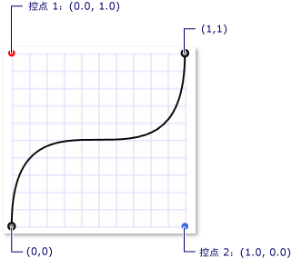

# 关键帧动画概述
本主题将向您介绍关键帧动画。  通过关键帧动画，您可以使用两个以上的目标值制作动画，并控制动画的内插方法。  
  
 本主题包括以下部分。  
  
   
-   [必备组件](#prerequisites)  
  
-   [使用关键帧动画](#keyframeanimations)  
  
-   [相关主题](#seeAlsoToggle)  
  
   
## 必备组件  
 若要理解本概述，您应熟悉 [!INCLUDE[TLA#tla_winclient](../../../../includes/tlasharptla-winclient-md.md)] 动画和时间线。  有关动画的简介，请参见[动画概述](../../../../docs/framework/wpf/graphics-multimedia/animation-overview.md)。它还有助于您熟悉 From\/To\/By 动画。  有关更多信息，请参见 [From\/To\/By 动画概述](../../../../docs/framework/wpf/graphics-multimedia/from-to-by-animations-overview.md)。  
  
   
## 什么是关键帧动画？  
 与 From\/To\/By 动画类似，关键帧动画以动画形式显示了目标属性的值。  它通过其 <xref:System.Windows.Media.Animation.Timeline.Duration%2A> 创建其目标值之间的过渡。  但是，From\/To\/By 动画可以创建两个值之间的过渡，而单个关键帧动画则可以创建任意数量的目标值之间的过渡。  与 From\/To\/By 动画不同的是，关键帧动画没有设置其目标值所需的 From、To 或 By 属性。  关键帧动画的目标值是使用关键帧对象进行描述的，因此称作“关键帧动画”。  若要指定动画的目标值，您可以创建关键帧对象并将其添加到动画的 <xref:System.Windows.Media.Animation.DoubleAnimationUsingKeyFrames.KeyFrames%2A> 集合内。  动画运行时，将在您指定的帧之间过渡。  
  
 某些关键帧方法除支持多个目标值外，还支持多个内插方法。  动画的内插方法定义了从某个值过渡到下一个值的方式。  有三种内插类型：[离散](GTMT)、[线性](GTMT)和[样条](GTMT)。  
  
 若要对关键帧动画进行动画处理，需要完成下列步骤。  
  
-   声明动画并以针对 From\/To\/By 动画的方式指定其 <xref:System.Windows.Media.Animation.Timeline.Duration%2A>。  
  
-   对于每一个目标值，创建相应类型的关键帧，设置其值和 <xref:System.Windows.Media.Animation.KeyTime>，并将其添加到动画的 <xref:System.Windows.Media.Animation.DoubleAnimationUsingKeyFrames.KeyFrames%2A> 集合内。  
  
-   以针对 From\/To\/By 动画的方式将动画与属性相关联。  有关使用演示图板将动画应用到属性的更多信息，请参见[演示图板概述](../../../../docs/framework/wpf/graphics-multimedia/storyboards-overview.md)。  
  
 下面的示例使用 <xref:System.Windows.Media.Animation.DoubleAnimationUsingKeyFrames> 对 <xref:System.Windows.Shapes.Rectangle> 元素在四个不同的位置进行动画处理。  
  
 <!-- TODO: review snippet reference [!code-xml[keyframes_ovw_snip#BasicKeyFrameExampleWholePage](../../../../samples/snippets/csharp/VS_Snippets_Wpf/keyframes_ovw_snip/CS/KeyFramesIntroduction.xaml#basickeyframeexamplewholepage)]  -->
 <!-- TODO: review snippet reference [!code-xml[keyframes_ovw_snip#BasicKeyFrameExampleWholePage](../../../../samples/snippets/xaml/VS_Snippets_Wpf/keyframes_ovw_snip/XAML/KeyFramesIntroduction.xaml#basickeyframeexamplewholepage)]  -->  
  
 您可以通过在标记和代码中使用 <xref:System.Windows.Media.Animation.Storyboard>，或者通过在代码中使用 <xref:System.Windows.Media.Animation.Animatable.BeginAnimation%2A> 方法以类似于针对 From\/To\/By 动画的方式将关键帧动画应用于属性。  还可以使用关键帧动画创建 <xref:System.Windows.Media.Animation.AnimationClock>，并将其应用于一个或多个属性。  有关应用动画的各种方法的更多信息，请参见[属性动画技术概述](../../../../docs/framework/wpf/graphics-multimedia/property-animation-techniques-overview.md)。  
  
   
## 关键帧动画类型  
 由于动画生成属性值，因此对于不同的属性类型，会有不同的动画类型。  若要对采用 <xref:System.Double> 的属性（例如元素的 <xref:System.Windows.FrameworkElement.Width%2A> 属性）进行动画处理，请使用生成 <xref:System.Double> 值的动画。  若要对采用 <xref:System.Windows.Point> 的属性进行动画处理，请使用生成 <xref:System.Windows.Point> 值的动画，依此类推。  
  
 关键帧动画类属于 <xref:System.Windows.Media.Animation> 命名空间，并遵守下列命名约定：  
  
 *\<类型\>* `AnimationUsingKeyFrames`  
  
 其中 *\<类型\>* 是该类进行动画处理的值的类型。  
  
 [!INCLUDE[TLA2#tla_winclient](../../../../includes/tla2sharptla-winclient-md.md)] 提供了以下关键帧动画类。  
  
|属性类型|对应的 From\/To\/By 动画类|支持的内插方法|  
|----------|--------------------------|-------------|  
|<xref:System.Boolean>|<xref:System.Windows.Media.Animation.BooleanAnimationUsingKeyFrames>|离散|  
|<xref:System.Byte>|<xref:System.Windows.Media.Animation.ByteAnimationUsingKeyFrames>|离散、线性、样条|  
|<xref:System.Windows.Media.Color>|<xref:System.Windows.Media.Animation.ColorAnimationUsingKeyFrames>|离散、线性、样条|  
|<xref:System.Decimal>|<xref:System.Windows.Media.Animation.DecimalAnimationUsingKeyFrames>|离散、线性、样条|  
|<xref:System.Double>|<xref:System.Windows.Media.Animation.DoubleAnimationUsingKeyFrames>|离散、线性、样条|  
|<xref:System.Int16>|<xref:System.Windows.Media.Animation.Int16AnimationUsingKeyFrames>|离散、线性、样条|  
|<xref:System.Int32>|<xref:System.Windows.Media.Animation.Int32AnimationUsingKeyFrames>|离散、线性、样条|  
|<xref:System.Int64>|<xref:System.Windows.Media.Animation.Int64AnimationUsingKeyFrames>|离散、线性、样条|  
|<xref:System.Windows.Media.Matrix>|<xref:System.Windows.Media.Animation.MatrixAnimationUsingKeyFrames>|离散|  
|<xref:System.Object>|<xref:System.Windows.Media.Animation.ObjectAnimationUsingKeyFrames>|离散|  
|<xref:System.Windows.Point>|<xref:System.Windows.Media.Animation.PointAnimationUsingKeyFrames>|离散、线性、样条|  
|<xref:System.Windows.Media.Media3D.Quaternion>|<xref:System.Windows.Media.Animation.QuaternionAnimationUsingKeyFrames>|离散、线性、样条|  
|<xref:System.Windows.Rect>|<xref:System.Windows.Media.Animation.RectAnimationUsingKeyFrames>|离散、线性、样条|  
|<xref:System.Windows.Media.Media3D.Rotation3D>|<xref:System.Windows.Media.Animation.Rotation3DAnimationUsingKeyFrames>|离散、线性、样条|  
|<xref:System.Single>|<xref:System.Windows.Media.Animation.SingleAnimationUsingKeyFrames>|离散、线性、样条|  
|<xref:System.String>|<xref:System.Windows.Media.Animation.StringAnimationUsingKeyFrames>|离散|  
|<xref:System.Windows.Size>|<xref:System.Windows.Media.Animation.SizeAnimationUsingKeyFrames>|离散、线性、样条|  
|<xref:System.Windows.Thickness>|<xref:System.Windows.Media.Animation.ThicknessAnimationUsingKeyFrames>|离散、线性、样条|  
|<xref:System.Windows.Media.Media3D.Vector3D>|<xref:System.Windows.Media.Animation.Vector3DAnimationUsingKeyFrames>|离散、线性、样条|  
|<xref:System.Windows.Vector>|<xref:System.Windows.Media.Animation.VectorAnimationUsingKeyFrames>|离散、线性、样条|  
  
   
## 目标值（关键帧）和关键时间  
 就像在对不同属性类型进行动画处理时有不同类型的关键帧动画一样，关键帧对象的类型也各不相同：对于每种进行动画处理的值和所支持的内插方法，都有一个对象类型。  关键帧类型遵守以下命名约定：  
  
 *\<内插方法\>\<类型\>* `KeyFrame`  
  
 其中 *\<内插方法\>* 是关键帧使用的内插方法，*\<类型\>* 是类进行动画处理的值的类型。  支持所有三种内插方法的关键帧动画有三种关键帧类型可供您使用。  例如，您可以使用以下三种具有 <xref:System.Windows.Media.Animation.DoubleAnimationUsingKeyFrames> 的关键帧类型：<xref:System.Windows.Media.Animation.DiscreteDoubleKeyFrame>、<xref:System.Windows.Media.Animation.LinearDoubleKeyFrame> 和 <xref:System.Windows.Media.Animation.SplineDoubleKeyFrame> （后面部分将对内插方法进行详细说明）。  
  
 关键帧的主要用途是指定 <xref:System.Windows.Media.Animation.IKeyFrame.KeyTime%2A> 和 <xref:System.Windows.Media.Animation.IKeyFrame.Value%2A>。  每个关键帧类型都可提供这两种属性。  
  
-   <xref:System.Windows.Media.Animation.IKeyFrame.Value%2A> 属性指定该关键帧的目标值。  
  
-   <xref:System.Windows.Media.Animation.IKeyFrame.KeyTime%2A> 属性指定到达关键帧的 <xref:System.Windows.Media.Animation.IKeyFrame.Value%2A> 的时间（在动画的 <xref:System.Windows.Media.Animation.Timeline.Duration%2A> 之内）。  
  
 关键帧动画开始后，会按照由关键帧 <xref:System.Windows.Media.Animation.IKeyFrame.KeyTime%2A> 属性定义的顺序来循环访问其关键帧。  
  
-   如果时间 0 上没有关键帧，动画将在目标属性当前值和第一个关键帧的 <xref:System.Windows.Media.Animation.IKeyFrame.Value%2A> 之间创建一个过渡；否则，动画的输出值将成为第一个关键帧的值。  
  
-   动画将使用由第二个关键帧指定的内插方法来创建第一个和第二个关键帧的 <xref:System.Windows.Media.Animation.IKeyFrame.Value%2A> 之间的过渡。  过渡起始自第一个关键帧的 <xref:System.Windows.Media.Animation.IKeyFrame.KeyTime%2A>，在到达第二个关键帧的 <xref:System.Windows.Media.Animation.IKeyFrame.KeyTime%2A> 时结束。  
  
-   动画将继续，并创建每个后续关键帧及其前面的关键帧之间的过渡。  
  
-   最终，动画过渡到关键时间最大（等于或小于动画的 <xref:System.Windows.Media.Animation.Timeline.Duration%2A>）的关键帧值。  
  
 如果动画的 <xref:System.Windows.Media.Animation.Timeline.Duration%2A> 为 <xref:System.Windows.Duration.Automatic%2A>，或其 <xref:System.Windows.Media.Animation.Timeline.Duration%2A> 等于最后一个关键帧的时间，则动画将结束。  否则，如果动画的 <xref:System.Windows.Duration> 大于最后一个关键帧的关键时间，则动画的关键帧值将一直保留，直到到达其 <xref:System.Windows.Duration> 的末尾为止。  与所有动画类似，关键帧动画使用其 <xref:System.Windows.Media.Animation.Timeline.FillBehavior%2A> 属性确定在到达其活动周期末尾时是否保留最终值。  有关更多信息，请参见 [计时行为概述](../../../../docs/framework/wpf/graphics-multimedia/timing-behaviors-overview.md)。  
  
 下面的示例使用在前面的示例中定义的 <xref:System.Windows.Media.Animation.DoubleAnimationUsingKeyFrames> 对象来演示 <xref:System.Windows.Media.Animation.IKeyFrame.Value%2A> 和 <xref:System.Windows.Media.Animation.IKeyFrame.KeyTime%2A> 属性的工作方式。  
  
-   第一个关键帧立即将动画的输出值设置为 0。  
  
-   第二个关键帧在 0 和 350 之间进行动画移动。  它的起始位置是第一个关键帧的结束位置（时间 \= 0 秒），播放 2 秒钟，结束位置为时间 \= 0:0:2。  
  
-   第三个关键帧在 350 和 50 之间进行动画移动。  它的起始位置是第二个关键帧的结束位置（时间 \= 2 秒），播放 5 秒钟，结束位置为时间 \= 0:0:7。  
  
-   第四个关键帧在 50 和 200 之间进行动画移动。  它的起始位置是第三个关键帧的结束位置（时间 \= 7 秒），播放 1 秒钟，结束位置为时间 \= 0:0:8。  
  
-   由于动画的 <xref:System.Windows.Media.Animation.Timeline.Duration%2A> 属性设置为 10 秒，该动画将其最终值保留两秒钟，并将在时间 \= 0:0:10 时结束。  
  
 <!-- TODO: review snippet reference [!code-xml[keyframes_ovw_snip#BasicKeyFrameExampleWholePage](../../../../samples/snippets/csharp/VS_Snippets_Wpf/keyframes_ovw_snip/CS/KeyFramesIntroduction.xaml#basickeyframeexamplewholepage)]  -->
 <!-- TODO: review snippet reference [!code-xml[keyframes_ovw_snip#BasicKeyFrameExampleWholePage](../../../../samples/snippets/xaml/VS_Snippets_Wpf/keyframes_ovw_snip/XAML/KeyFramesIntroduction.xaml#basickeyframeexamplewholepage)]  -->  
  
   
## 内插方法  
 前面部分提到了某些关键帧动画支持多种内插方法。  动画的内插对动画在其持续时间内在值之间进行过渡的方式进行了描述。  通过选择您的动画将要使用哪种关键帧类型，您可以定义该关键帧段的内插方法。  有三种类型的内插方法：线性、离散和样条。  
  
### 线性内插  
 使用[线性内插](GTMT)，动画将以段持续期间内的固定速度来播放。  例如，如果关键帧段从 0 过渡到 10，持续期间为 5 秒，则动画会在指定时间输出以下值：  
  
|时间|输出值|  
|--------|---------|  
|0|0|  
|1|2|  
|2|4|  
|3|6|  
|4|8|  
|4.25|8.5|  
|4.5|9|  
|5|10|  
  
### 离散内插  
 使用[离散内插](GTMT)，动画函数将从一个值跳到下一个没有内插的值。  如果关键帧段从 0 过渡到 10，持续期间为 5 秒，则动画会在指定时间输出以下值：  
  
|时间|输出值|  
|--------|---------|  
|0|0|  
|1|0|  
|2|0|  
|3|0|  
|4|0|  
|4.25|0|  
|4.5|0|  
|5|10|  
  
 请注意，动画在段持续期间恰好结束之前不会更改其输出值。  
  
 [样条内插](GTMT)更为复杂。  有关内容将在下一部分介绍。  
  
   
### 样条内插  
 样条内插可用于达到更现实的计时效果。  由于动画通常用于模拟现实世界中发生的效果，因此开发人员可能需要精确地控制对象的加速和减速，并需要严格地对计时段进行操作。  通过样条关键帧，您可以使用样条内插进行动画处理。  使用其他关键帧，您可以指定一个 <xref:System.Windows.Media.Animation.IKeyFrame.Value%2A> 和 <xref:System.Windows.Media.Animation.IKeyFrame.KeyTime%2A>。  使用样条关键帧，您还可以指定一个 <xref:System.Windows.Media.Animation.SplineDoubleKeyFrame.KeySpline%2A>。  下面的示例演示 <xref:System.Windows.Media.Animation.DoubleAnimationUsingKeyFrames> 的单个样条关键帧。  请注意 <xref:System.Windows.Media.Animation.KeySpline> 属性，它正是样条关键帧与其他类型的关键帧的不同之处。  
  
 <!-- TODO: review snippet reference [!code-xml[keyframes_ovw_snip#SingleSplineKeyFrameExample](../../../../samples/snippets/csharp/VS_Snippets_Wpf/keyframes_ovw_snip/CS/InterpolationMethodsExample.xaml#singlesplinekeyframeexample)]  -->
 <!-- TODO: review snippet reference [!code-xml[keyframes_ovw_snip#SingleSplineKeyFrameExample](../../../../samples/snippets/xaml/VS_Snippets_Wpf/keyframes_ovw_snip/XAML/InterpolationMethodsExample.xaml#singlesplinekeyframeexample)]  -->  
  
 一条[三次方贝塞尔曲线](GTMT)由一个起点、一个终点和两个控制点来定义。  样条关键帧的 <xref:System.Windows.Media.Animation.KeySpline> 属性定义从 \(0,0\) 延伸到 \(1,1\) 的贝塞尔曲线的两个控制点。  第一个控制点控制贝塞尔曲线前半部分的曲线因子，第二个控制点控制贝塞尔线段后半部分的曲线因子。  所得到的曲线是对该样条关键帧的更改速率所进行的描述。  曲线陡度越大，关键帧更改其值的速度越快。  曲线趋于平缓时，关键帧更改其值的速度也趋于缓慢。  
  
 您可以使用 <xref:System.Windows.Media.Animation.KeySpline> 来模拟下落的水滴或跳动的球等的物理轨迹，或者应用动画的其他“潜入”和“潜出”效果。  对于用户交互效果，例如背景淡入\/淡出或控制按钮弹跳等，您可能要应用样条内插，以便以特定方式提高或降低动画的更改速率。  
  
 以下示例将 <xref:System.Windows.Media.Animation.KeySpline> 指定为 0、1、1、0，可产生如下贝塞尔曲线。  
  
   
控制点为 \(0.0, 1.0\) 和 \(1.0, 0.0\) 的关键样条  
  
 <!-- TODO: review snippet reference [!code-xml[keyframes_ovw_snip#SingleSplineKeyFrameExample](../../../../samples/snippets/csharp/VS_Snippets_Wpf/keyframes_ovw_snip/CS/InterpolationMethodsExample.xaml#singlesplinekeyframeexample)]  -->
 <!-- TODO: review snippet reference [!code-xml[keyframes_ovw_snip#SingleSplineKeyFrameExample](../../../../samples/snippets/xaml/VS_Snippets_Wpf/keyframes_ovw_snip/XAML/InterpolationMethodsExample.xaml#singlesplinekeyframeexample)]  -->  
  
 此关键帧将在开始时快速运动，减速，然后再次加速，直到结束。  
  
 以下示例将 <xref:System.Windows.Media.Animation.KeySpline> 指定为 0.5、0.25、0.75、1.0，可产生如下贝塞尔曲线。  
  
   
控制点为 \(0.25, 0.5\) 和 \(0.75, 1.0\) 的关键样条  
  
 <!-- TODO: review snippet reference [!code-xml[keyframes_ovw_snip#SingleSplineKeyFrameExampleInline3](../../../../samples/snippets/csharp/VS_Snippets_Wpf/keyframes_ovw_snip/CS/InterpolationMethodsExample.xaml#singlesplinekeyframeexampleinline3)]  -->
 <!-- TODO: review snippet reference [!code-xml[keyframes_ovw_snip#SingleSplineKeyFrameExampleInline3](../../../../samples/snippets/xaml/VS_Snippets_Wpf/keyframes_ovw_snip/XAML/InterpolationMethodsExample.xaml#singlesplinekeyframeexampleinline3)]  -->  
  
 由于贝塞尔曲线的曲度变化幅度很小，此关键帧的运动速率几乎固定不变；只在将近接近结束时才开始减速。  
  
 下面的示例使用 <xref:System.Windows.Media.Animation.DoubleAnimationUsingKeyFrames> 对矩形的位置进行动画处理。  由于 <xref:System.Windows.Media.Animation.DoubleAnimationUsingKeyFrames> 使用 <xref:System.Windows.Media.Animation.SplineDoubleKeyFrame> 对象，每个关键帧值之间的过渡都将使用样条内插。  
  
 <!-- TODO: review snippet reference [!code-xml[keyframes_ovw_snip#SplinedInterpolationExample](../../../../samples/snippets/csharp/VS_Snippets_Wpf/keyframes_ovw_snip/CS/InterpolationMethodsExample.xaml#splinedinterpolationexample)]  -->
 <!-- TODO: review snippet reference [!code-xml[keyframes_ovw_snip#SplinedInterpolationExample](../../../../samples/snippets/xaml/VS_Snippets_Wpf/keyframes_ovw_snip/XAML/InterpolationMethodsExample.xaml#splinedinterpolationexample)]  -->  
  
 样条内插可能很难理解；请使用不同的设置进行体验，这会有助于理解。  通过 [Key Spline Animation Sample](http://go.microsoft.com/fwlink/?LinkID=160011)（关键样条动画示例），可以更改关键样条值，并可查看由此所产生的动画结果。  
  
   
### 组合内插方法  
 您可在一个关键帧动画中使用具有不同内插类型的关键帧。  如果两个具有不同内插的关键帧动画彼此跟随，第二个关键帧的内插方法将用于创建从第一个值到第二个值的过渡。  
  
 以下示例将创建一个使用线性、样条和离散内插的 <xref:System.Windows.Media.Animation.DoubleAnimationUsingKeyFrames>。  
  
 <!-- TODO: review snippet reference [!code-xml[keyframes_ovw_snip#ComboInterpolationExample](../../../../samples/snippets/csharp/VS_Snippets_Wpf/keyframes_ovw_snip/CS/InterpolationMethodsExample.xaml#combointerpolationexample)]  -->
 <!-- TODO: review snippet reference [!code-xml[keyframes_ovw_snip#ComboInterpolationExample](../../../../samples/snippets/xaml/VS_Snippets_Wpf/keyframes_ovw_snip/XAML/InterpolationMethodsExample.xaml#combointerpolationexample)]  -->  
  
   
## 有关持续时间和关键时间的更多信息  
 像其他动画一样，关键帧动画具有 <xref:System.Windows.Duration> 属性。  除了指定动画的 <xref:System.Windows.Duration> 外，您还需要指定向每个关键帧分配持续时间内的多长一段时间。  您可以为动画的每个关键帧描述其 <xref:System.Windows.Media.Animation.IKeyFrame.KeyTime%2A> 来实现此目的。  每个关键帧的 <xref:System.Windows.Media.Animation.IKeyFrame.KeyTime%2A> 都指定了该关键帧的结束时间。  
  
 <xref:System.Windows.Media.Animation.IKeyFrame.KeyTime%2A> 属性并不指定关键时间播放的长度。  关键帧播放时间长度由关键帧的结束时间、前一个关键帧的结束时间以及动画的持续时间来确定。  可以以时间值、百分比的形式来指定关键时间，或者将其指定为特殊值 <xref:System.Windows.Media.Animation.KeyTime.Uniform%2A> 或 <xref:System.Windows.Media.Animation.KeyTime.Paced%2A>。  
  
 以下列表描述了指定关键时间的不同方式。  
  
### TimeSpan 值  
 您可以使用 <xref:System.TimeSpan> 值来指定 <xref:System.Windows.Media.Animation.KeyTime>。  该值应大于或等于 0 并且小于或等于动画的持续时间。  下面的示例演示一个持续时间为 10 秒钟、有四个关键帧（这些关键帧的关键时间被指定为时间值）的动画。  
  
-   在前 3 秒钟内，第一个关键帧将在基值和 100 之间进行动画移动。结束位置为时间 \= 0:0:03。  
  
-   第二个关键帧在 100 和 200 之间进行动画移动。  它的起始位置是第一个关键帧的结束位置（时间 \= 3 秒），播放 5 秒钟，结束位置为时间 \= 0:0:8。  
  
-   第三个关键帧在 200 和 500 之间进行动画移动。  它的起始位置是第二个关键帧的结束位置（时间 \= 8 秒），播放 1 秒钟，结束位置为时间 \= 0:0:9。  
  
-   第四个关键帧在 500 和 600 之间进行动画移动。  它的起始位置是第三个关键帧的结束位置（时间 \= 9 秒），播放 1 秒钟，结束位置为时间 \= 0:0:10。  
  
 <!-- TODO: review snippet reference [!code-xml[keyframes_ovw_snip#TimeSpanKeyTimeExample](../../../../samples/snippets/csharp/VS_Snippets_Wpf/keyframes_ovw_snip/CS/KeyTimesExample.xaml#timespankeytimeexample)]  -->
 <!-- TODO: review snippet reference [!code-xml[keyframes_ovw_snip#TimeSpanKeyTimeExample](../../../../samples/snippets/xaml/VS_Snippets_Wpf/keyframes_ovw_snip/XAML/KeyTimesExample.xaml#timespankeytimeexample)]  -->  
  
### 百分比值  
 百分比值指定关键帧在动画的 <xref:System.Windows.Media.Animation.Timeline.Duration%2A> 内的某百分比处结束。  在 [!INCLUDE[TLA2#tla_xaml](../../../../includes/tla2sharptla-xaml-md.md)] 中，将百分比指定为一个数字，后面跟随 `%` 符号。  在代码中，使用 <xref:System.Windows.Media.Animation.KeyTime.FromPercent%2A> 方法并向其传递一个 <xref:System.Double>，以表示百分比。  该值必须大于或等于 0 并且小于或等于 100%。  下面的示例演示一个持续时间为 10 秒钟、有四个关键帧（这些关键帧的关键时间被指定为百分比）的动画。  
  
-   在前 3 秒钟内，第一个关键帧将在基值和 100 之间进行动画移动，结束位置为时间 \= 0:0:3。  
  
-   第二个关键帧在 100 和 200 之间进行动画移动。  它的起始位置是第一个关键帧的结束位置（时间 \= 3 秒），播放 5 秒钟，结束位置为时间 \= 0:0:8 \(0.8 \* 10 \= 8\)。  
  
-   第三个关键帧在 200 和 500 之间进行动画移动。  它的起始位置是第二个关键帧的结束位置（时间 \= 8 秒），播放 1 秒钟，结束位置为时间 \= 0:0:9 \(0.9 \* 10 \= 9\)。  
  
-   第四个关键帧在 500 和 600 之间进行动画移动。  它的起始位置是第三个关键帧的结束位置（时间 \= 9 秒），播放 1 秒钟，结束位置为时间 \= 0:0:10 \(1 \* 10 \= 10\)。  
  
 <!-- TODO: review snippet reference [!code-xml[keyframes_ovw_snip#PercentageKeyTimeExample](../../../../samples/snippets/csharp/VS_Snippets_Wpf/keyframes_ovw_snip/CS/KeyTimesExample.xaml#percentagekeytimeexample)]  -->
 <!-- TODO: review snippet reference [!code-xml[keyframes_ovw_snip#PercentageKeyTimeExample](../../../../samples/snippets/xaml/VS_Snippets_Wpf/keyframes_ovw_snip/XAML/KeyTimesExample.xaml#percentagekeytimeexample)]  -->  
  
### 特殊值 Uniform  
 如果希望每个关键帧的持续时间都相同，请使用 <xref:System.Windows.Media.Animation.KeyTime.Uniform%2A> 计时。  
  
 <xref:System.Windows.Media.Animation.KeyTime.Uniform%2A> 关键时间按关键帧的数量平均分配可用时间，以确定每个关键帧的结束时间。  下面的示例演示一个持续时间为 10 秒钟、有四个关键帧（这些关键帧的关键时间被指定为 <xref:System.Windows.Media.Animation.KeyTime.Uniform%2A>）的动画。  
  
-   在前 2.5 秒钟内，第一个关键帧将在基值和 100 之间进行动画移动，结束位置为时间 \= 0:0:2.5。  
  
-   第二个关键帧在 100 和 200 之间进行动画移动。  它的起始位置是第一个关键帧的结束位置（时间 \= 2.5 秒），播放大约 2.5 秒钟，结束位置为时间 \= 0:0:5。  
  
-   第三个关键帧在 200 和 500 之间进行动画移动。  它的起始位置是第二个关键帧的结束位置（时间 \= 5 秒），播放 2.5 秒钟，结束位置为时间 \= 0:0:7.5。  
  
-   第四个关键帧在 500 和 600 之间进行动画移动。  它的起始位置是第二个关键帧的结束位置（时间 \= 7.5 秒），播放 2.5 秒钟，结束位置为时间 \= 0:0:1。  
  
 <!-- TODO: review snippet reference [!code-xml[keyframes_ovw_snip#UniformKeyTimeExample](../../../../samples/snippets/csharp/VS_Snippets_Wpf/keyframes_ovw_snip/CS/KeyTimesExample.xaml#uniformkeytimeexample)]  -->
 <!-- TODO: review snippet reference [!code-xml[keyframes_ovw_snip#UniformKeyTimeExample](../../../../samples/snippets/xaml/VS_Snippets_Wpf/keyframes_ovw_snip/XAML/KeyTimesExample.xaml#uniformkeytimeexample)]  -->  
  
### 特殊值 Paced  
 如果希望以固定速率显示动画，请使用 <xref:System.Windows.Media.Animation.KeyTime.Paced%2A> 计时。  
  
 <xref:System.Windows.Media.Animation.KeyTime.Paced%2A> 关键时间根据每一关键帧的长度来分配可用时间，以确定每帧的持续时间。  这样，动画的速度或速率将保持不变。  下面的示例演示一个持续时间为 10 秒钟、有三个关键帧（这些关键帧的关键时间被指定为 <xref:System.Windows.Media.Animation.KeyTime.Paced%2A>）的动画。  
  
 <!-- TODO: review snippet reference [!code-xml[keyframes_ovw_snip#PacedKeyTimeExample](../../../../samples/snippets/csharp/VS_Snippets_Wpf/keyframes_ovw_snip/CS/KeyTimesExample.xaml#pacedkeytimeexample)]  -->
 <!-- TODO: review snippet reference [!code-xml[keyframes_ovw_snip#PacedKeyTimeExample](../../../../samples/snippets/xaml/VS_Snippets_Wpf/keyframes_ovw_snip/XAML/KeyTimesExample.xaml#pacedkeytimeexample)]  -->  
  
 请注意，如果最后一个关键帧的关键时间为 <xref:System.Windows.Media.Animation.KeyTime.Paced%2A> 或 <xref:System.Windows.Media.Animation.KeyTime.Uniform%2A>，其解析的关键时间将设置为 100%。  如果多帧动画中的第一个关键帧为固定速度，则其解析的关键时间将设置为 0。  如果关键帧集合仅包含单个关键帧，并且是一个固定速度的关键帧，则其解析的关键时间将设置为 100%。  
  
 一个关键帧动画中的不同关键帧可使用不同的关键时间类型。  
  
   
## 组合关键时间，顺序紊乱的关键帧  
 您可在同一动画中使用具有不同 <xref:System.Windows.Media.Animation.KeyTime> 值类型的关键帧。  此外，我们建议您以关键帧的预期播放顺序来添加关键帧，但也可不必这么操作。  动画和计时系统能够处理顺序紊乱的关键帧。  将忽略具有无效关键时间的关键帧。  
  
 以下列表描述了为关键帧动画的关键帧解析关键时间的过程。  
  
1.  解析 <xref:System.TimeSpan> <xref:System.Windows.Media.Animation.KeyTime> 值。  
  
2.  确定动画的*总内插时间*，即关键帧动画完成向前迭代所需的全部时间。  
  
    1.  如果动画的 <xref:System.Windows.Media.Animation.Timeline.Duration%2A> 不是 <xref:System.Windows.Duration.Automatic%2A> 或 <xref:System.Windows.Duration.Forever%2A>，则总内插时间为动画的 <xref:System.Windows.Media.Animation.Timeline.Duration%2A> 属性的值。  
  
    2.  否则，总内插时间是其关键帧中所指定的最大 <xref:System.TimeSpan> <xref:System.Windows.Media.Animation.KeyTime> 值（如果存在这样的值）。  
  
    3.  否则，总内插时间为 1 秒。  
  
3.  使用总内插时间值解析 <xref:System.Windows.Media.Animation.KeyTimeType> <xref:System.Windows.Media.Animation.KeyTime> 值。  
  
4.  如果最后一个关键帧尚未在前面的步骤中解析，则将解析该关键帧。  如果最后一个关键帧的 <xref:System.Windows.Media.Animation.KeyTime> 为 <xref:System.Windows.Media.Animation.KeyTime.Uniform%2A> 或 <xref:System.Windows.Media.Animation.KeyTime.Paced%2A>，其解析的时间将等于总内插时间。  
  
     如果第一个关键帧的 <xref:System.Windows.Media.Animation.KeyTime> 为 <xref:System.Windows.Media.Animation.KeyTime.Paced%2A>，并且此动画具有多个关键帧，则将其 <xref:System.Windows.Media.Animation.KeyTime> 值解析为零；如果只有一个关键帧，并且其 <xref:System.Windows.Media.Animation.KeyTime> 值为 <xref:System.Windows.Media.Animation.KeyTime.Paced%2A>，则该值将解析为总内插时间，如前面的步骤所述。  
  
5.  解析其余的 <xref:System.Windows.Media.Animation.KeyTime.Uniform%2A> <xref:System.Windows.Media.Animation.KeyTime> 值：它们将平均分配可用时间。  在此过程中，未解析的 <xref:System.Windows.Media.Animation.KeyTime.Paced%2A> <xref:System.Windows.Media.Animation.KeyTime> 值将被临时视为 <xref:System.Windows.Media.Animation.KeyTime.Uniform%2A> <xref:System.Windows.Media.Animation.KeyTime> 值，并将获得临时解析时间。  
  
6.  解析具有未指定关键时间的关键帧的 <xref:System.Windows.Media.Animation.KeyTime> 值，具体做法是使用距离它们最近的、已解析 <xref:System.Windows.Media.Animation.KeyTime> 值的声明关键帧。  
  
7.  解析其余的 <xref:System.Windows.Media.Animation.KeyTime.Paced%2A> <xref:System.Windows.Media.Animation.KeyTime> 值。  <xref:System.Windows.Media.Animation.KeyTime.Paced%2A> <xref:System.Windows.Media.Animation.KeyTime> 使用临近关键帧的 <xref:System.Windows.Media.Animation.KeyTime> 值确定其解析时间。  目标是确保动画速度在此关键帧的解析时间内保持固定不变。  
  
8.  将关键帧按解析时间（主键）以及声明顺序（次键）进行排序，换言之，根据解析关键帧 <xref:System.Windows.Media.Animation.KeyTime> 值按固定顺序进行排序。  
  
## 请参阅  
 <xref:System.Windows.Media.Animation.KeyTime>   
 <xref:System.Windows.Media.Animation.KeySpline>   
 <xref:System.Windows.Media.Animation.Timeline>   
 [Key Spline Animation Sample](http://go.microsoft.com/fwlink/?LinkID=160011)   
 [KeyFrame Animation Sample](http://go.microsoft.com/fwlink/?LinkID=160012)   
 [动画概述](../../../../docs/framework/wpf/graphics-multimedia/animation-overview.md)   
 [演示图板概述](../../../../docs/framework/wpf/graphics-multimedia/storyboards-overview.md)   
 [关键帧动画帮助主题](../../../../docs/framework/wpf/graphics-multimedia/key-frame-animation-how-to-topics.md)   
 [计时行为概述](../../../../docs/framework/wpf/graphics-multimedia/timing-behaviors-overview.md)