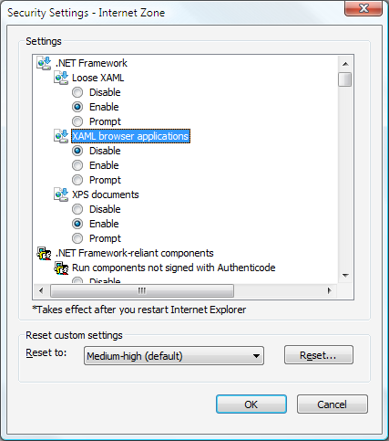

# 安全性 (WPF)
 在开发 [!INCLUDE[TLA#tla_wpf](../../../includes/tlasharptla-wpf-md.md)] 独立应用程序和浏览器承载的应用程序时，您必须考虑安全模式。不管是使用 Windows Installer \(.msi\)、XCopy 还是 [!INCLUDE[TLA2#tla_clickonce](../../../includes/tla2sharptla-clickonce-md.md)] 进行部署，[!INCLUDE[TLA2#tla_wpf](../../../includes/tla2sharptla-wpf-md.md)] 独立应用程序都将采用无限制的权限（[!INCLUDE[TLA2#tla_cas](../../../includes/tla2sharptla-cas-md.md)] **FullTrust** 权限集）执行。  不支持使用 ClickOnce 部署部分信任的独立 WPF 应用程序。  不过，完全信任的宿主应用程序可以使用 .NET Framework 外接程序模型创建部分信任的 <xref:System.AppDomain>。  有关更多信息，请参见 [WPF 外接程序概述](../../../docs/framework/wpf/app-development/wpf-add-ins-overview.md)。  
  
 [!INCLUDE[TLA2#tla_wpf](../../../includes/tla2sharptla-wpf-md.md)] 浏览器承载的应用程序由 [!INCLUDE[TLA#tla_iegeneric](../../../includes/tlasharptla-iegeneric-md.md)] 或 Firefox 承载，可以是 [!INCLUDE[TLA#tla_xbap#plural](../../../includes/tlasharptla-xbapsharpplural-md.md)] 或松散的[!INCLUDE[TLA#tla_xaml](../../../includes/tlasharptla-xaml-md.md)] 文档。有关更多信息，请参见 [WPF XAML 浏览器应用程序概述](../../../docs/framework/wpf/app-development/wpf-xaml-browser-applications-overview.md)。  
  
 [!INCLUDE[TLA2#tla_wpf](../../../includes/tla2sharptla-wpf-md.md)] 浏览器承载的应用程序在一个部分信任的安全沙盒中执行，在默认情况下，仅限于默认 [!INCLUDE[TLA2#tla_cas](../../../includes/tla2sharptla-cas-md.md)] **Internet** 区域权限集。  这可以有效地将 [!INCLUDE[TLA2#tla_wpf](../../../includes/tla2sharptla-wpf-md.md)] 浏览器承载的应用程序与客户端计算机进行隔离，采用的方法与希望隔离典型 Web 应用程序所用的方法相同。  XBAP 最高可以将权限提升到“完全信任”，具体情况视部署 URL 的安全区域和客户端的安全配置而定。  有关更多信息，请参见 [WPF 部分信任安全](../../../docs/framework/wpf/wpf-partial-trust-security.md)。  
  
 本主题介绍了 [!INCLUDE[TLA#tla_wpf](../../../includes/tlasharptla-wpf-md.md)] 独立应用程序和浏览器承载的应用程序的安全模型。  
  
 本主题包含以下各节：  
  
-   [安全导航](#SafeTopLevelNavigation)  
  
-   [Web 浏览软件安全设置](#InternetExplorerSecuritySettings)  
  
-   [WebBrowser 控件和功能控制](#webbrowser_control_and_feature_controls)  
  
-   [对于部分受信任的客户端应用程序禁用 APTCA 程序集](#APTCA)  
  
-   [松散 XAML 文件的沙盒行为](#LooseContentSandboxing)  
  
-   [用于开发可提高安全性的 WPF 应用程序的资源](#BestPractices)  
  
   
## 安全导航  
 对于 [!INCLUDE[TLA2#tla_xbap#plural](../../../includes/tla2sharptla-xbapsharpplural-md.md)]，[!INCLUDE[TLA2#tla_wpf](../../../includes/tla2sharptla-wpf-md.md)] 区分两种类型的导航：应用程序和浏览器。  
  
 *应用程序导航* 是指浏览器承载的应用程序内的内容项之间的导航。  *浏览器导航* 是指可更改浏览器本身的内容和位置 URL 的导航。  应用程序导航（通常为 XAML）和浏览器导航（通常为 HTML）之间的关系如下图所示：  
  
   
  
 是否将内容类型视为可供 [!INCLUDE[TLA2#tla_xbap](../../../includes/tla2sharptla-xbap-md.md)] 安全导航主要取决于是使用应用程序导航还是浏览器导航。  
  
   
### 应用程序导航的安全性  
 如果应用程序的导航可以使用打包的 [!INCLUDE[TLA2#tla_uri](../../../includes/tla2sharptla-uri-md.md)] 来标识，则将该应用程序导航视为安全，它支持四种类型的内容：  
  
|内容类型|说明|URI 示例|  
|----------|--------|------------|  
|资源|使用生成类型**“资源”**添加到项目中的文件。|`pack://application:,,,/MyResourceFile.xaml`|  
|Content|使用生成类型**“内容”**添加到项目中的文件。|`pack://application:,,,/MyContentFile.xaml`|  
|源站点|使用生成类型**“无”**添加到项目中的文件。|`pack://siteoforigin:,,,/MySiteOfOriginFile.xaml`|  
|应用程序代码|具有已编译的代码隐藏的 XAML 资源。   \- 或 \-   使用生成类型**“页”**添加到项目中的 XAML 文件。|`pack://application:,,,/MyResourceFile` `.xaml`|  
  
> [!NOTE]
>  有关应用程序数据文件和打包的 [!INCLUDE[TLA2#tla_uri#plural](../../../includes/tla2sharptla-urisharpplural-md.md)] 的更多信息，请参见 [WPF 应用程序资源、内容和数据文件](../../../docs/framework/wpf/app-development/wpf-application-resource-content-and-data-files.md)。  
  
 用户可能会导航到这些内容类型的文件，或者可能通过编程方式导航到这些内容类型的文件。  
  
-   **用户导航**。  用户通过单击 <xref:System.Windows.Documents.Hyperlink> 元素进行导航。  
  
-   **编程导航**。  应用程序在不涉及用户的情况下进行导航，例如，通过设置 <xref:System.Windows.Navigation.NavigationWindow.Source%2A?displayProperty=fullName> 属性进行导航。  
  
   
### 浏览器导航的安全性  
 只有在以下条件下，才会将浏览器导航视为安全：  
  
-   **用户导航**。  用户通过单击主 <xref:System.Windows.Navigation.NavigationWindow>（而不是嵌套 <xref:System.Windows.Controls.Frame>）内的 <xref:System.Windows.Documents.Hyperlink> 元素进行导航。  
  
-   **区域**。  导航到的内容位于 Internet 或本地 Intranet。  
  
-   **协议**。  使用的协议是 **http**、**https**、**file** 或 **mailto**。  
  
 如果 [!INCLUDE[TLA2#tla_xbap](../../../includes/tla2sharptla-xbap-md.md)] 尝试以不符合这些条件的方式导航内容，则会引发 <xref:System.Security.SecurityException>。  
  
   
## Web 浏览软件安全设置  
 计算机上的安全设置确定为任何 Web 浏览软件授予的访问权限。  Web 浏览软件包括任何使用 [WinINet](http://go.microsoft.com/fwlink/?LinkId=179379) 或 [UrlMon](http://go.microsoft.com/fwlink/?LinkId=179383) API 的应用程序或组件，其中包括 Internet Explorer 和 PresentationHost.exe。  
  
 [!INCLUDE[TLA2#tla_iegeneric](../../../includes/tla2sharptla-iegeneric-md.md)] 提供了一种机制，通过它可以配置允许由 [!INCLUDE[TLA2#tla_iegeneric](../../../includes/tla2sharptla-iegeneric-md.md)] 执行的功能或来自它的功能，包括下面各项：  
  
-   [!INCLUDE[TLA2#tla_winfx](../../../includes/tla2sharptla-winfx-md.md)] 相关组件  
  
-   ActiveX 控件和插件  
  
-   下载  
  
-   脚本  
  
-   用户身份验证  
  
 可通过这种方式确保安全的功能集合分别针对**“Internet”**、**“Intranet”**、**“可信站点”**和**“受限站点”**区域在每个区域中配置。  下面的步骤描述如何配置安全设置：  
  
1.  打开**“控制面板”**。  
  
2.  单击**“网络和 Internet”**，然后单击**“Internet 选项”**。  
  
     将出现“Internet 选项”对话框。  
  
3.  在**“安全”**选项卡上，选择要为其配置安全设置的区域。  
  
4.  单击**“自定义级别”**按钮。  
  
     **“安全设置”**对话框将出现，并且您可以为所选区域配置安全设置。  
  
       
  
> [!NOTE]
>  也可以从 Internet Explorer 中进入“Internet 选项”对话框。  单击**“工具”**，然后单击**“Internet 选项”**。  
  
 从 [!INCLUDE[TLA#tla_ie7](../../../includes/tlasharptla-ie7-md.md)] 开始，包括了以下四种专门为 [!INCLUDE[TLA2#tla_winfx](../../../includes/tla2sharptla-winfx-md.md)] 提供的安全设置：  
  
-   **松散的 XAML**。  控制 [!INCLUDE[TLA2#tla_iegeneric](../../../includes/tla2sharptla-iegeneric-md.md)] 是否可以导航到松散的 [!INCLUDE[TLA2#tla_xaml](../../../includes/tla2sharptla-xaml-md.md)] 文件。  （“启用”、“禁用”和“提示”选项）。  
  
-   **XAML 浏览器应用程序**。  控制 [!INCLUDE[TLA2#tla_iegeneric](../../../includes/tla2sharptla-iegeneric-md.md)] 是否可以导航到 [!INCLUDE[TLA2#tla_xbap#plural](../../../includes/tla2sharptla-xbapsharpplural-md.md)] 并运行它。  （“启用”、“禁用”和“提示”选项）。  
  
 默认情况下，将对**“Internet”**、**“本地 Intranet”**和**“可信站点”**区域启用所有这些设置，而对**“受限站点”**区域则禁用这些设置。  
  
   
### 与安全相关的 WPF 注册表设置  
 除了可通过“Internet 选项”设置的安全设置之外，还可以通过以下注册表值有选择地阻止许多安全敏感 WPF 功能。  这些值是在以下注册表项下定义的：  
  
 `HKEY_LOCAL_MACHINE\SOFTWARE\Microsoft\.NETFramework\Windows Presentation Foundation\Features`  
  
 下表列出了可以设置的值。  
  
|值名称|值类型|值数据|  
|---------|---------|---------|  
|XBAPDisallow|REG\_DWORD|1 为禁止；0 为允许。|  
|LooseXamlDisallow|REG\_DWORD|1 为禁止；0 为允许。|  
|WebBrowserDisallow|REG\_DWORD|1 为禁止；0 为允许。|  
|MediaAudioDisallow|REG\_DWORD|1 为禁止；0 为允许。|  
|MediaImageDisallow|REG\_DWORD|1 为禁止；0 为允许。|  
|MediaVideoDisallow|REG\_DWORD|1 为禁止；0 为允许。|  
|ScriptInteropDisallow|REG\_DWORD|1 为禁止；0 为允许。|  
  
   
## WebBrowser 控件和功能控制  
 可以使用 WPF <xref:System.Windows.Controls.WebBrowser> 控件来承载 Web 内容。  WPF <xref:System.Windows.Controls.WebBrowser> 控件包装基础 WebBrowser ActiveX 控件。  当您使用 WPF <xref:System.Windows.Controls.WebBrowser> 控件来承载不受信任的 Web 内容时，WPF 提供了某些支持来保护应用程序的安全。  但是，某些安全功能必须由使用 <xref:System.Windows.Controls.WebBrowser> 控件的应用程序直接应用。  有关 WebBrowser ActiveX 控件的更多信息，请参见 [WebBrowser Control Overviews and Tutorials](http://go.microsoft.com/fwlink/?LinkId=179388)（WebBrowser 控件概述和教程）。  
  
> [!NOTE]
>  本节也适用于 <xref:System.Windows.Controls.Frame> 控件，因为该控件使用 <xref:System.Windows.Controls.WebBrowser> 导航到 HTML 内容。  
  
 如果使用 WPF <xref:System.Windows.Controls.WebBrowser> 控件来承载不受信任的 Web 内容，则应用程序应使用部分信任的 <xref:System.AppDomain> 来帮助将应用程序代码与潜在的恶意 HTML 脚本代码隔离。  如果应用程序使用 <xref:System.Windows.Controls.WebBrowser.InvokeScript%2A> 方法和 <xref:System.Windows.Controls.WebBrowser.ObjectForScripting%2A> 属性与承载的脚本交互，则情况尤为如此。  有关更多信息，请参见 [WPF 外接程序概述](../../../docs/framework/wpf/app-development/wpf-add-ins-overview.md)。  
  
 如果应用程序使用 WPF <xref:System.Windows.Controls.WebBrowser> 控件，则提高安全性和减轻攻击的另一种方法是启用 Internet Explorer 功能控制。  功能控制是 Internet Explorer 的新增功能，使管理员和开发人员能够配置承载 WebBrowser ActiveX 控件的 Internet Explorer 和应用程序的功能，该控件包装在 WPF <xref:System.Windows.Controls.WebBrowser> 控件中。  可通过使用 [CoInternetSetFeatureEnabled](http://go.microsoft.com/fwlink/?LinkId=179394) 函数或更改注册表中的值来配置功能控制。  有关功能控制的更多信息，请参见 [Introduction to Feature Controls](http://go.microsoft.com/fwlink/?LinkId=179390)（功能控制简介）和 [Internet Feature Controls](http://go.microsoft.com/fwlink/?LinkId=179392)（Internet 功能控制）。  
  
 如果要开发使用 WPF <xref:System.Windows.Controls.WebBrowser> 控件的独立 WPF 应用程序，WPF 将自动为您的应用程序启用以下功能控制。  
  
|功能控制|  
|----------|  
|FEATURE\_MIME\_HANDLING|  
|FEATURE\_MIME\_SNIFFING|  
|FEATURE\_OBJECT\_CACHING|  
|FEATURE\_SAFE\_BINDTOOBJECT|  
|FEATURE\_WINDOW\_RESTRICTIONS|  
|FEATURE\_ZONE\_ELEVATION|  
|FEATURE\_RESTRICT\_FILEDOWNLOAD|  
|FEATURE\_RESTRICT\_ACTIVEXINSTALL|  
|FEATURE\_ADDON\_MANAGEMENT|  
|FEATURE\_HTTP\_USERNAME\_PASSWORD\_DISABLE|  
|FEATURE\_SECURITYBAND|  
|FEATURE\_UNC\_SAVEDFILECHECK|  
|FEATURE\_VALIDATE\_NAVIGATE\_URL|  
|FEATURE\_DISABLE\_TELNET\_PROTOCOL|  
|FEATURE\_WEBOC\_POPUPMANAGEMENT|  
|FEATURE\_DISABLE\_LEGACY\_COMPRESSION|  
|FEATURE\_SSLUX|  
  
 由于这些功能控制是无条件启用的，因此它们可能会对完全信任的应用程序造成损害。  在这种情况下，如果特定应用程序及其承载的内容没有安全风险，则可以禁用对应的功能控制。  
  
 功能控制是由实例化 WebBrowser ActiveX 对象的进程应用的。  因此，如果要创建可导航到不受信任的内容的独立应用程序，您应认真考虑启用附加功能控制。  
  
> [!NOTE]
>  此建议是根据 MSHTML 和 SHDOCVW 主机安全性的一般性建议做出的。  有关更多信息，请参见 [The MSHTML Host Security FAQ: Part I of II](http://go.microsoft.com/fwlink/?LinkId=179396)（MSHTML 主机安全性常见问题：第 I 部分\/共 II 部分）和 [The MSHTML Host Security FAQ: Part II of II](http://go.microsoft.com/fwlink/?LinkId=179415)（MSHTML 主机安全性常见问题：第 II 部分\/共 II 部分）。  
  
 对于可执行文件，请考虑通过将该注册表值设置为 1 来启用以下功能控制。  
  
|功能控制|  
|----------|  
|FEATURE\_ACTIVEX\_REPURPOSEDETECTION|  
|FEATURE\_BLOCK\_LMZ\_IMG|  
|FEATURE\_BLOCK\_LMZ\_OBJECT|  
|FEATURE\_BLOCK\_LMZ\_SCRIPT|  
|FEATURE\_RESTRICT\_RES\_TO\_LMZ|  
|FEATURE\_RESTRICT\_ABOUT\_PROTOCOL\_IE7|  
|FEATURE\_SHOW\_APP\_PROTOCOL\_WARN\_DIALOG|  
|FEATURE\_LOCALMACHINE\_LOCKDOWN|  
|FEATURE\_FORCE\_ADDR\_AND\_STATUS|  
|FEATURE\_RESTRICTED\_ZONE\_WHEN\_FILE\_NOT\_FOUND|  
  
 对于可执行文件，请考虑通过将该注册表值设置为 0 来禁用以下功能控制。  
  
|功能控制|  
|----------|  
|FEATURE\_ENABLE\_SCRIPT\_PASTE\_URLACTION\_IF\_PROMPT|  
  
 如果在 [!INCLUDE[TLA#tla_iegeneric](../../../includes/tlasharptla-iegeneric-md.md)] 中运行包括 WPF <xref:System.Windows.Controls.WebBrowser> 控件的部分信任 [!INCLUDE[TLA#tla_xbap](../../../includes/tlasharptla-xbap-md.md)]，则 WPF 将在 Internet Explorer 进程的地址空间中承载 WebBrowser ActiveX 控件。  由于 WebBrowser ActiveX 控件承载于 [!INCLUDE[TLA2#tla_iegeneric](../../../includes/tla2sharptla-iegeneric-md.md)] 进程中，因此也会为 WebBrowser ActiveX 控件启用 Internet Explorer 的所有功能控制。  
  
 与普通的独立应用程序相比，运行于 Internet Explorer 中的 XBAP 还将另外获得一层安全保护。  之所以有这一层安全保护，原因是 Internet Explorer 在 [!INCLUDE[TLA#tla_winvista](../../../includes/tlasharptla-winvista-md.md)] 和 [!INCLUDE[win7](../../../includes/win7-md.md)] 上默认情况下以保护模式运行，因此 WebBrowser ActiveX 控件也在保护模式下运行。  有关保护模式的更多信息，请参见 [Understanding and Working in Protected Mode Internet Explorer](http://go.microsoft.com/fwlink/?LinkId=179393)（了解保护模式和在保护模式下使用 Internet Explorer）。  
  
> [!NOTE]
>  如果尝试在 Firefox 中运行包括 WPF <xref:System.Windows.Controls.WebBrowser> 控件的 XBAP，尽管在 Internet 区域中，也会引发 <xref:System.Security.SecurityException>。  这是 WPF 安全策略造成的。  
  
   
## 对于部分受信任的客户端应用程序禁用 APTCA 程序集  
 当托管的程序集安装到[!INCLUDE[TLA#tla_gac](../../../includes/tlasharptla-gac-md.md)] 时，它们将变为完全受信任，这是因为用户在安装这些程序集时必须提供明确的权限。  因为这些程序集是完全受信任的，所以只有完全受信任的托管客户端应用程序才可以使用它们。  若要允许部分受信任的应用程序使用它们，则必须使用 <xref:System.Security.AllowPartiallyTrustedCallersAttribute> \(APTCA\) 来对其进行标记。  仅当程序集经过测试，可在部分信任的情况下安全执行时，才应该使用此特性标记该程序集。  
  
 但是，APTCA 程序集在安装到 [!INCLUDE[TLA2#tla_gac](../../../includes/tla2sharptla-gac-md.md)] 后，可能会暴露出安全漏洞。  一旦发现安全漏洞，程序集发行者即可生成安全更新，以修复现有安装上的问题，还可以阻止在发现该问题后进行安装。  一个更新选项是即使卸载程序集有可能中断使用该程序集的其他完全受信任的客户端应用程序，也会载程序集。  
  
 [!INCLUDE[TLA2#tla_wpf](../../../includes/tla2sharptla-wpf-md.md)] 提供了一种机制，可以通过该机制对部分信任的 [!INCLUDE[TLA2#tla_xbap#plural](../../../includes/tla2sharptla-xbapsharpplural-md.md)] 禁用 APTCA 程序集，而无需卸载 APTCA 程序集。  
  
 若要禁用 APTCA 程序集，您必须创建一个特殊的注册表项：  
  
 `HKEY_LOCAL_MACHINE\SOFTWARE\Microsoft\.NETFramework\policy\APTCA\<AssemblyFullName>, FileVersion=<AssemblyFileVersion>`  
  
 下面显示一个示例：  
  
 `HKEY_LOCAL_MACHINE\SOFTWARE\Microsoft\.NETFramework\policy\APTCA\aptcagac, Version=1.0.0.0, Culture=neutral, PublicKeyToken=215e3ac809a0fea7, FileVersion=1.0.0.0`  
  
 此项建立 APTCA 程序集的条目。  还必须在此项中创建启用或禁用程序集的值。  下面是该值的详细信息：  
  
-   值名称：**APTCA\_FLAG**。  
  
-   值类型：**REG\_DWORD**。  
  
-   值数据：**1** 为禁用；**0** 为启用。  
  
 如果必须为部分信任的客户端应用程序禁用程序集，则可以编写一个创建注册表项和值的更新。  
  
> [!NOTE]
>  由于核心的 [!INCLUDE[TLA2#tla_winfx](../../../includes/tla2sharptla-winfx-md.md)] 程序集是托管应用程序运行所必需的，因此以此方式禁用这些程序集并不会使其受到影响。  为禁用 APTCA 程序集提供的支持主要面向第三方应用程序。  
  
   
## 松散 XAML 文件的沙盒行为  
 松散 [!INCLUDE[TLA2#tla_xaml](../../../includes/tla2sharptla-xaml-md.md)] 文件是纯标记 XAML 文件，这些文件不依赖于任何代码隐藏、事件处理程序或特定于应用程序的程序集。  直接从浏览器中导航到松散 [!INCLUDE[TLA2#tla_xaml](../../../includes/tla2sharptla-xaml-md.md)] 文件时，将会基于默认 Internet 区域权限集将这些文件加载在安全沙盒中。  
  
 但是，当从独立应用程序中的 <xref:System.Windows.Navigation.NavigationWindow> 或 <xref:System.Windows.Controls.Frame> 导航至松散 [!INCLUDE[TLA2#tla_xaml](../../../includes/tla2sharptla-xaml-md.md)] 文件时，安全行为将有所不同。  
  
 在这两种情况下，导航到的松散 [!INCLUDE[TLA2#tla_xaml](../../../includes/tla2sharptla-xaml-md.md)] 文件将继承其宿主应用程序的权限。  但是，从安全性的角度讲，此行为可能不是很理想，尤其是如果一个松散 [!INCLUDE[TLA2#tla_xaml](../../../includes/tla2sharptla-xaml-md.md)] 文件是由一个不受信任或未知的实体产生，则更是如此。  这种内容称为*外部内容*，当导航至这些内容时可以配置 <xref:System.Windows.Controls.Frame> 和 <xref:System.Windows.Navigation.NavigationWindow> 以将其隔离。  通过将 **SandboxExternalContent** 属性设置为 true，可以实现隔离，如以下 <xref:System.Windows.Controls.Frame> 和 <xref:System.Windows.Navigation.NavigationWindow> 的示例所示：  
  
 [!code-xml[SecurityOverviewSnippets#FrameMARKUP](../../../samples/snippets/csharp/VS_Snippets_Wpf/SecurityOverviewSnippets/CS/Window2.xaml#framemarkup)]  
  
 [!code-xml[SecurityOverviewSnippets#NavigationWindowMARKUP](../../../samples/snippets/csharp/VS_Snippets_Wpf/SecurityOverviewSnippets/CS/Window1.xaml#navigationwindowmarkup)]  
  
 使用此设置，可以将外部内容加载到不同于此应用程序的承载进程的进程。  此进程将被限制在默认 Internet 区域权限集中，从而有效地将其与承载应用程序和客户端计算机隔离。  
  
> [!NOTE]
>  即使从独立应用程序中的 <xref:System.Windows.Navigation.NavigationWindow> 或 <xref:System.Windows.Controls.Frame> 到松散 [!INCLUDE[TLA2#tla_xaml](../../../includes/tla2sharptla-xaml-md.md)] 文件的导航是基于 WPF 浏览器承载基础结构实现的（涉及到 PresentationHost 进程），但与在 [!INCLUDE[wiprlhext](../../../includes/wiprlhext-md.md)] 和 [!INCLUDE[win7](../../../includes/win7-md.md)] 上直接在 Internet Explorer 中加载的内容（仍然通过 PresentationHost）相比，安全级别要稍差一些。这是因为使用 Web 浏览器的独立 WPF 应用程序未提供 Internet Explorer 的额外“保护模式”安全功能。  
  
   
## 用于开发可提高安全性的 WPF 应用程序的资源  
 下面是一些可帮助开发提高安全性 [!INCLUDE[TLA2#tla_wpf](../../../includes/tla2sharptla-wpf-md.md)] 应用程序的附加资源：  
  
|区域|资源|  
|--------|--------|  
|托管代码|[Patterns and Practices Security Guidance for Applications](http://go.microsoft.com/fwlink/?LinkId=117426)（应用程序的模式和实践安全指南）|  
|[!INCLUDE[TLA2#tla_cas](../../../includes/tla2sharptla-cas-md.md)]|[代码访问安全性](../../../docs/framework/misc/code-access-security.md)|  
|[!INCLUDE[TLA2#tla_clickonce](../../../includes/tla2sharptla-clickonce-md.md)]|[ClickOnce 安全和部署](../Topic/ClickOnce%20Security%20and%20Deployment.md)|  
|[!INCLUDE[TLA2#tla_wpf](../../../includes/tla2sharptla-wpf-md.md)]|[WPF 部分信任安全](../../../docs/framework/wpf/wpf-partial-trust-security.md)|  
  
## 请参阅  
 [WPF 部分信任安全](../../../docs/framework/wpf/wpf-partial-trust-security.md)   
 [WPF 安全策略 — 平台安全性](../../../docs/framework/wpf/wpf-security-strategy-platform-security.md)   
 [WPF 安全策略 — 安全工程](../../../docs/framework/wpf/wpf-security-strategy-security-engineering.md)   
 [Patterns and Practices Security Guidance for Applications](http://go.microsoft.com/fwlink/?LinkId=117426)   
 [代码访问安全性](../../../docs/framework/misc/code-access-security.md)   
 [ClickOnce 安全和部署](../Topic/ClickOnce%20Security%20and%20Deployment.md)   
 [XAML 概述 \(WPF\)](../../../docs/framework/wpf/advanced/xaml-overview-wpf.md)